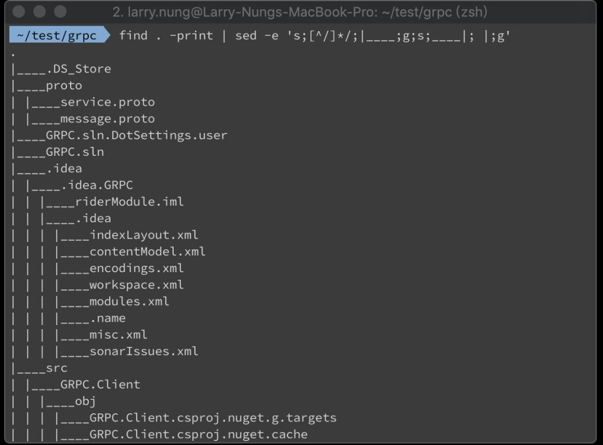
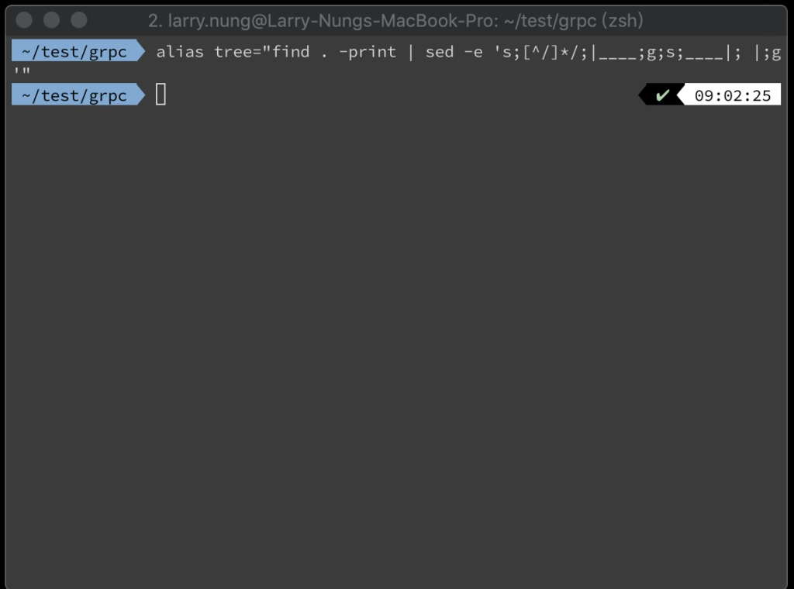
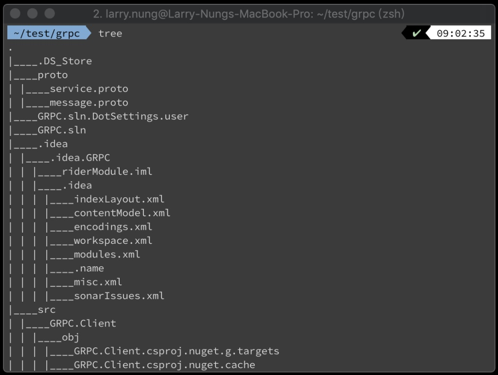

若未裝 tree 命令但想要顯示 Directory tree，可以用 find 命令搭配 sed 命令做到類似的效果。  

<!-- More -->

    find . -print | sed -e 's;[^/]*/;|____;g;s;____|; |;g'

 

運行起來很接近 tree 命令的效果，只是線不像 tree 命令那樣漂亮，也沒有像 tree 命令那樣可吃命令參數。  

 

如果這樣的效果已經很夠用，那可以設上 alias。  

    alias tree="find . -print | sed -e 's;[^/]*/;|____;g;s;____|; |;g'"

 

後續方便重複使用。  

 

Link
-----
* [mac tree命令- 破男孩- 博客園](https://www.cnblogs.com/ayseeing/p/4097066.html)
