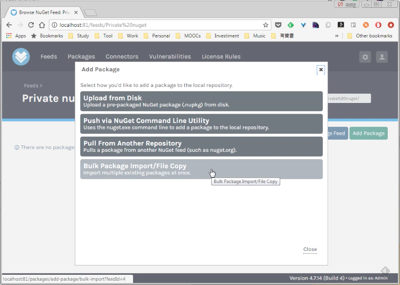
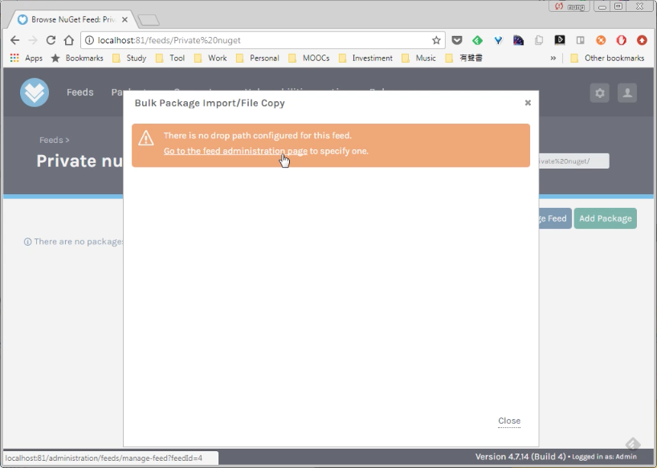
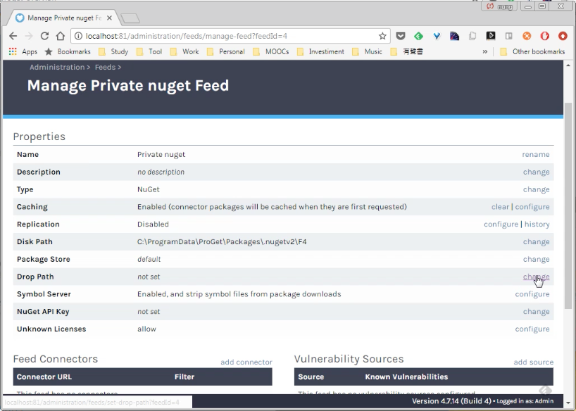
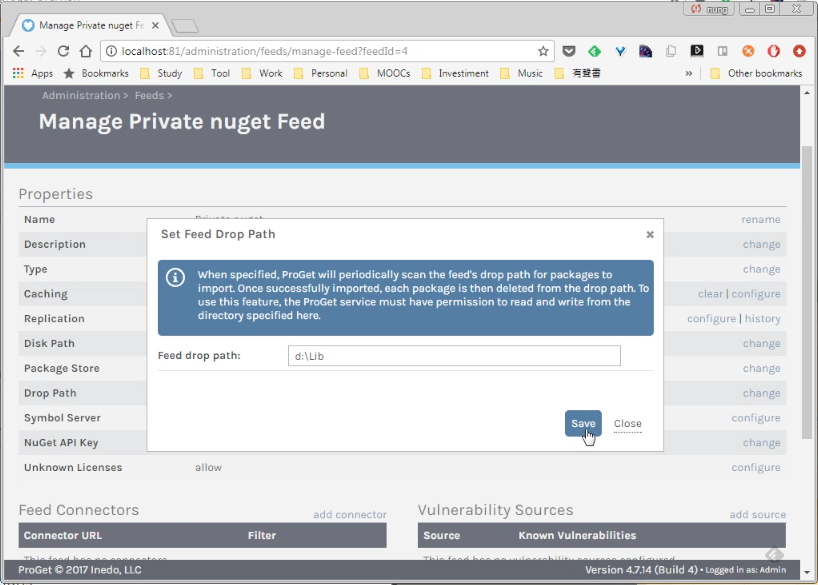
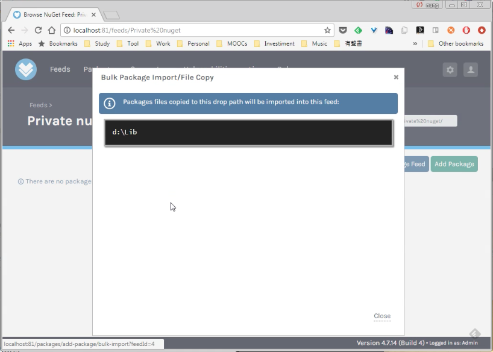
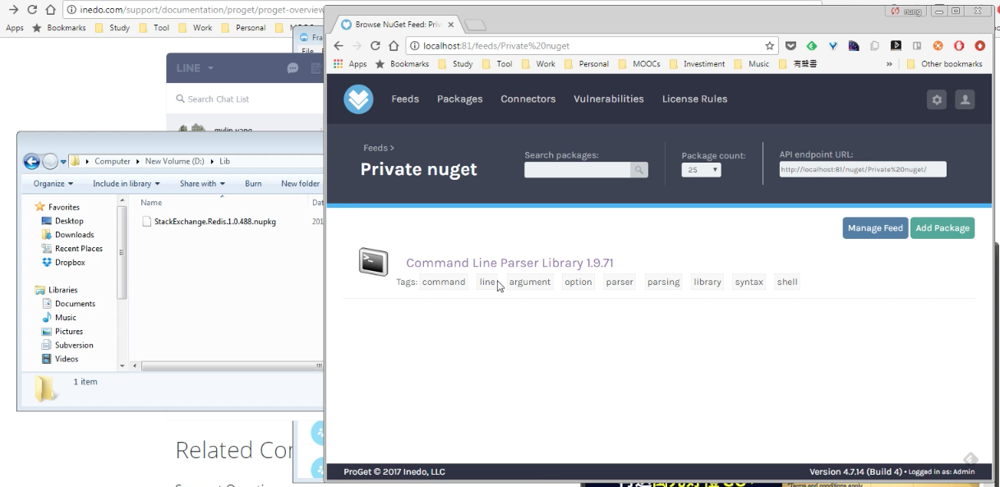

要將大量的 NuGet 套件匯入到 ProGet 的 NuGet feed，可在 ProGet 的 NuGet feed 頁面按下 Add Package 按鈕。  

<!-- More -->

 

點選 Bulk Package Import/File Copy。  

 

這功能需要設定 drop path，若 drop path 未被設定，會看到如下警示畫面，可點選 Go to the feed administration page 連結設定 drop path。  

 

 

 

若是 drop path 有設定的話，則會顯示 drop path 設定。  

 

接著只要將 NuGet 套件放置 drop path。  

 

套件即會被匯入。  

 
