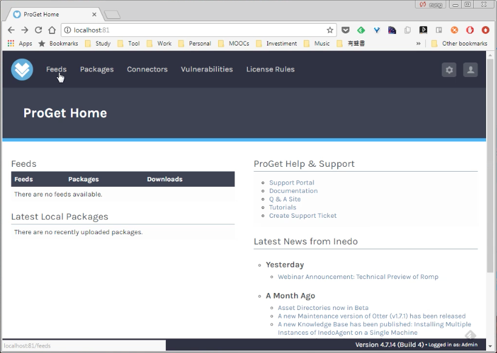
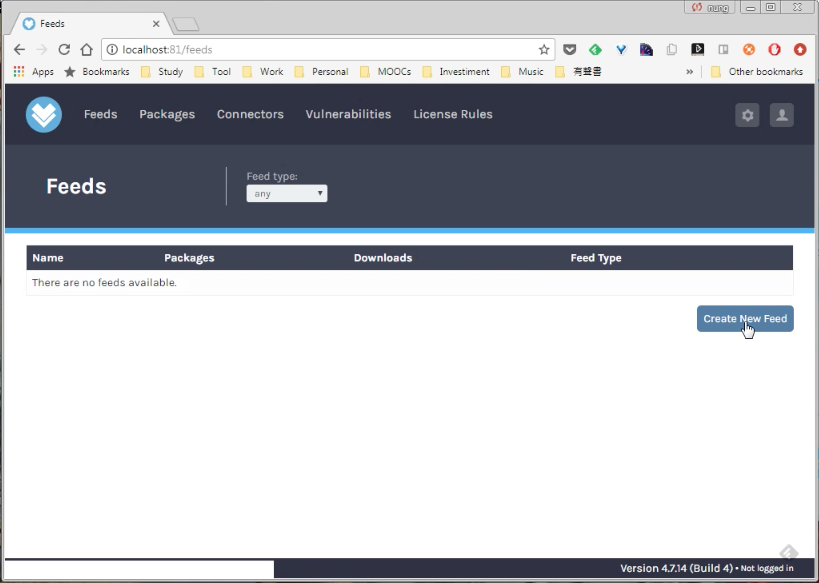
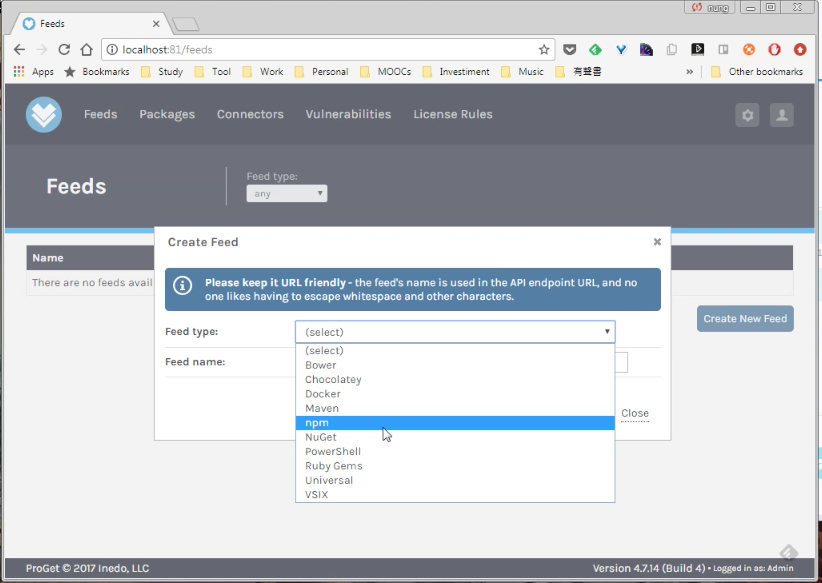
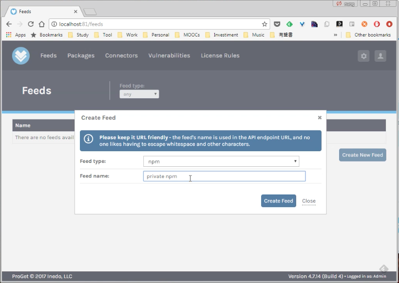
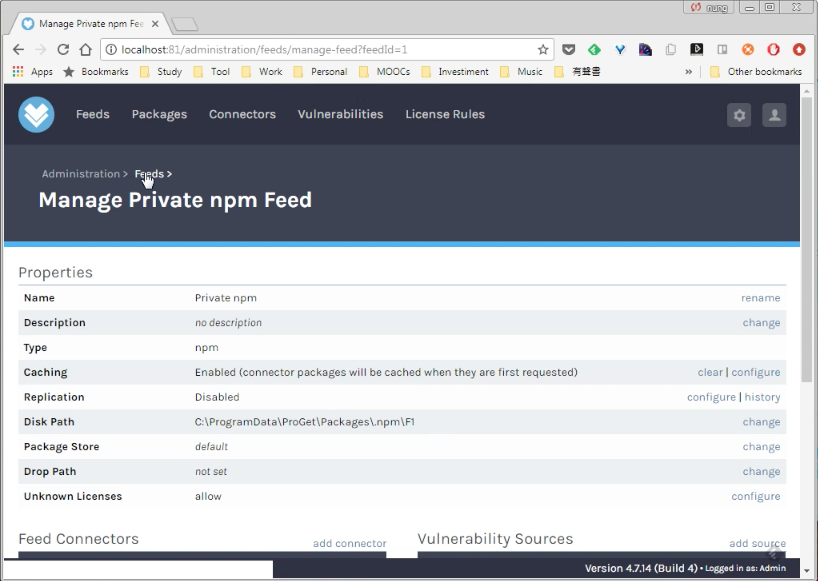
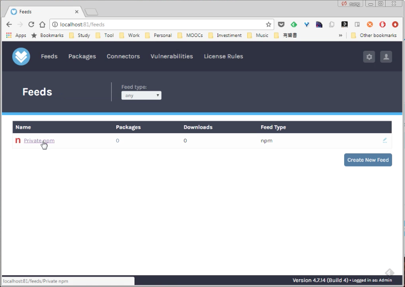

ProGet 要建立 Feed，可在帳號登入後切至 Feeds 頁面。   

<!-- More -->

 

點選 Create New Feed 按鈕。  

 

選取要建立的 Feed 類型，看是 npm、NuGet、Bower...

 

設定要建立的 Feed 的名稱，按下 Create Feed 按鈕。  

 

指定的 Feed 就會被建立，並帶到 Manage Feed 的頁面，若有需要可透過該頁面做細部設定的調整。  

 

切回 Feeds 頁面就會看到剛建立的 Feed。   

 
