要安裝 ProGet，可到 [ProGet 官網](http://inedo.com/proget)，切換到下載頁面下載安裝程式。  

<!-- More -->

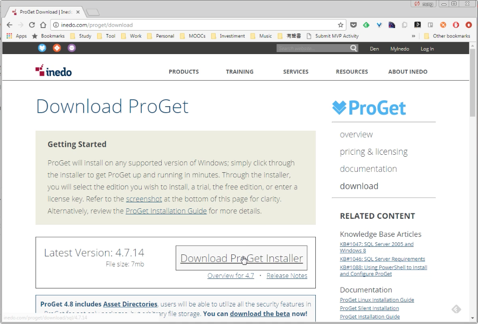

 

安裝程式下載下來後點擊安裝，  

 

一開始是授權頁面，沒問題的話按下 I Agree 按鈕接受授權繼續。    

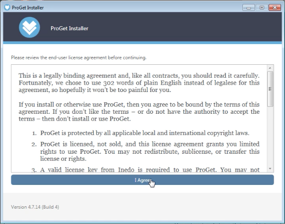

 

設定要使用的 ProGet 版本，看是要使用免費版、企業版的 45 天試用、還是要輸入序號使用。  

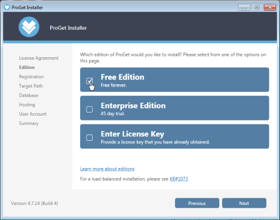

 

設定要註冊用的電子郵件與使用者名稱。  

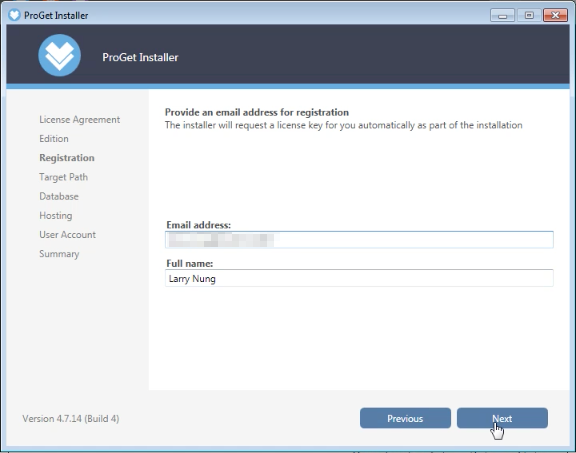

 

設定安裝的路徑。  

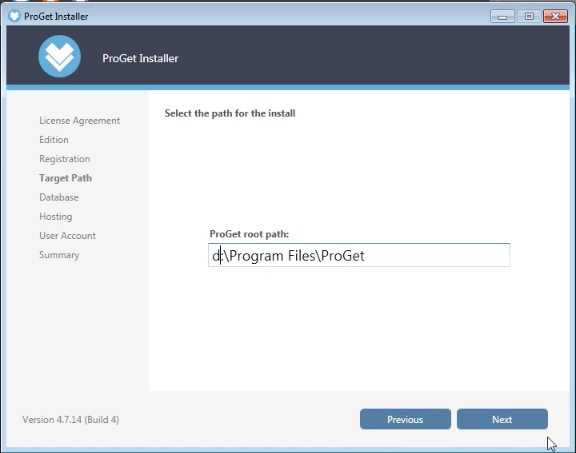

 

設定 ProGet 要用的 SQL Server。若已有 SQL Server，可勾選 Existing SQL Server Instance，設定 SQL Server 的連線。若是沒有現成的 SQL Server，可勾選 New Instance of SQL Express，讓安裝程式安裝 SQL Express 給 ProGet 使用。  

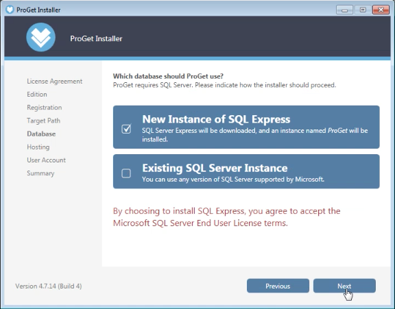

 

設定 ProGet 的 Host 方式。勾選 Integrated Web Server，ProGet 會 Host 成 Windows 服務。勾選 IIS，ProGet 會 Host 在 IIS 站台上。  

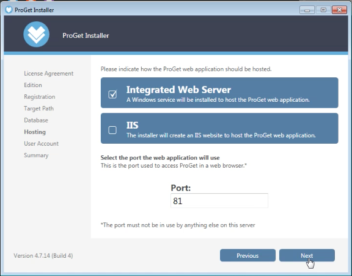

 

設定要給 ProGet 運行用的帳號。  

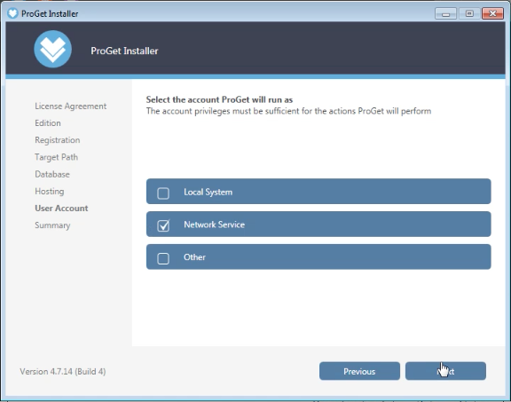

 

如果設定都正確，按下 Install 按鈕進行安裝即可。  

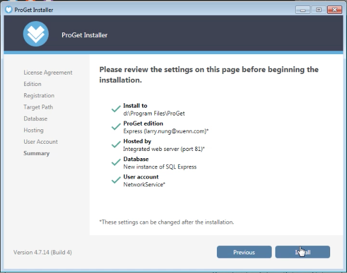

 

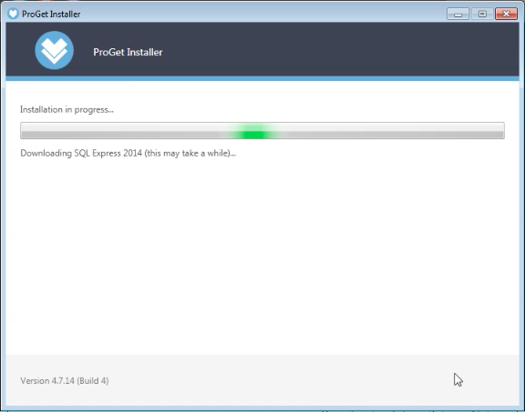

 

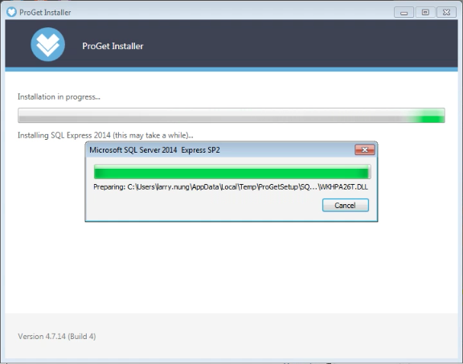

 

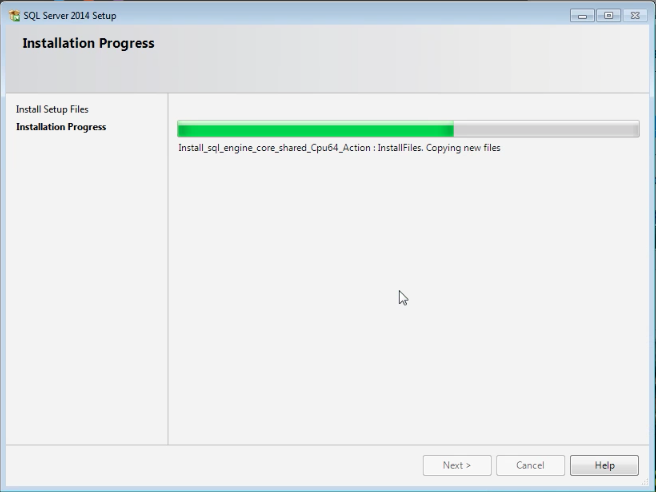

 

安裝完按下 Launch ProGet 按鈕。  

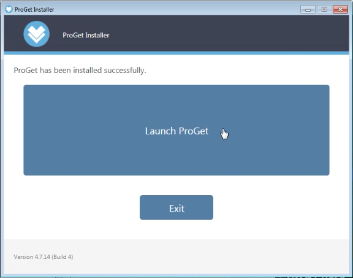

 

即可看到 ProGet 站台正常顯示。  

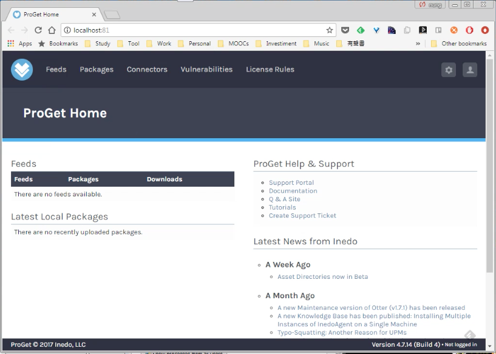

 

Link
----
* [ProGet | Universal Package Manager | Inedo](http://inedo.com/proget)
