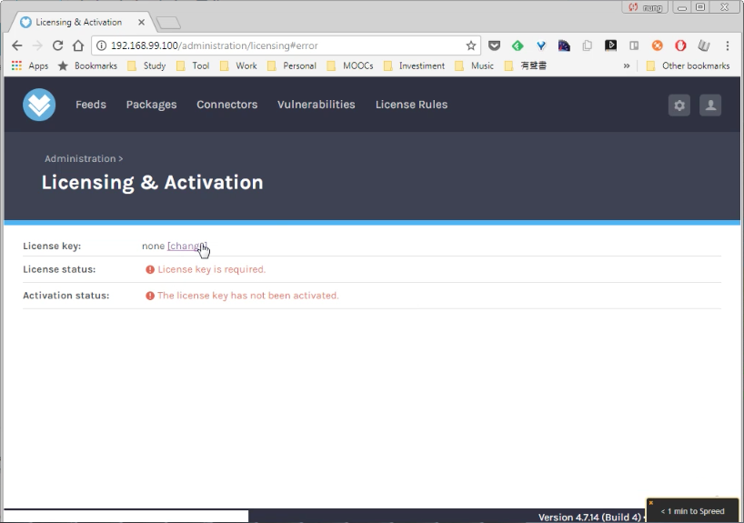
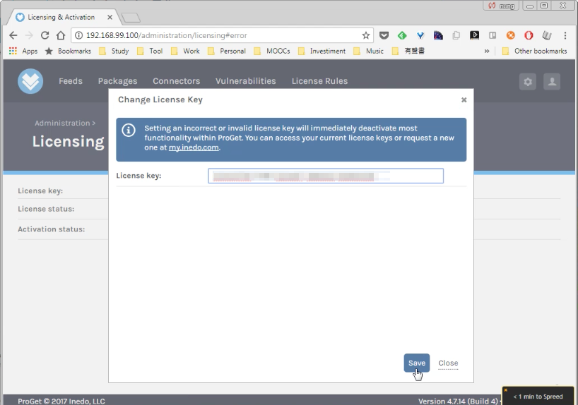
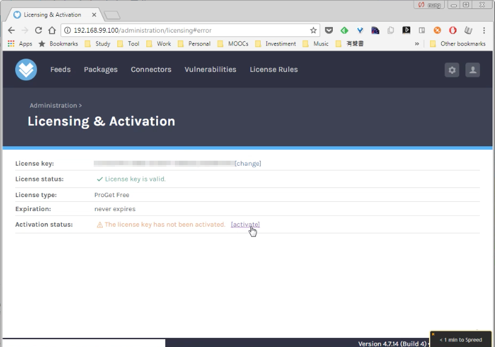
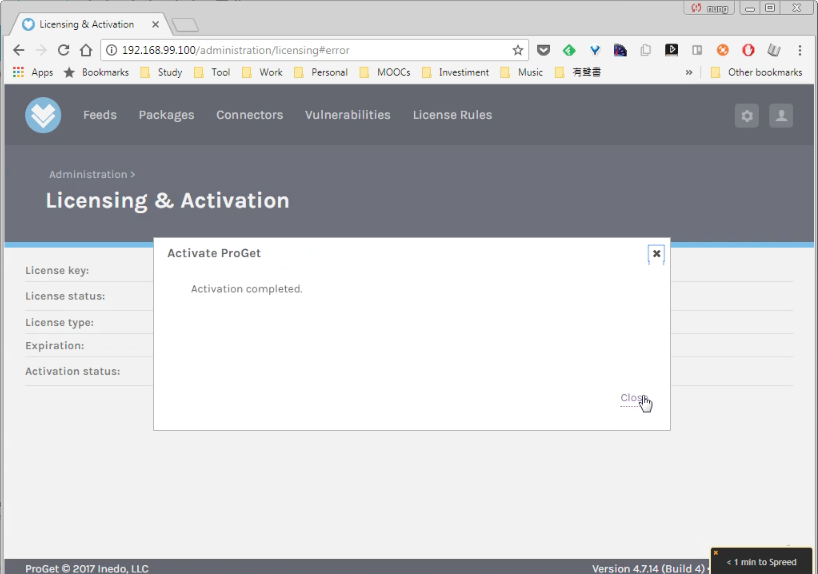
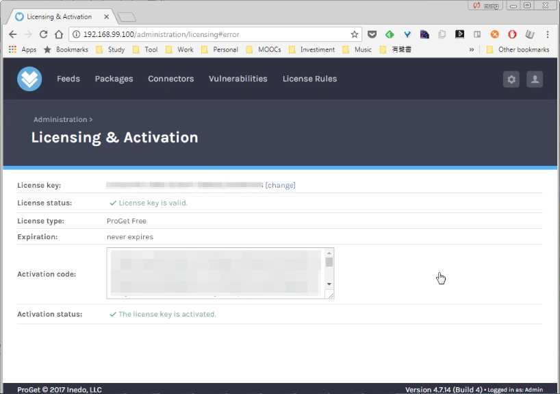

Licensing & Activation 頁面可設定 ProGet 的授權，像是使用 Docker 來跑 ProGet 的話，因為少了安裝的步驟，所以就需要自行到該頁面設定授權。  

<!-- More -->

 

要設定授權的話可以點選 License key 後方的 change 連結。  

 

輸入授權碼後按下 Save 按鈕。  

 

然後需按下 Activation status 後方的 activate 連結啟用授權。  

 

按下 Close 按鈕。  

 

授權即會啟用。  

 
