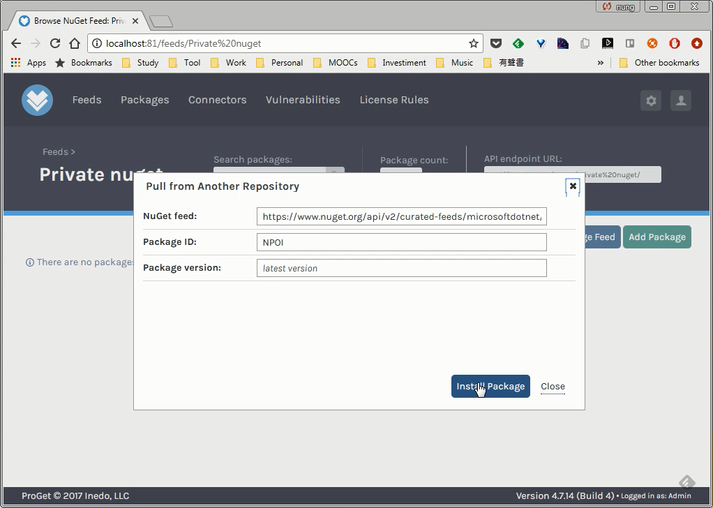

要拉外部 repository 的 NuGet 套件到 ProGet 的 NuGet feed，可在 ProGet 的 NuGet feed 頁面按下 Add Package 按鈕。  

<!-- More -->

 

點選 Pull From Another Repository。  

 

填入外部 Feed 位置、套件 ID、套件版本，按下 Install Package 按鈕。  

 

即會從指定的 Repository 位置拉指定版本的套件到 ProGet 的 NuGet feed。  

 

 
