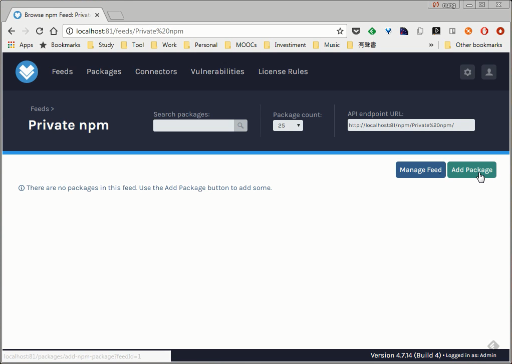
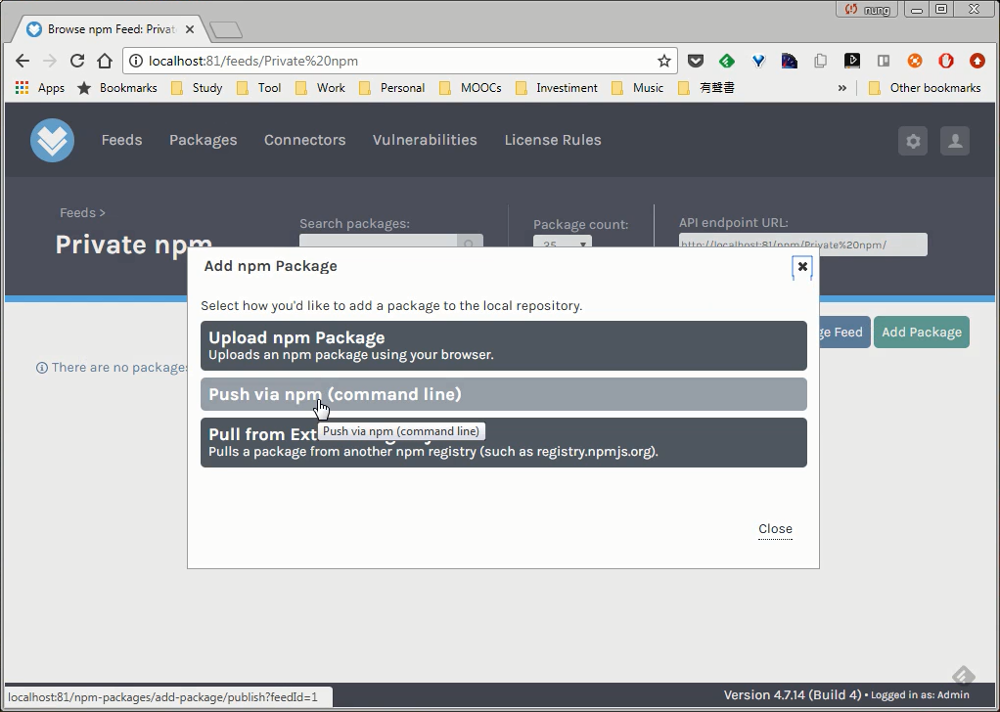
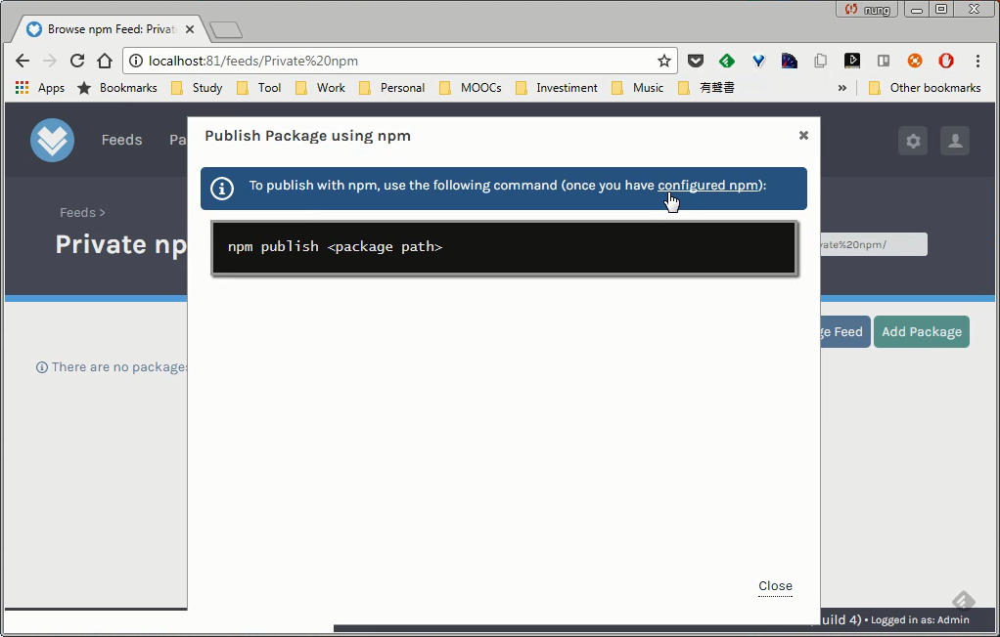
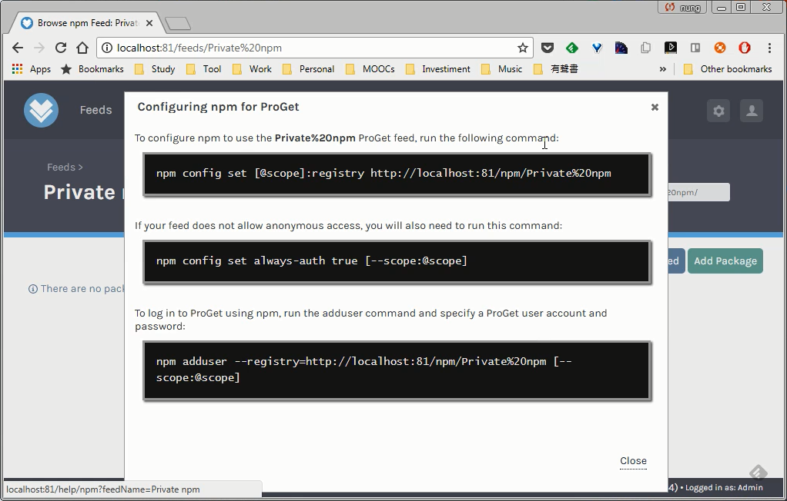
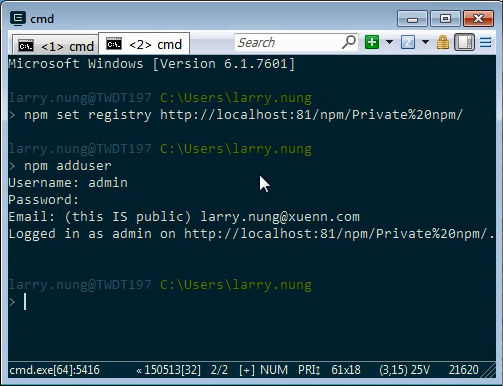
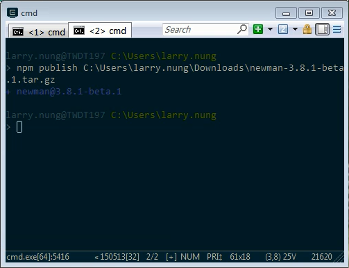
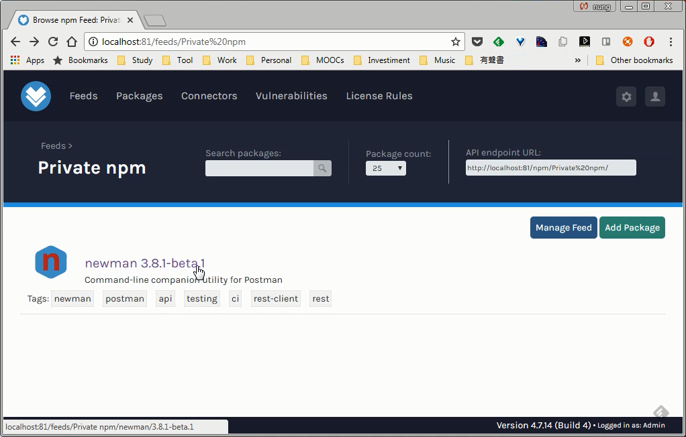
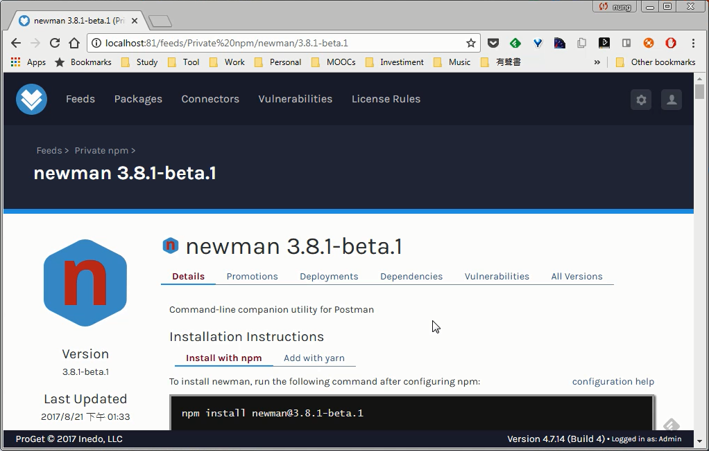

要透過 npm 命令上傳 npm 套件到 ProGet 的 npm feed，可在 ProGet 的 npm feed 頁面按下 Add Package 按鈕。

點選 Push via npm (Command line)。

這邊會告知怎樣使用 npm publish 命令上傳 npm 套件，使用前需點選 configured npm，參閱該連結做些設定。

像是設定 npm 的 registry 位置。

npm set registry

設定 npm registry 使用者帳號，這邊直接使用 ProGet 帳號轉小寫後輸入、輸入密碼。

npm adduser

再使用 npm publish 將指定的 npm 套件發佈上 Registry。

npm publish

選取的套件即會上傳到 ProGet 的 npm feed。

