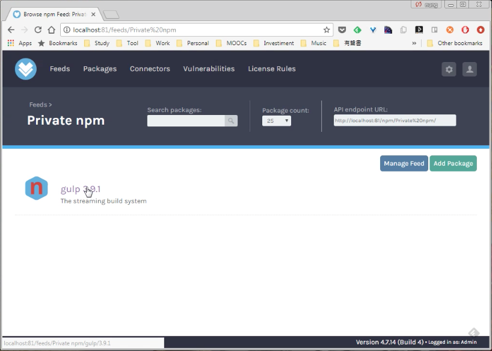

要上傳 npm 套件到 ProGet 的 npm feed，可在 ProGet 的 npm feed 頁面按下 Add Package 按鈕。  

<!-- More -->

 

點選 Upload npm Package。  

 

選取要上傳的套件檔案並設定 Tags，按下 Upload File 按鈕繼續。  

 

選取的套件即會上傳到 ProGet 的 npm feed。  

 

 
