R 語言翻轉教室是一全中文互動式教材，教材的內容主要是來自 [An Introduction to R](https://cran.r-project.org/doc/manuals/R-intro.pdf)。  

<!-- More -->

 

可開啟 RGui 或是 RStudio，在 Console 視窗輸入命令開始進行安裝。  

    source("http://wush978.github.io/R/init-swirl.R")

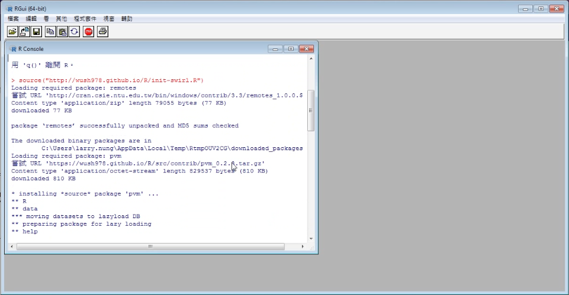

 

決定 CRAN 鏡象位置。  

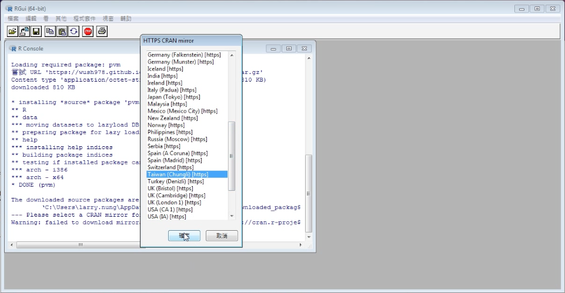

 

設定是否使用繁體中文，以及是否讓安裝程式幫你調整語系。  

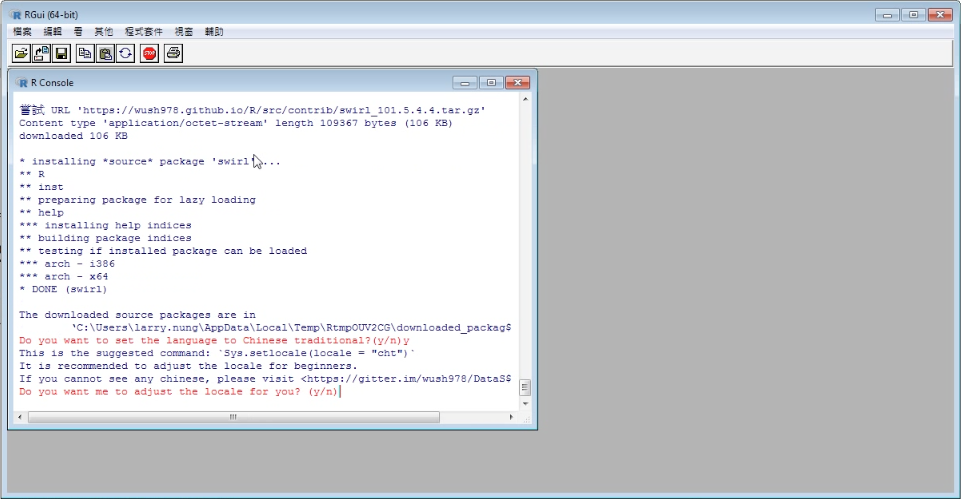

 

安裝好後輸入 swirl() 即可進入教材。  

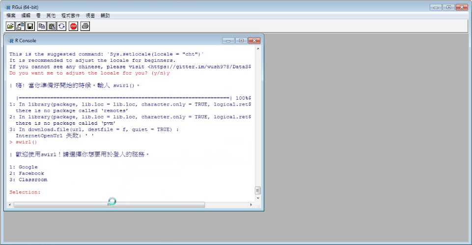

 

教材使用時需要做登入，選個希望使用的登入的方式並授權即可。  

 

安裝且登入後，會先帶一下教材必奧的操作知識，像是看到 '...' 代表要按 'Enter' 按鈕繼續：看到 "Selection:" 就是要輸入選擇後按 'Enter' 按鈕繼續。  

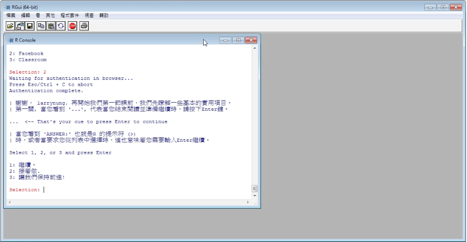

 

或是一些 swirl 提供的命令...等。  

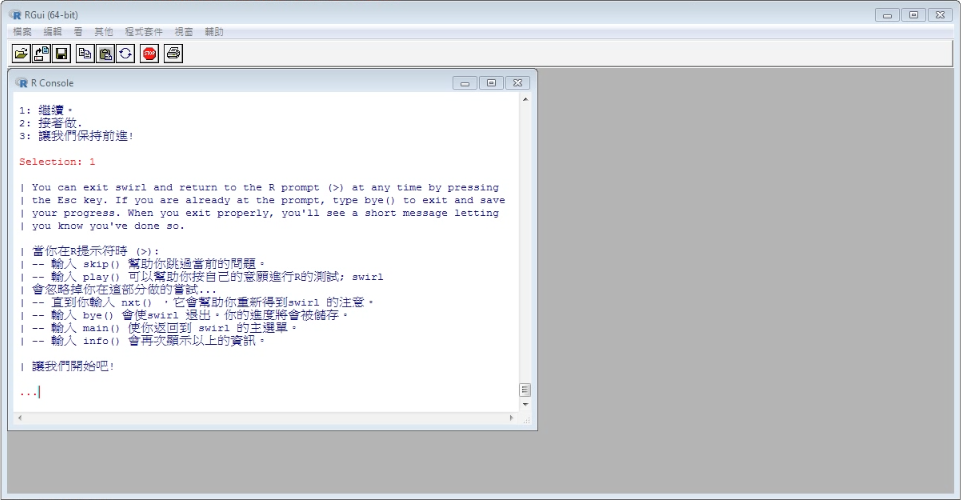

 

這部份帶完後才會開始進入課程，課程都放在 'DataScienceAndR' 下，所以這邊要選 1 繼續。  

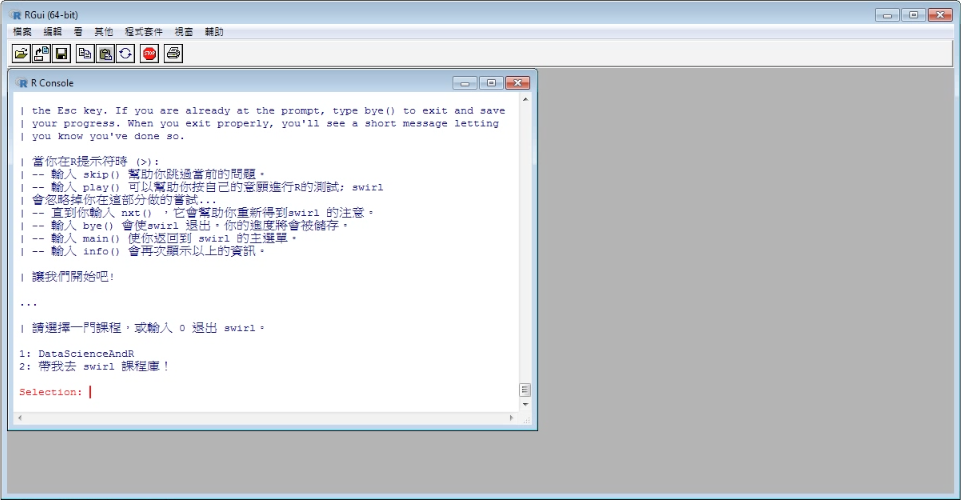

 

再挑選要上的課程即可。  

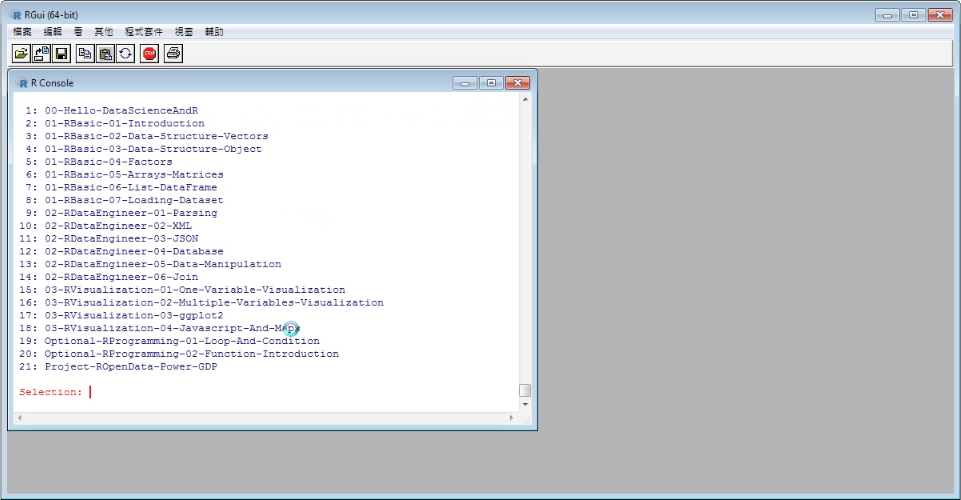

 

不過因為 RGui 在編輯器的編碼切換上會有些問題，建議還是使用 RStudio 來運行教材。  

 

學習告一段落，將 RGui 或是 RStudio 關閉。下次要進入教材的話，只要將 swirl 套件載入，輸入 swirl() 即可再次進入教材。  

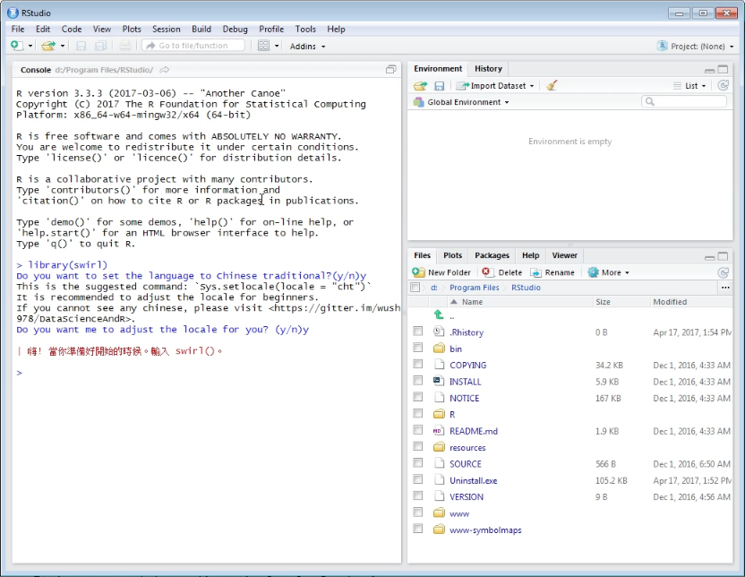

 

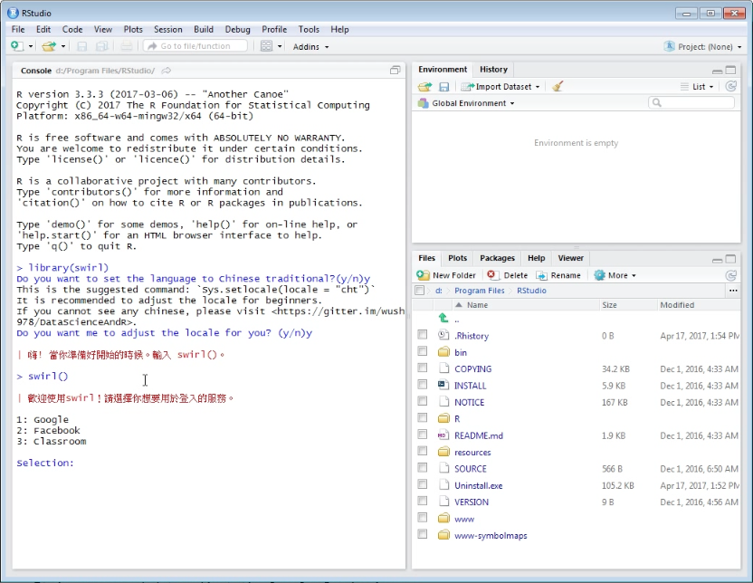

 

教材在使用上程式碼的部分可能會有中文顯示的問題，這時點選 RStudio 的 [File | Reopen with Encoding...] 主選單選項。  

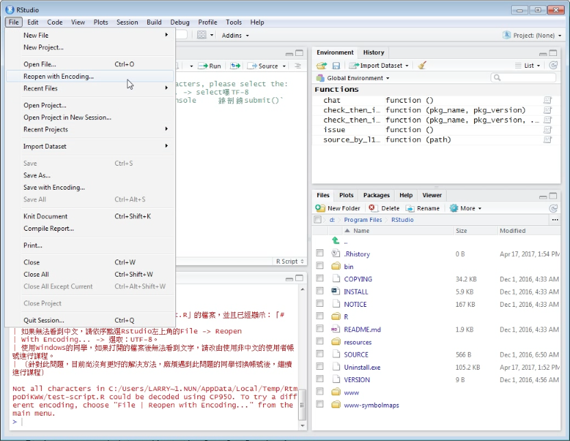

 

設定編碼為 UTF-8。  

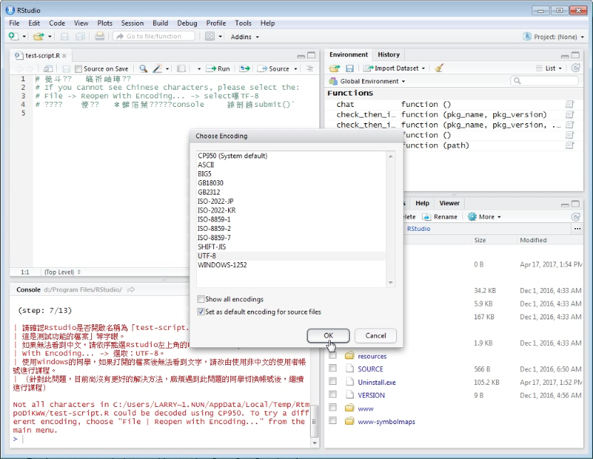

 

中文顯示就會正常了。  

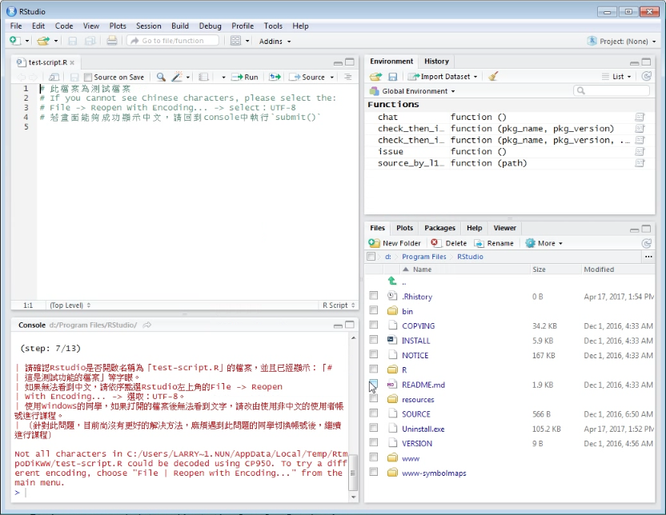

 

Link
----
* [R語言翻轉教室](http://datascienceandr.org/)
