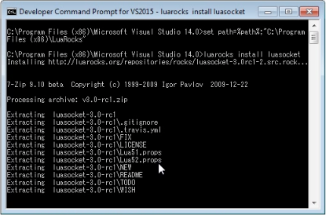
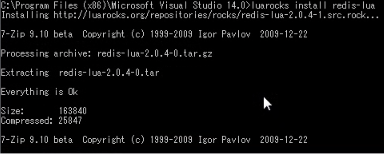
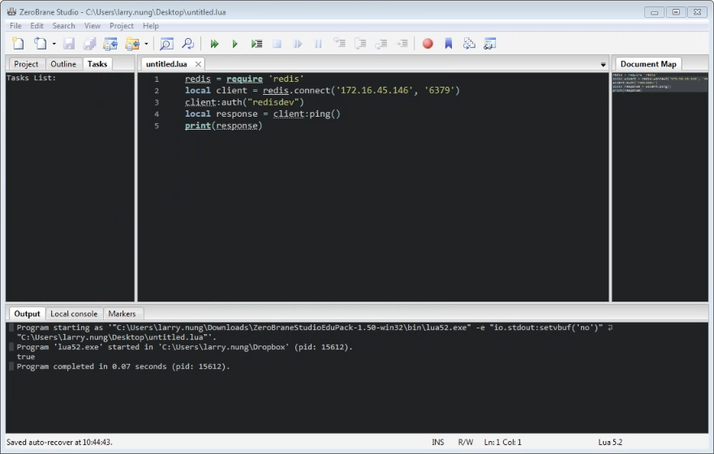

redis-lua 是 Lua 的 Redis client 套件，能讓 Lua 具備存取 Redis 的能力。  

<!-- More -->

<br/>


因為相依於 LuaSocket 套件，所以必須先用 LuaRocks 安裝 LuaSocket 套件。  

    luarocks install luasocket



<br/>


相依套件安裝好，就可以進行 redis-lua 套件的安裝。  

    luarocks install redis-lua



<br/>


都安裝好了就可以開始在程式中使用 redis-lua 對 Redis 進行存取。  

<br/>


使用上需先加入 redis-lua 套件。  

```lua
    local redis = require 'redis'
```

<br/>


然後進行對 redis 的連線。  

```lua
    local client = redis.connect(ip, port)
```

<br/>


如果 redis 有設定認證，可調用 auth 命令並帶入對應的密碼。  

```lua
    client:auth(password)
```

<br/>


接著就可以視需要調用其它 Redis 的命令。  



<br/>


Link
----
* [nrk/redis-lua: A Lua client library for the redis key value storage system.](https://github.com/nrk/redis-lua)
