要在 Windows 使用 Redis，可以到[這邊](https://github.com/MSOpenTech/redis)下載 Windows 的 Porting 版本。  

<!-- More -->

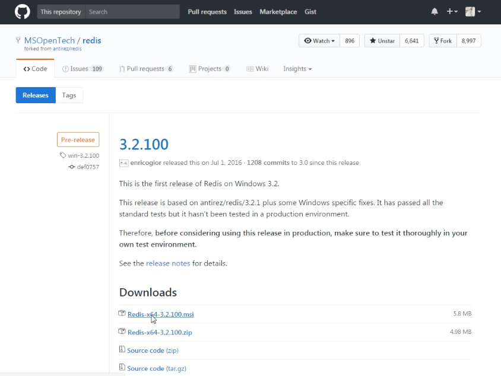

 

點擊安裝檔進行安裝。  

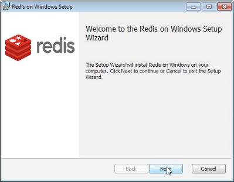

 

勾選同意授權。  

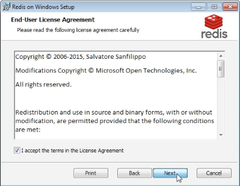

 

設定要安裝的位置，這邊也可以勾選順帶設定環境變數。  

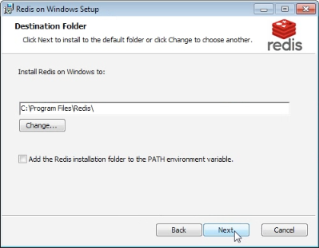

 

設定 Redis 要使用的 Port 號，這邊也可以勾選順帶設定防火牆。  

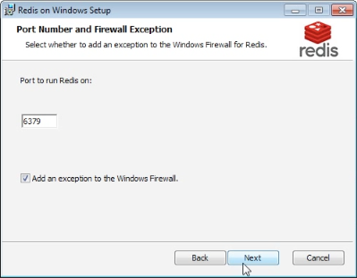

 

設定記憶體使用上限。  

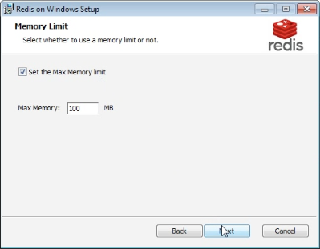

 

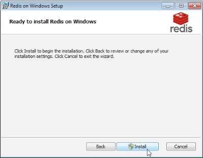

 

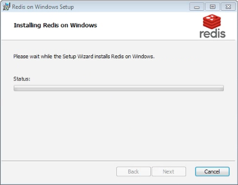

 

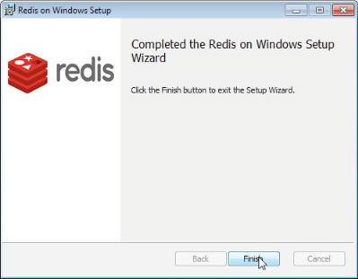

 

安裝完後在指定的安裝位置會看到 Redis 的設定檔，以及 Redis 附帶的一些 CLI Tool，像是 redis-cli、redis-server、redis-benchmark 等。  

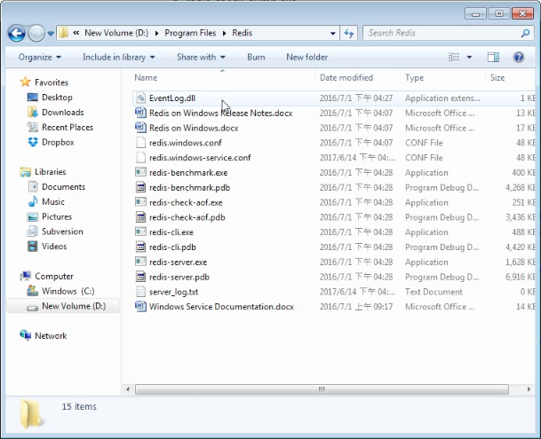

 

查看服務也可以看到安裝的 Redis 服務正在背後運行。  

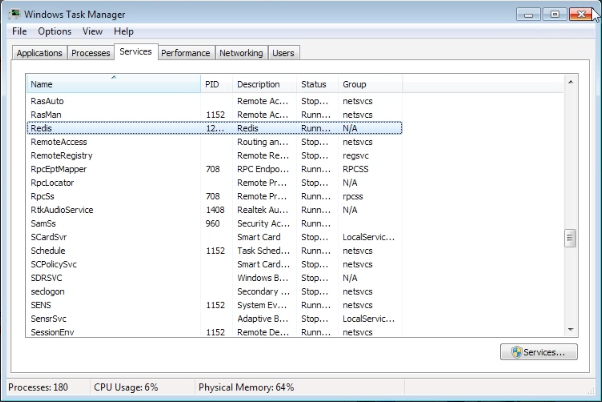

 

更進一步可以使用 Telnet。

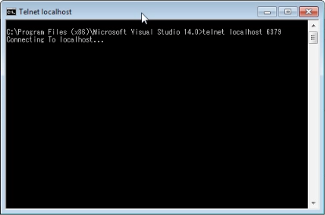

 

 

或是自帶的 redis-cli 工具進行一下 Redis 的連線測試。  

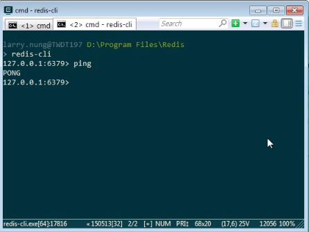

 

Link
----
* [MSOpenTech/redis: Redis is an in-memory database that persists on disk. The data model is key-value, but many different kind of values are supported: Strings, Lists, Sets, Sorted Sets, Hashes](https://github.com/MSOpenTech/redis)
