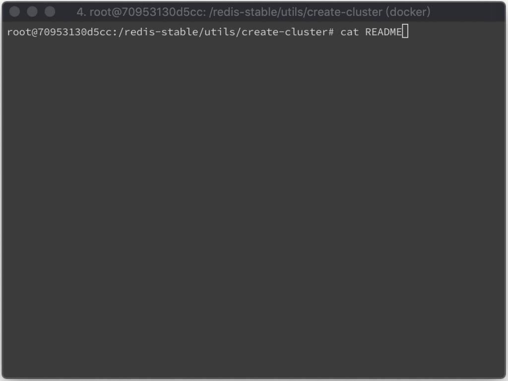
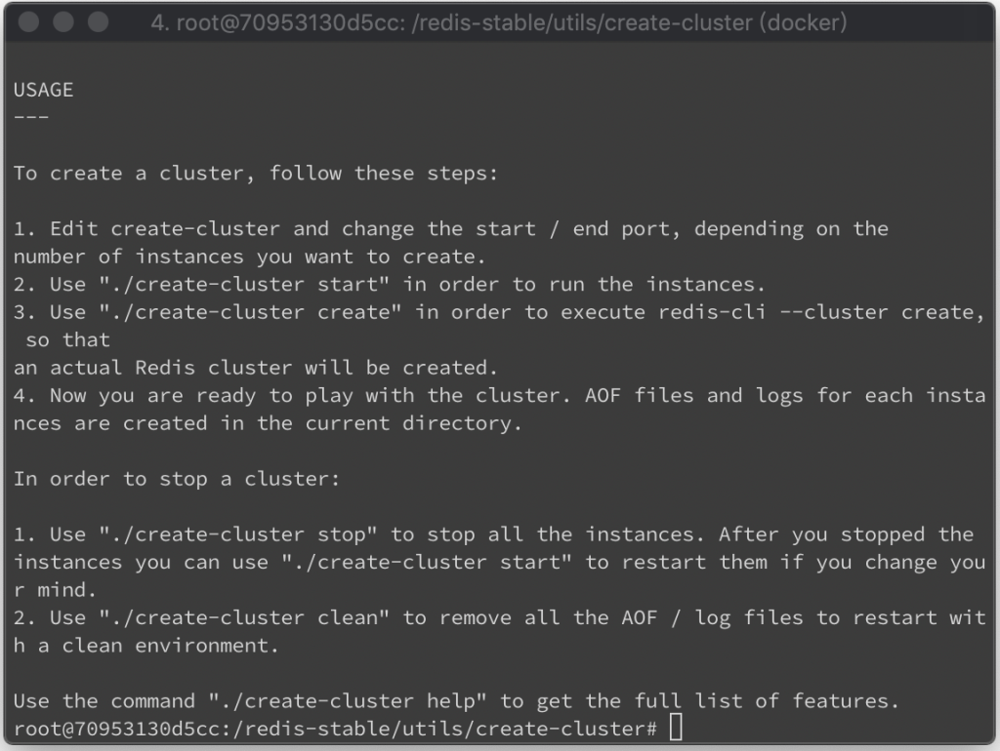
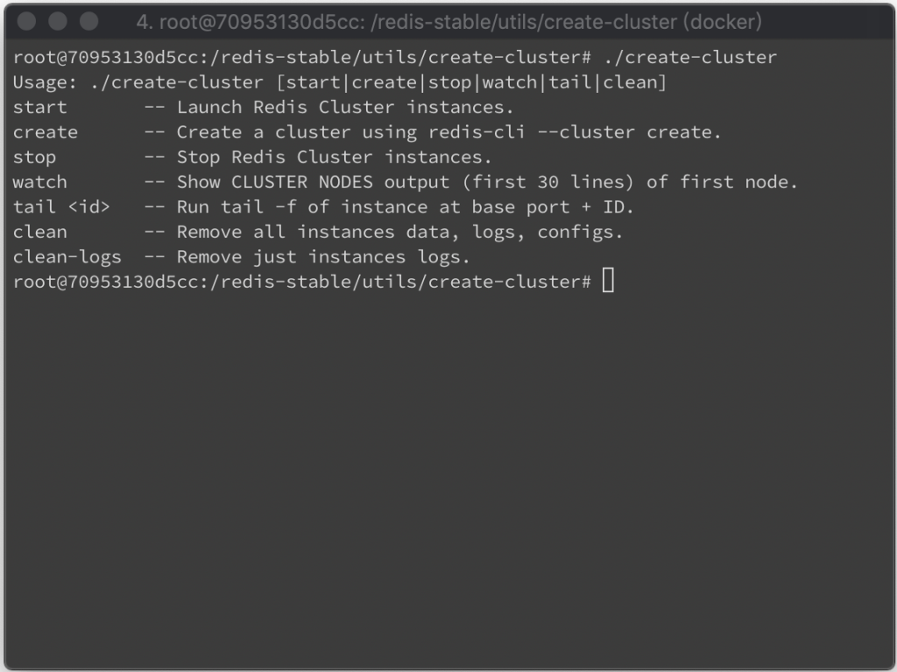
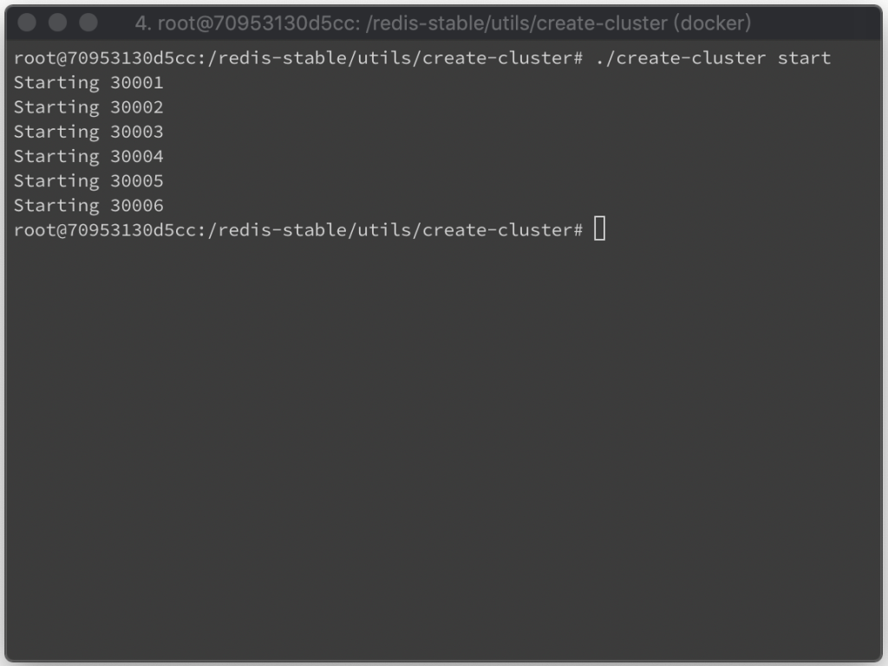
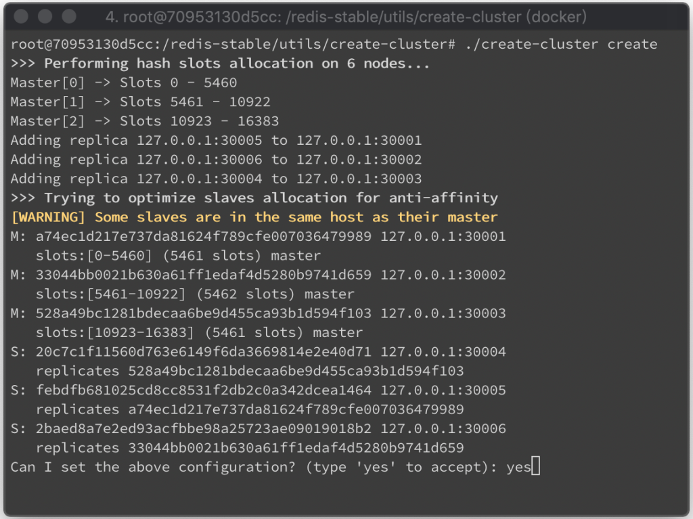
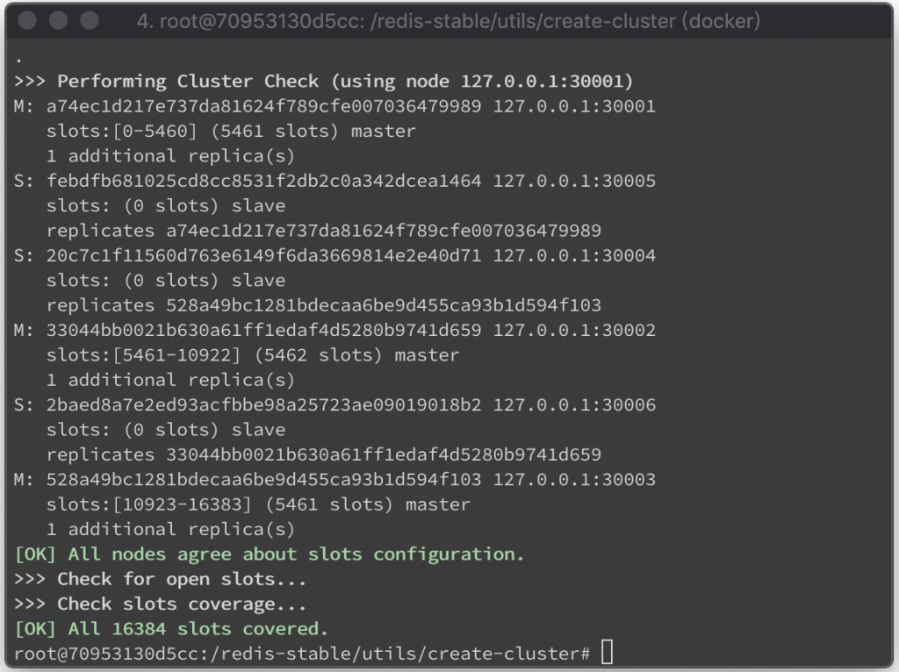
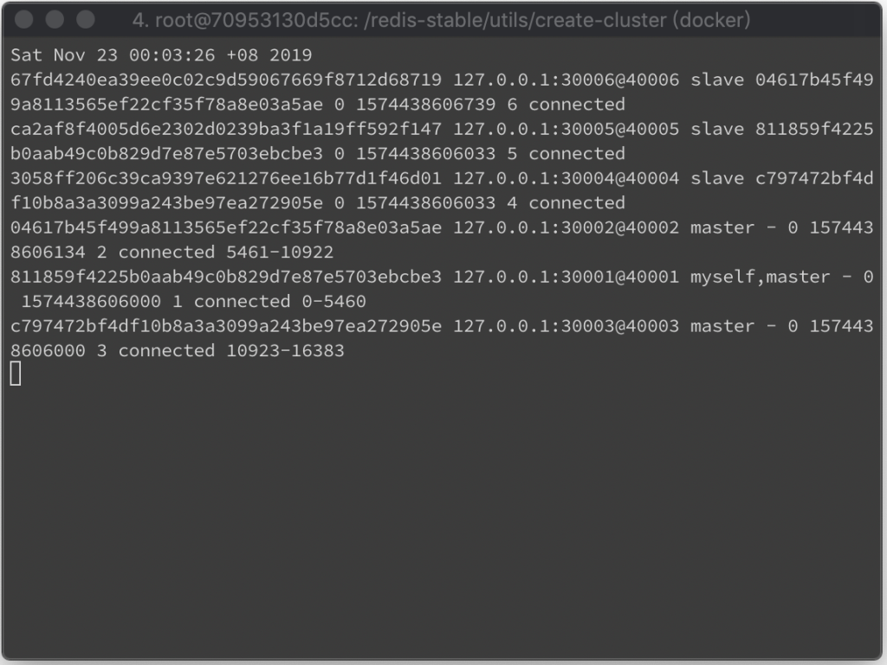
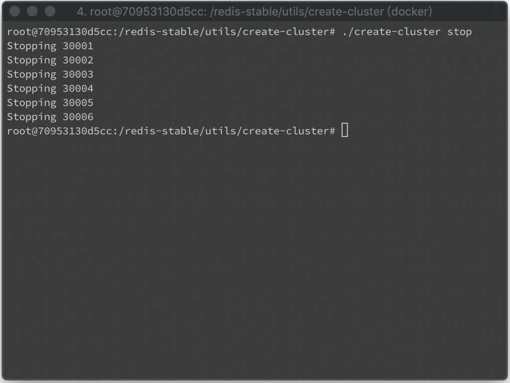
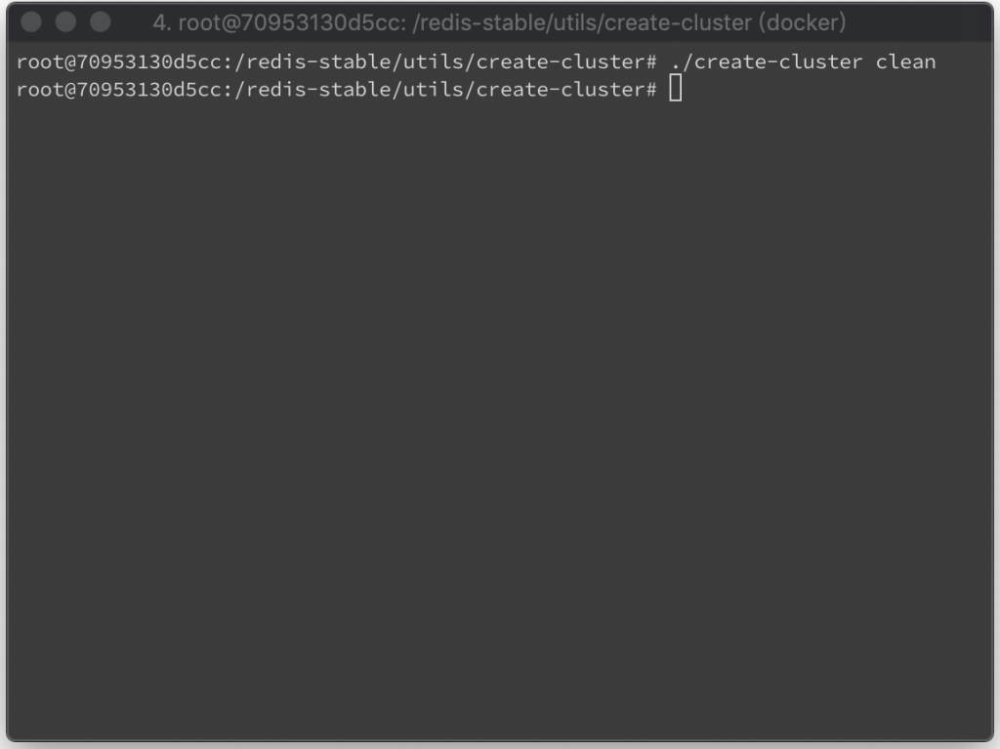
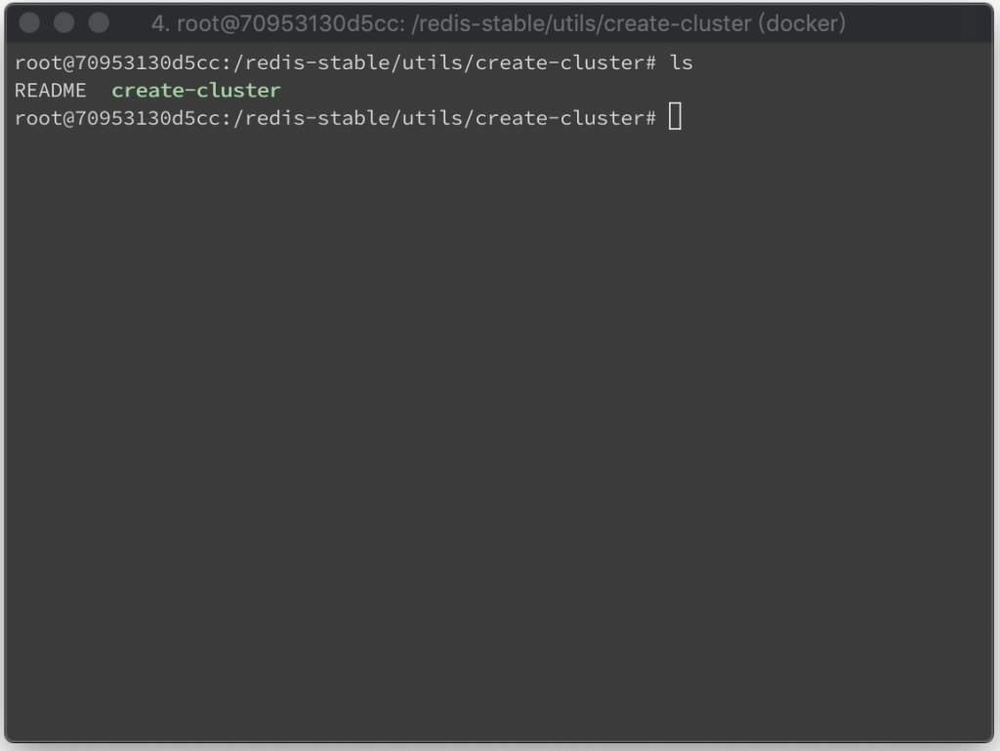

Redis 安裝完後 utils/create-cluster 目錄下有提供現成的腳本可以用來起 Redis cluster 做些測試。  

<!-- More -->

 

使用方式可參閱目錄下的 README。  

 

 

或是直接調用命令參考命令的說明。  

    ./create-cluster

 

簡單來說，可以用 start 將要組成 Redis cluster 的節點都先運行起來。  

    ./create-cluster start

 

再用 create 將運行起來的 Redis 連結組成 Cluster。  

    ./create-cluster create

 

 

若有需要，可用 watch 監看 Redis 的輸出。  

    ./create-cluster watch

 

如 Redis log 過多，可用 clean-logs 清除 Redis log。

    ./create-cluster clean-logs

 

不使用時可用 stop 停止 Redis 服務。  

    ./create-cluster stop

 

再用 clean 將 Redis 的 資料、設定、Log 都清除。

    ./create-cluster clean

 

