這邊紀錄一下如何不透過 create-cluster 腳本一步一步建立 Redis cluster。  

<!-- More -->

<br>


首先安裝 Redis，這邊為了方便筆者是直接使用 Docker 去起 Redis 容器。  

    docker run -it redis bash

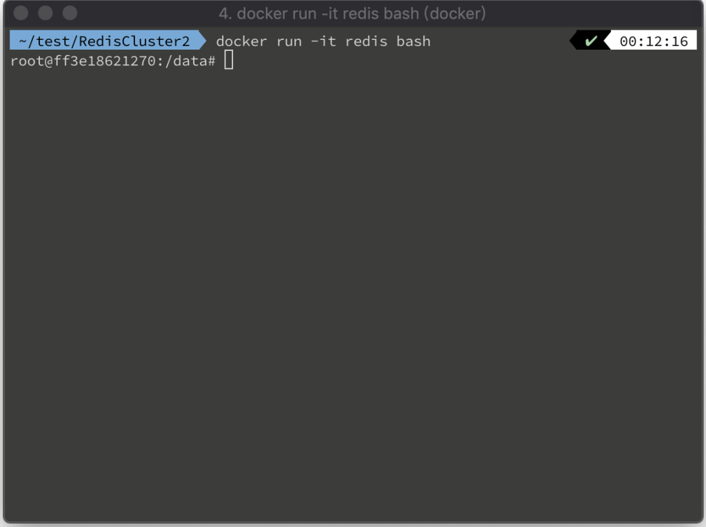

<br>


這邊為了測試方便，會讓六個 Redis instance 放在同一個容器。所以這邊筆者建立一個目錄便於後續操作。

    mkdir cluster-test

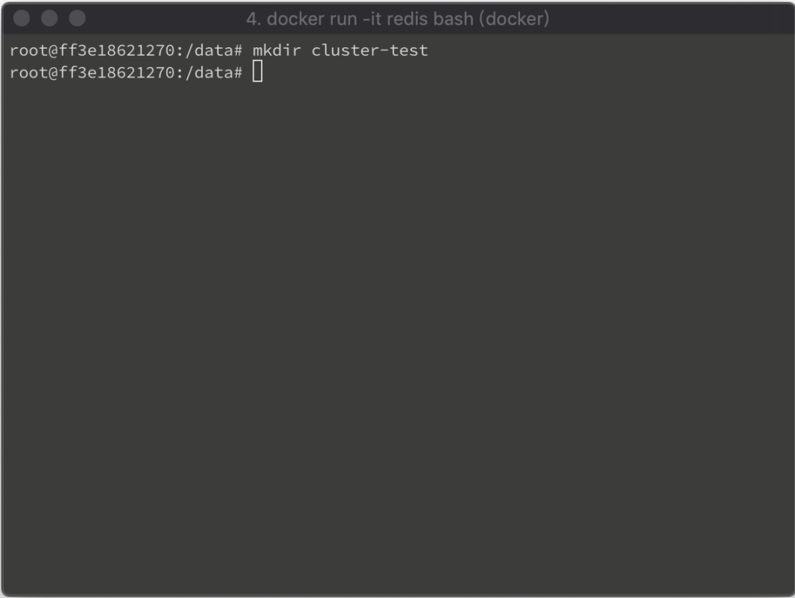

<br>


    cd cluster-test

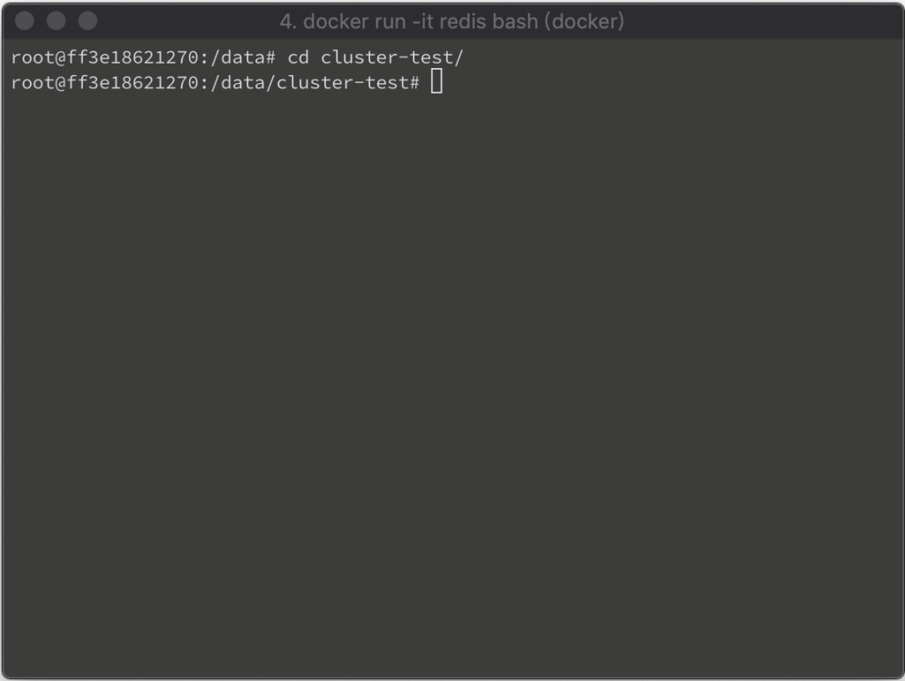

<br>


接著為每個 Redis instance 建立目錄。

    mkdir 7000 7001 7002 7003 7004 7005

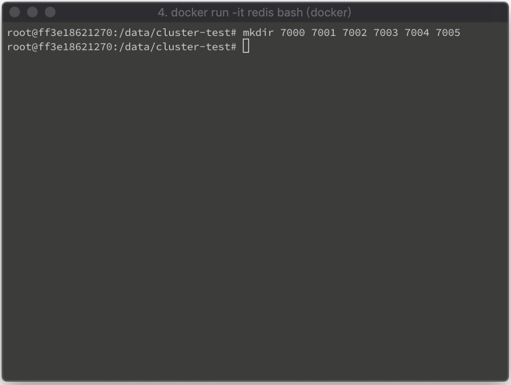

<br>


每個 Redis instance 放置對應的 Redis 設定。  

    cd 7000

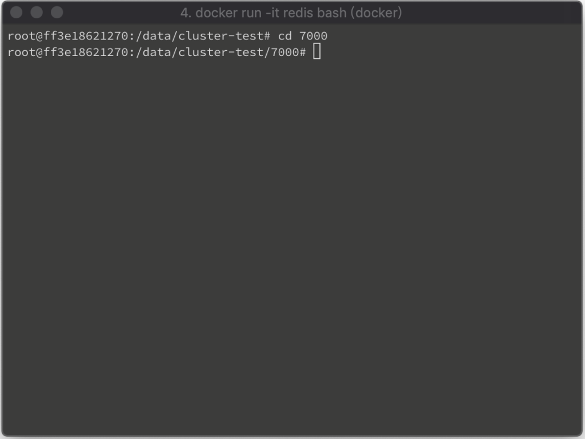

<br>


    apt-get update && apt-get install vim

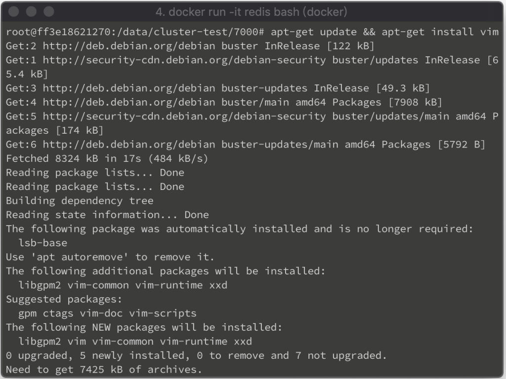

<br>


    vim redis.conf

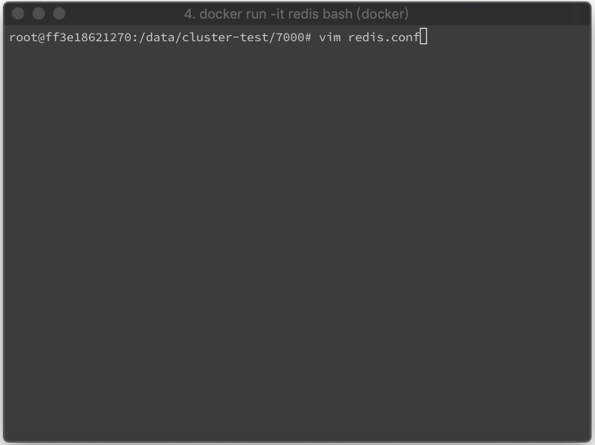

<br>


設定檔內記得設定 Redis instance 的 port 號與 cluster。  

```
port 7000
cluster-enabled yes
cluster-config-file nodes.conf
cluster-node-timeout 5000
appendonly yes
```

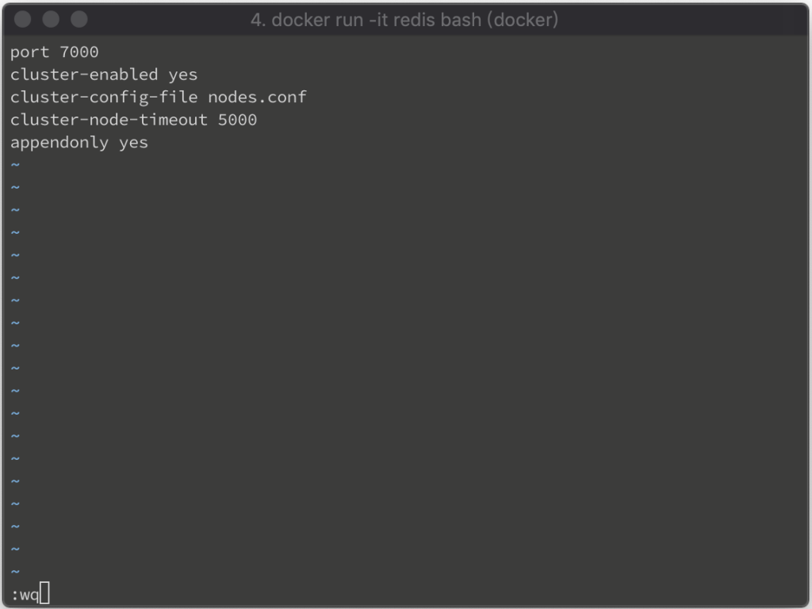

<br>


調用 redis-server 命令，指定設定檔，啟動 Redis instance。  

    redis-server redis.conf --daemonize yes

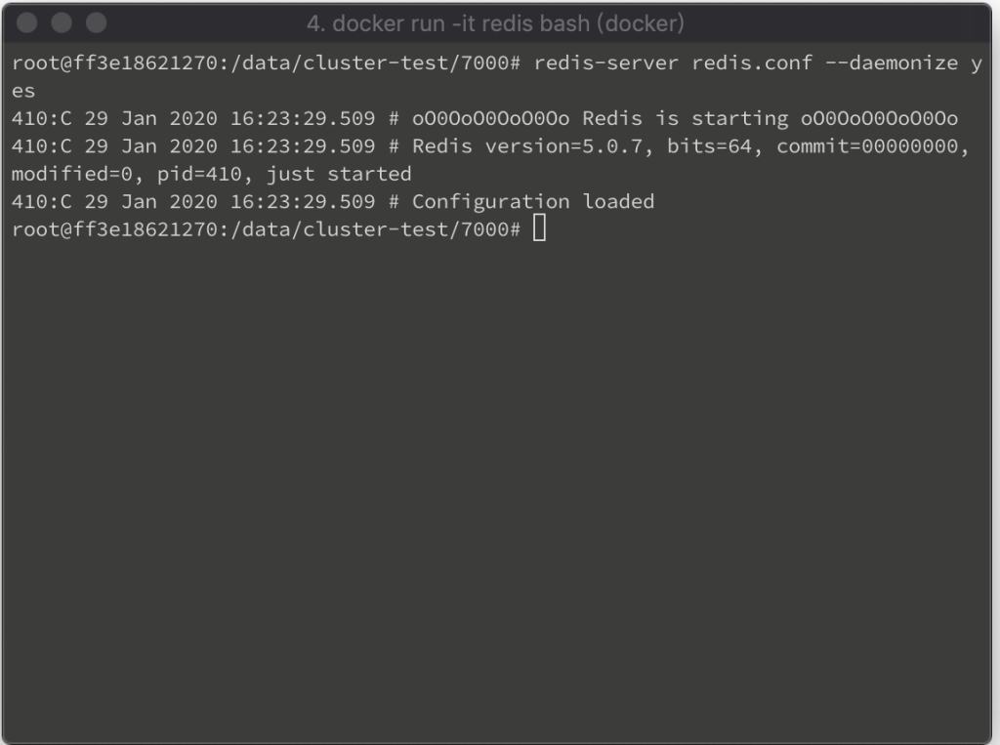

<br>


再透過 redis-cli 帶入 --cluster 參數與 Redis instance 的位置，指定要串成 cluster 的 Redis instance，並透過 --cluster-replicate 指定 slave 份數。  

    redis-cli --cluster create 127.0.0.1:7000 127.0.0.1:7001 127.0.0.1:7002 127.0.0.1:7003 127.0.0.1:7004 127.0.0.1:7005 --cluster-replicas 1

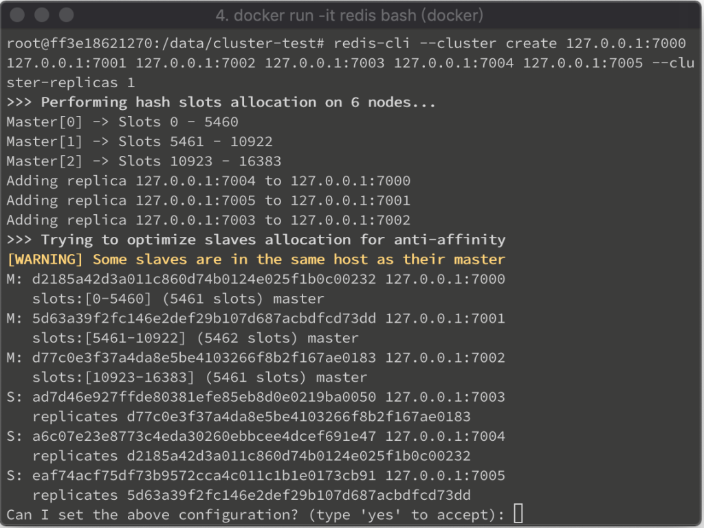

<br>


指定的 Redis instance 就會串成 Redis cluster。

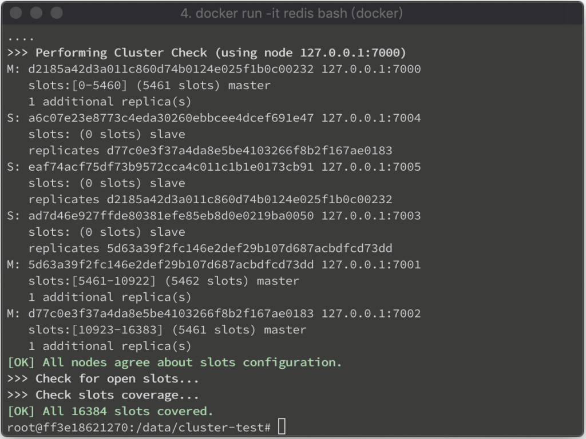

<br>


運行 Redis cluster info 命令查驗 Redis cluster 的狀態資訊，可看到 cluster_state 是 ok。    

    redis-cli -p 7000 cluster info

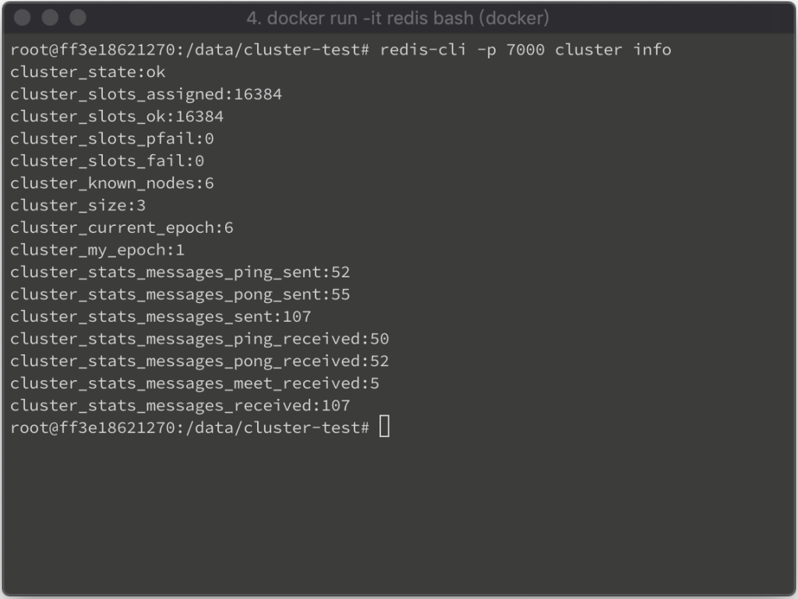

<br>


運行 Redis cluster nodes 命令查驗 Redis cluster 的節點資訊，可看到 Redis cluster 內的節點識別碼、Host、Port、Master or slave、連線狀態、及服務的 Slot 區間。  

    redis-cli -p 7000 cluster nodes

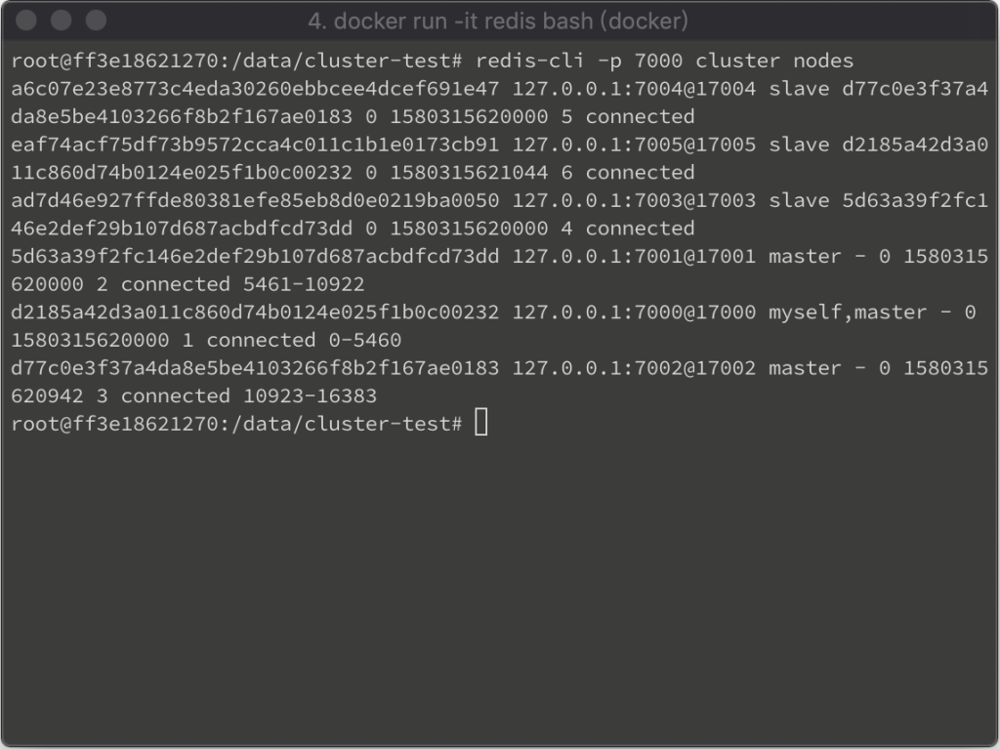

<br>


Link
=====
* [Redis cluster tutorial – Redis](https://redis.io/topics/cluster-tutorial)
