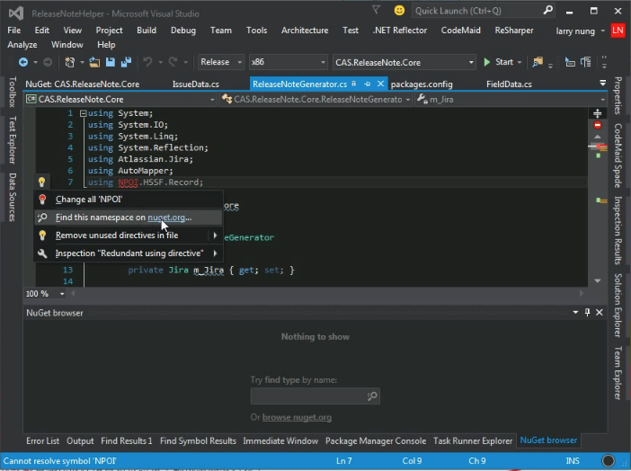
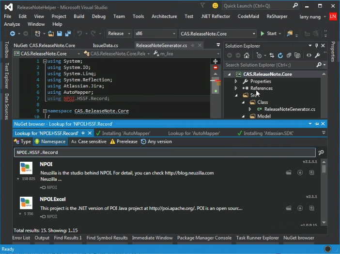
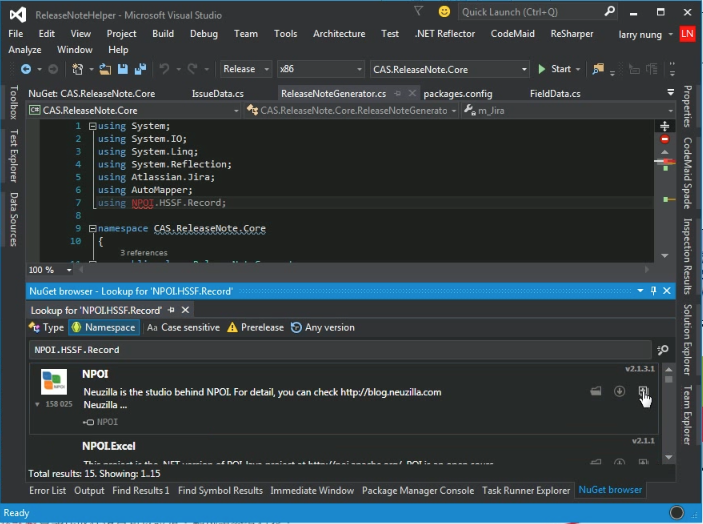
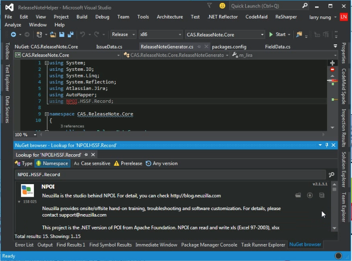
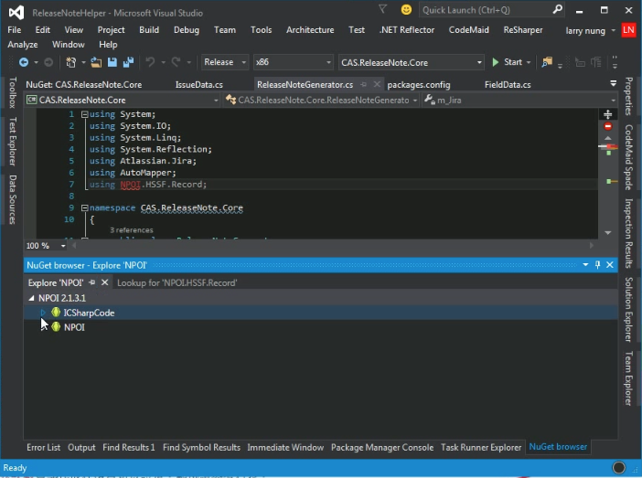
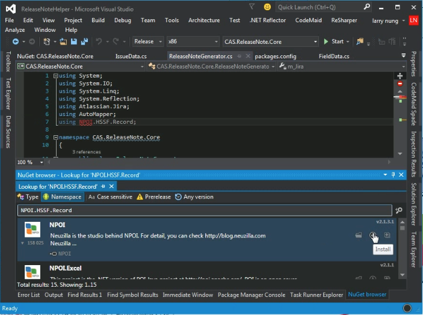
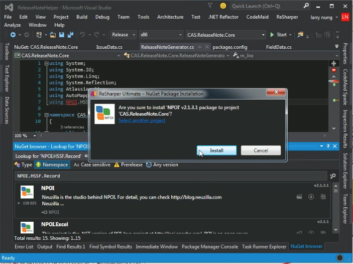
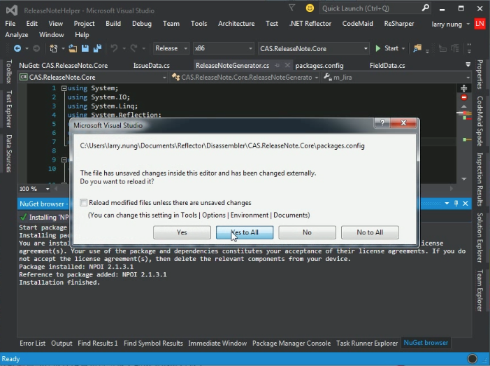

ReSharper 的 NuGet browser 提供 NuGet 套件的搜尋、瀏覽、與安裝的功能。  

<!-- More -->

 

若有需要可以直接開啟 NuGet browser 自行搜尋使用，也可以透過程式碼讓 ReSharper 幫我們帶出 NuGet browser 找尋遺失的 NuGet 套件。  

 

 

NuGet browser 找尋到 NuGet 套件後，後面會有三個按鈕，若不確定套件是否是要使找尋的，可透過最後一個按鈕將套件的詳細說明展開。  

 

 

若有查閱類別與成員的需要，這邊也可以透過第一個按鈕查閱。  

 

 

若都確認無誤要安裝的話，可按下第二個按鈕進行套件的安裝。  

 

 

 

Link
----
* [Finding, Exploring, and Installing NuGet Packages - Help | ReSharper](https://www.jetbrains.com/help/resharper/Finding_Exploring_and_Installing_NuGet_Packages.html)
