Resumonk 能將 LinkedIn Profile 匯入套用模版變成漂亮的個人化履歷。  

<!-- More -->

 

使用時需先按下首頁上方的 Create your resume 按鈕。  

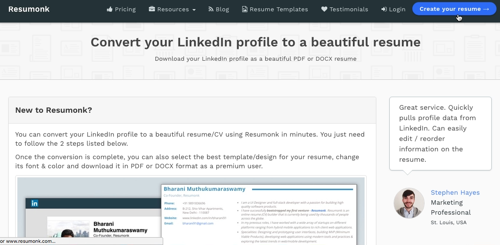
 
 

點選 Import from LinkedIn 按鈕。  

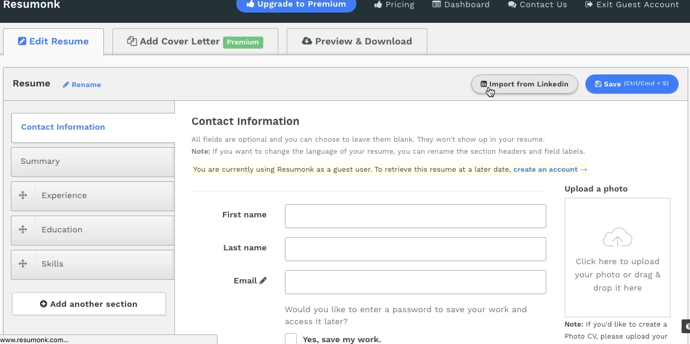
 
 

將 LinkedIn Profile 匯出成 PDF 檔，然後點選 Browse PDF File 按鈕。  

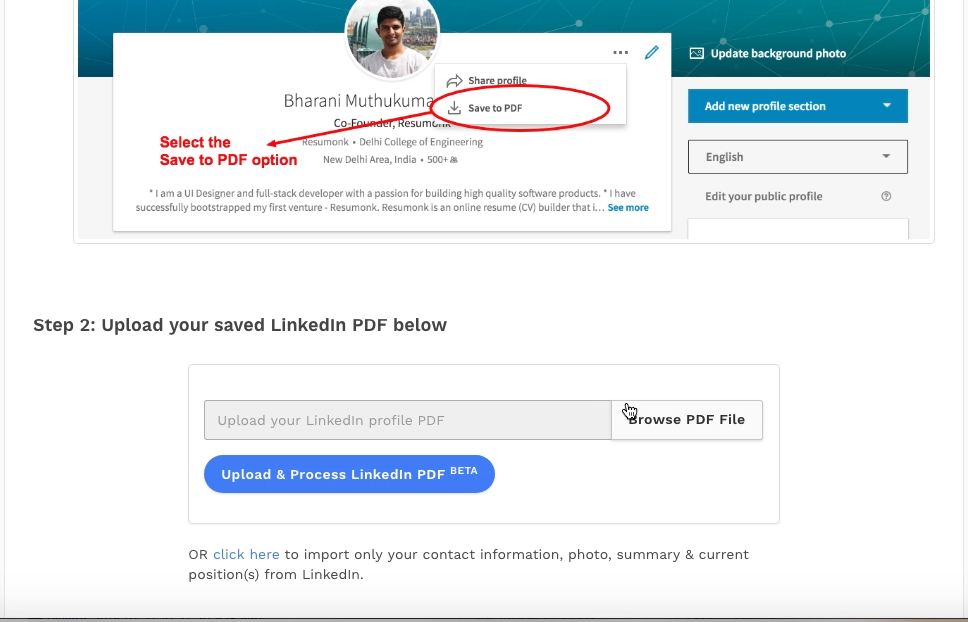
 
 

選取匯出的 LinkedIn Profile 檔。  

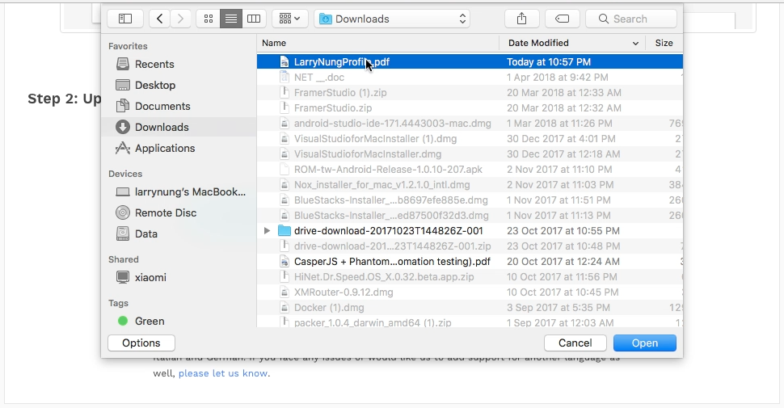
 
 

點選 Upload & Process LinkedIn PDF 按鈕。  

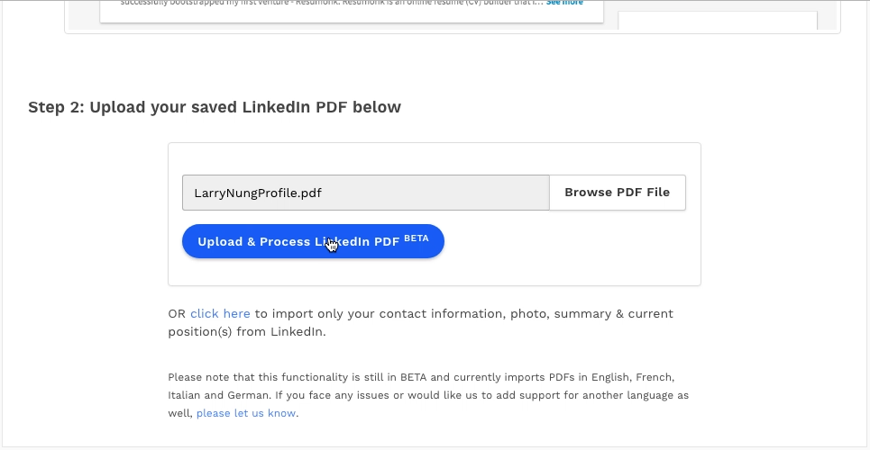
 
 

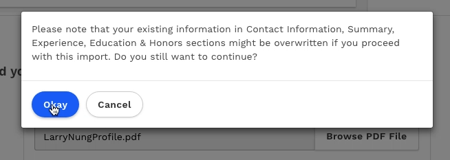
 
 

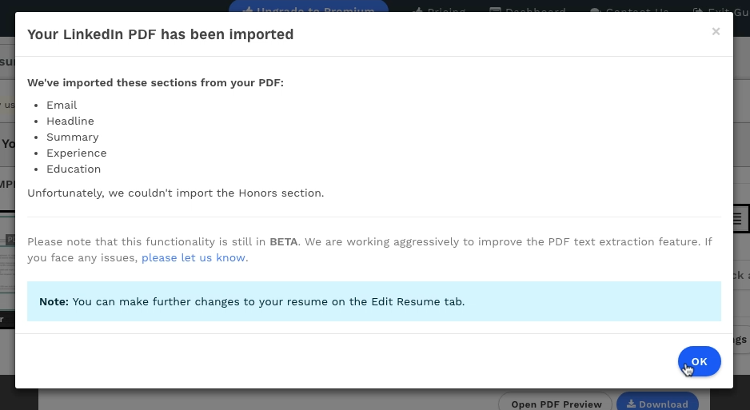
 
 

匯入完後若有需要也可直接在 Resumonk 上做些編輯。  

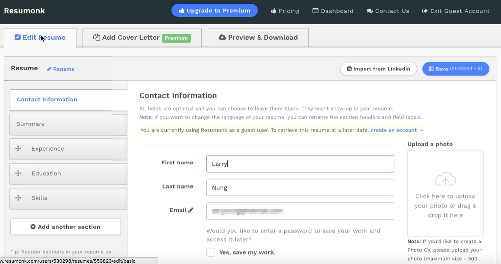
 
 

切至 Preview & Download 頁籤，可選取喜歡的 Resume 範本。  

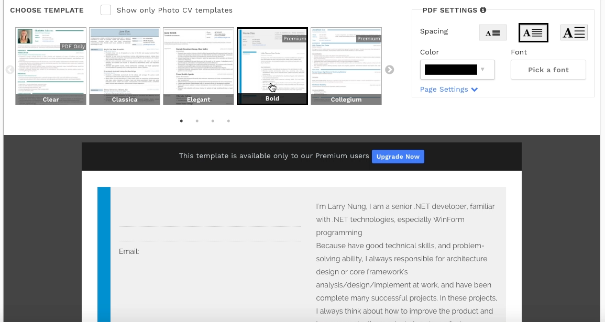
 
 

也可調整文字的字型/間隔/顏色。

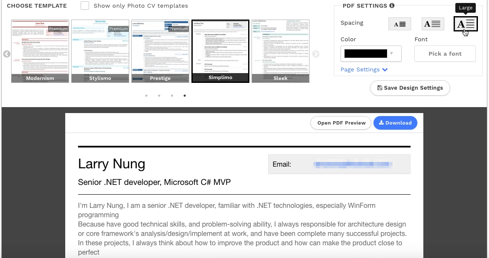
 
 

都選好後點選 Download 按鈕。  

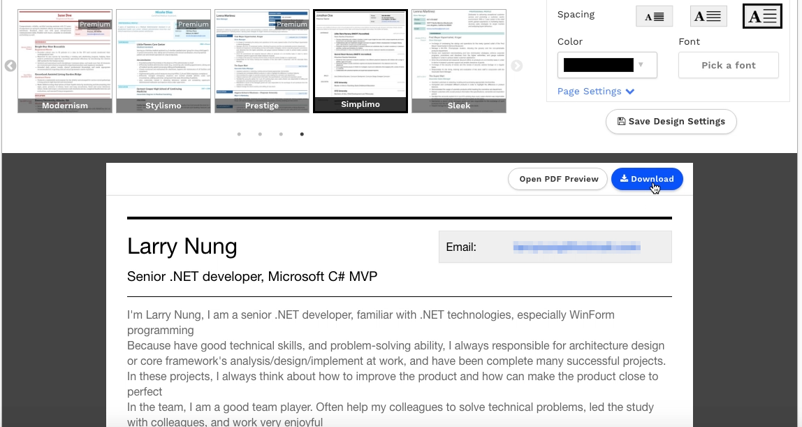
 
 

點選要下載的檔案格式即可取得產出的 Resume 檔。  

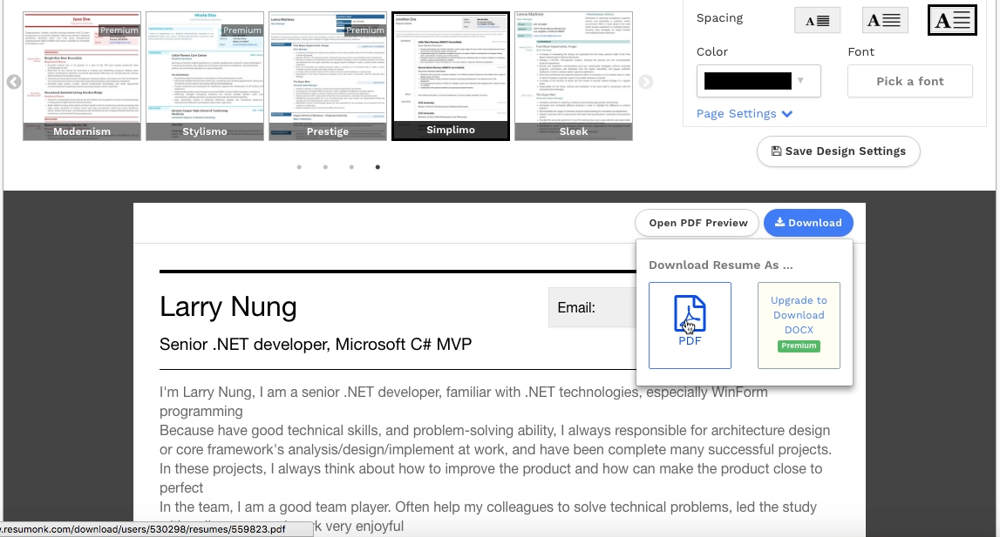
 
 

Link
----
* [Resumonk - Resume Builder, Cover Letter Templates, CV Maker | Resumonk](https://www.resumonk.com/)
