要安裝 R for Windows，首先要至官網下載頁面。    

<!-- More -->

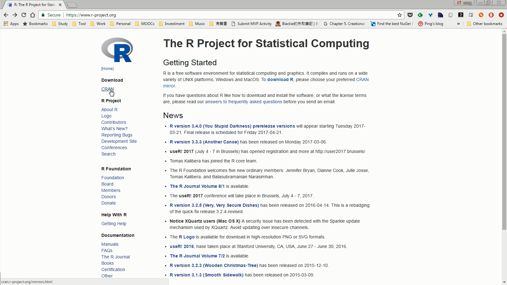

 

選取下載點。  

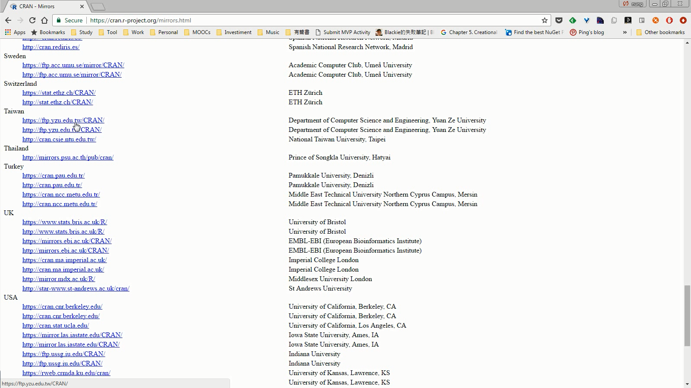

 

選取下載的作業系統版本。  

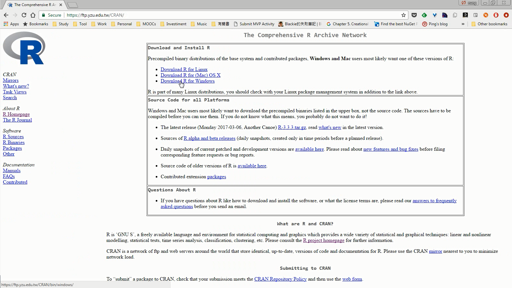

 

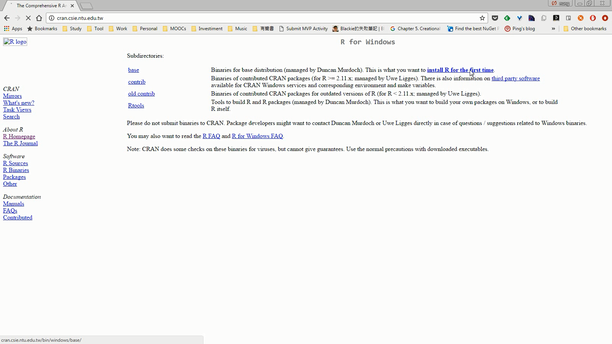

 

下載安裝程式。  

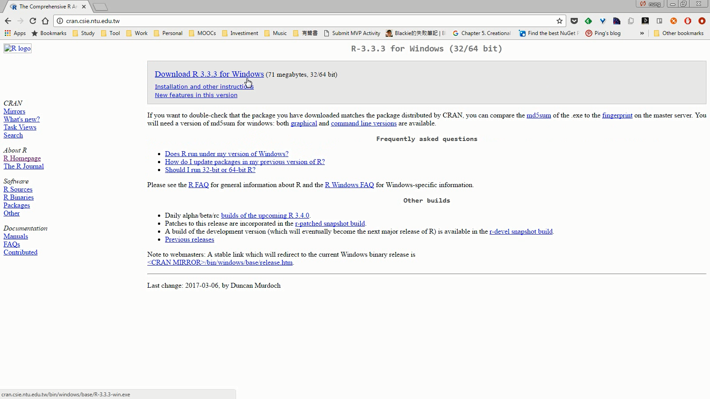

 

點擊下載下來的安裝程式進行安裝。  

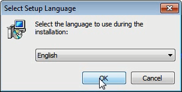

 

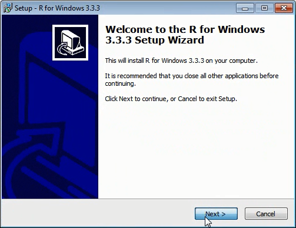

 

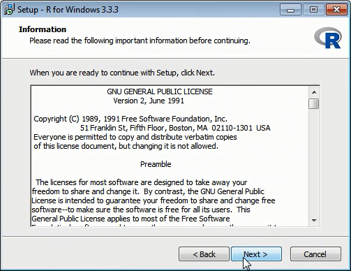

 

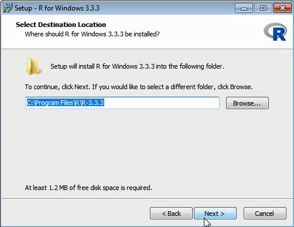

 

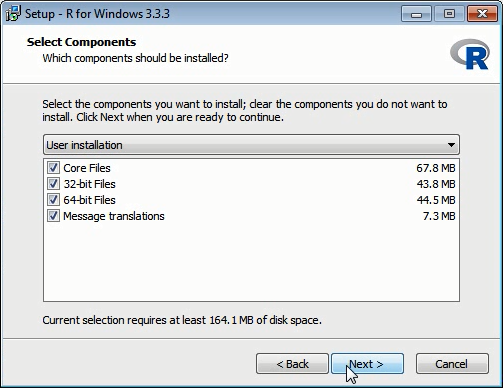

 

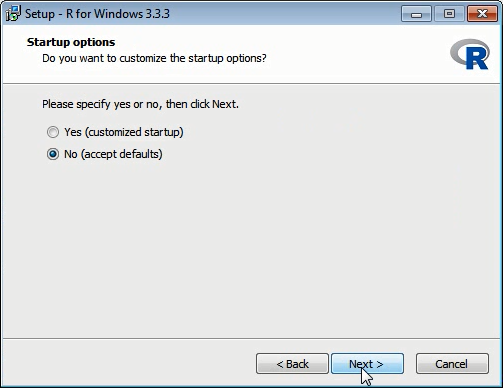

 

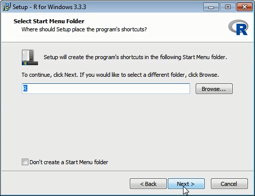

 

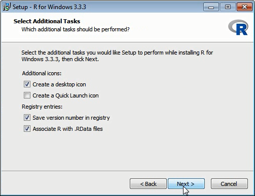

 

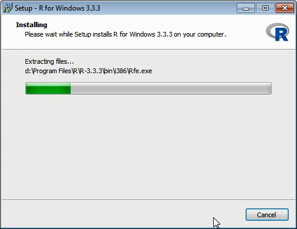

 

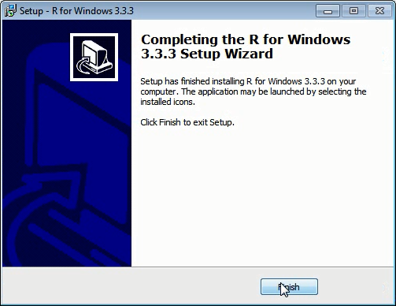

 

安裝完即可開始使用。  

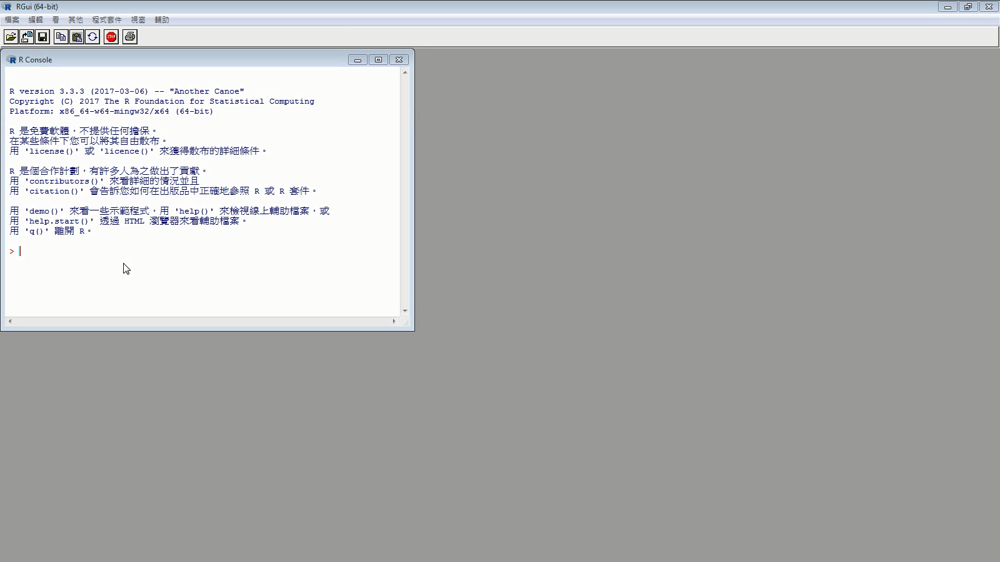

 

Link
----
* [R: The R Project for Statistical Computing](https://www.r-project.org/)
