要安裝 R for Windows，首先要至官網下載頁面。

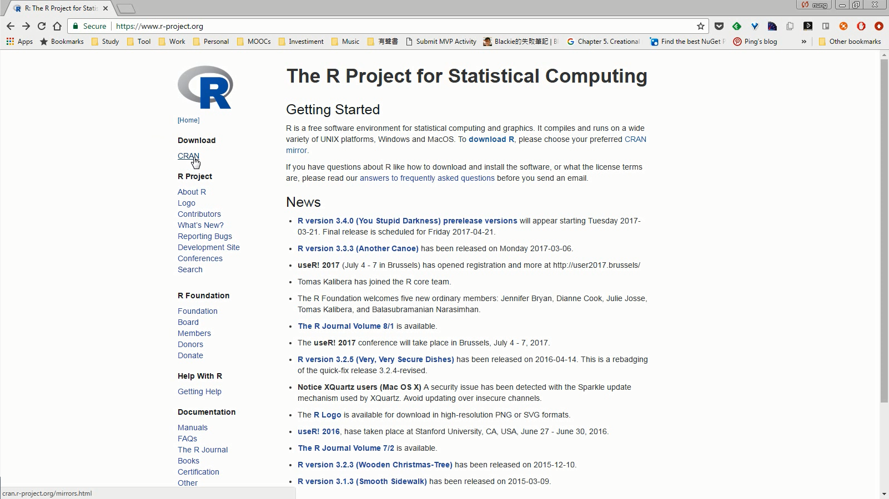

選取下載點。

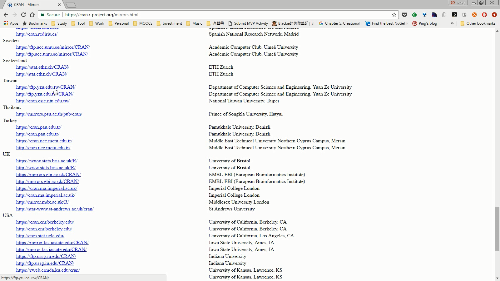

選取下載的作業系統版本。

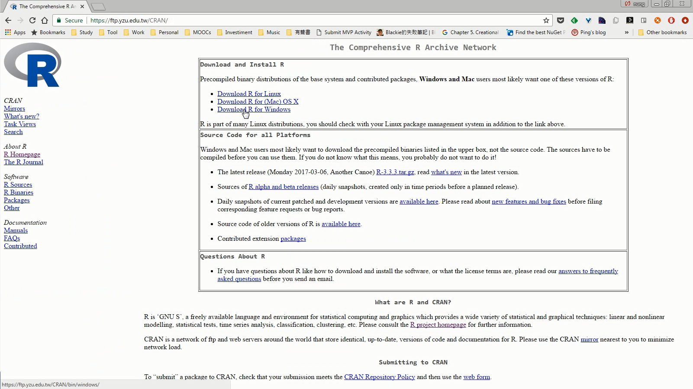

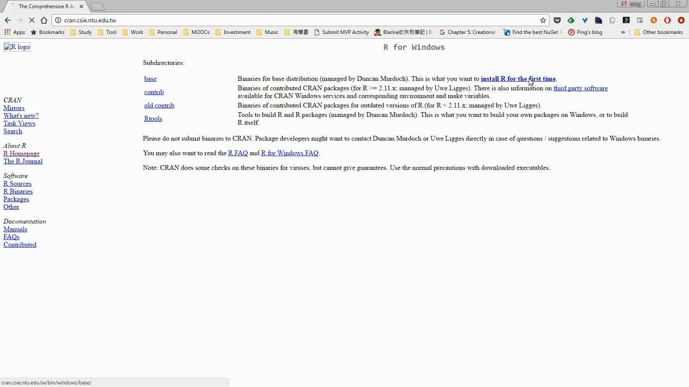

下載安裝程式。

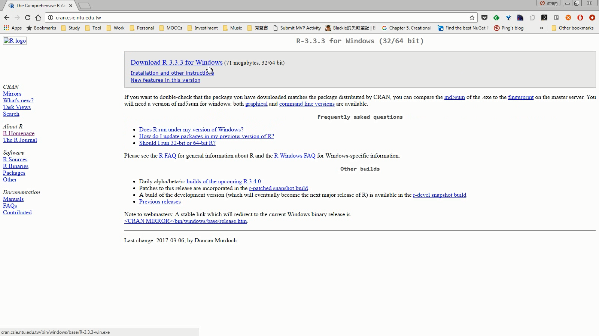

點擊下載下來的安裝程式進行安裝。

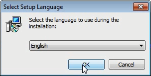

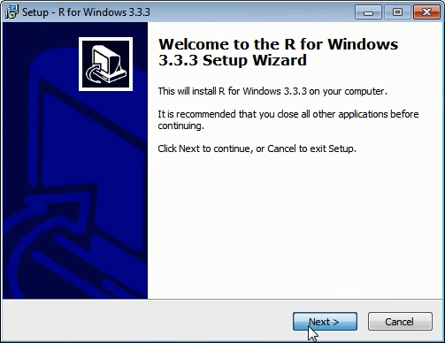

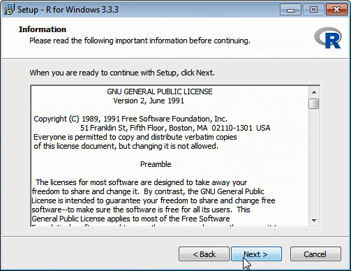

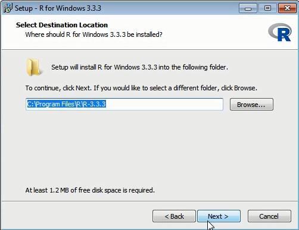

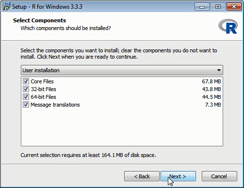

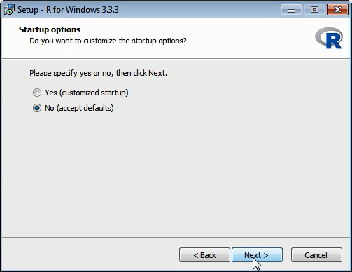

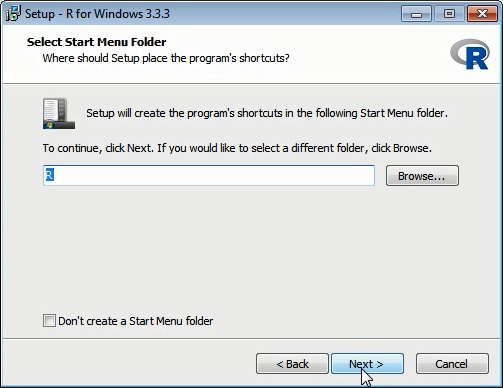

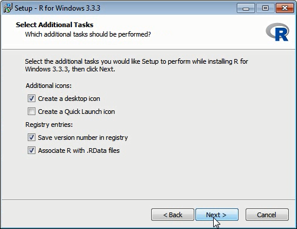

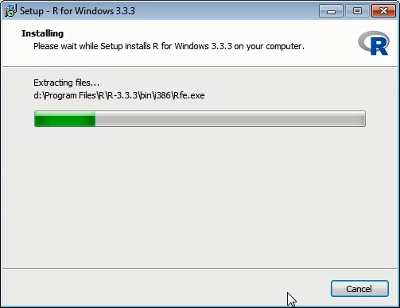

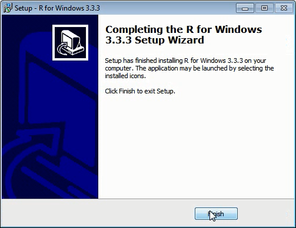

安裝完即可開始使用。

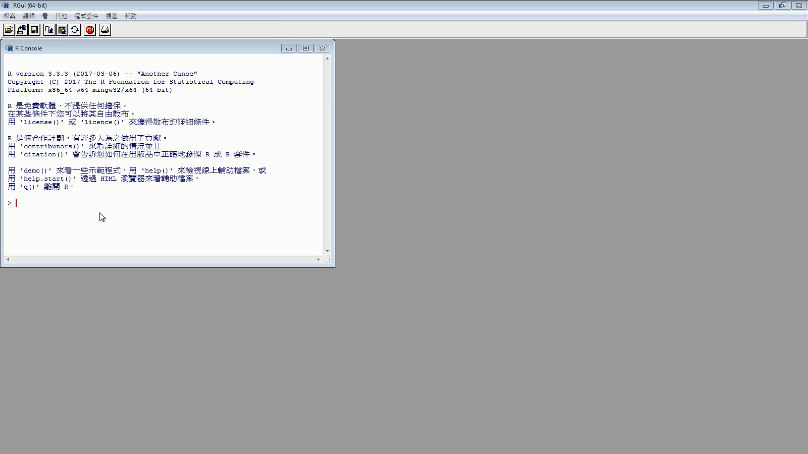

Link
----
* [R: The R Project for Statistical Computing](https://www.r-project.org/)