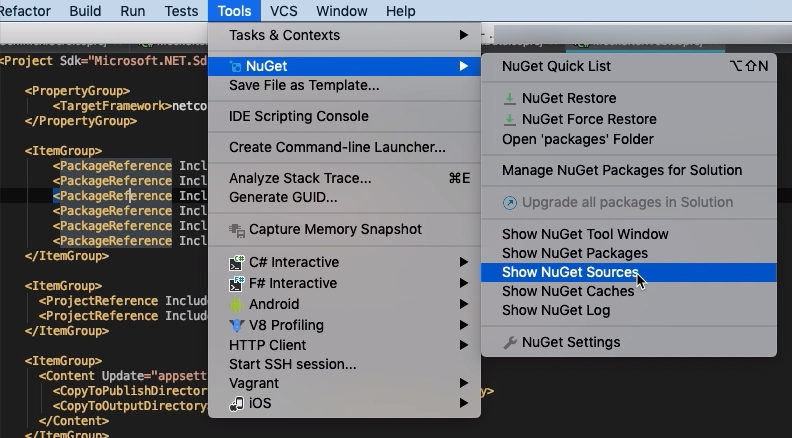
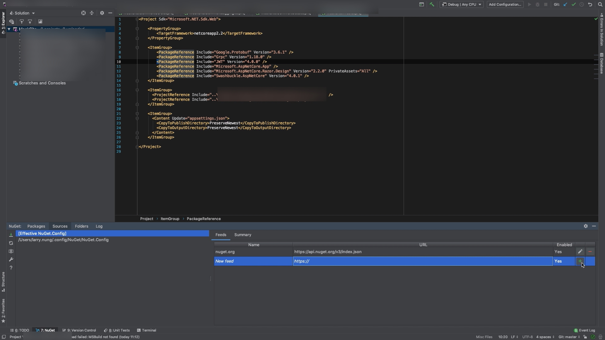
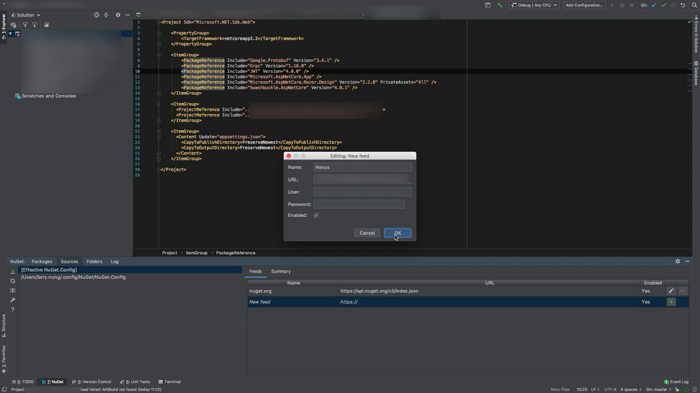
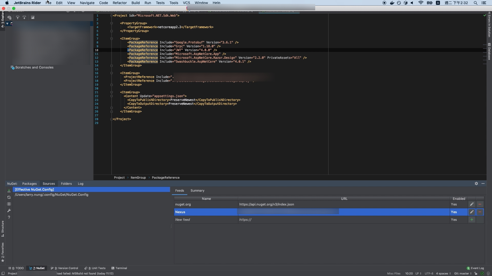

要在 Rider 使用自己的 NuGet feed 去抓取 NuGet 套件，可點選 [ Tools | NuGet | Show NuGet Sources ] 主選單選項。  

<!-- More -->

 

切到 Sources 頁籤，左側選取 Config 檔案，右側切到 Feeds 頁籤，然後點選 New feed 那列後方的 + 按鈕。  

 

填入 NuGet feed 資訊後按下 OK 按鈕即可。  

 

