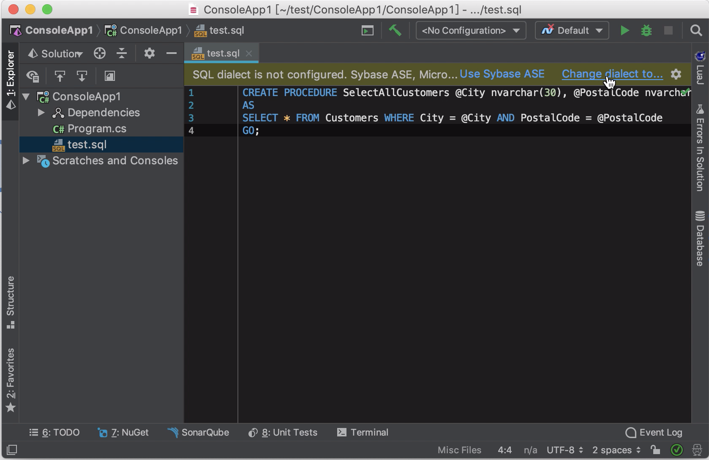
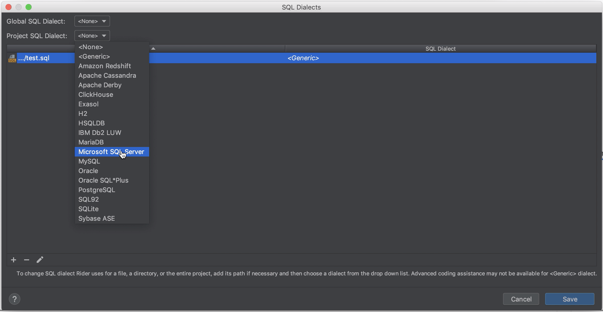
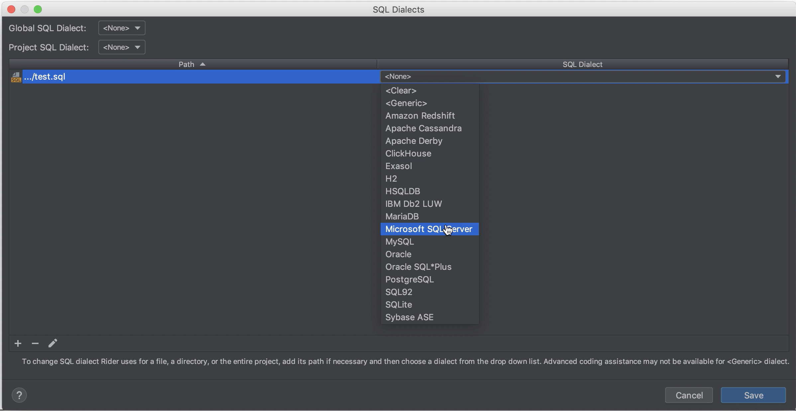
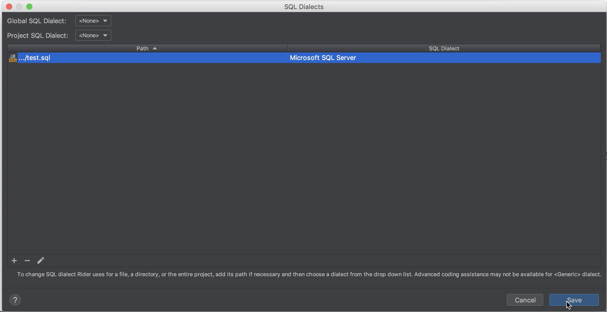
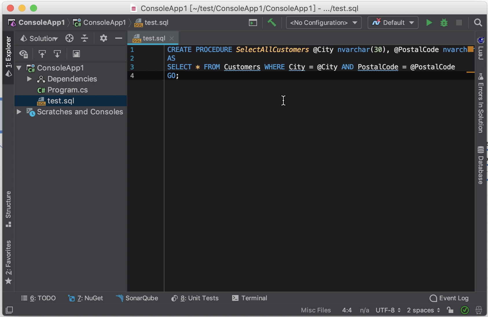
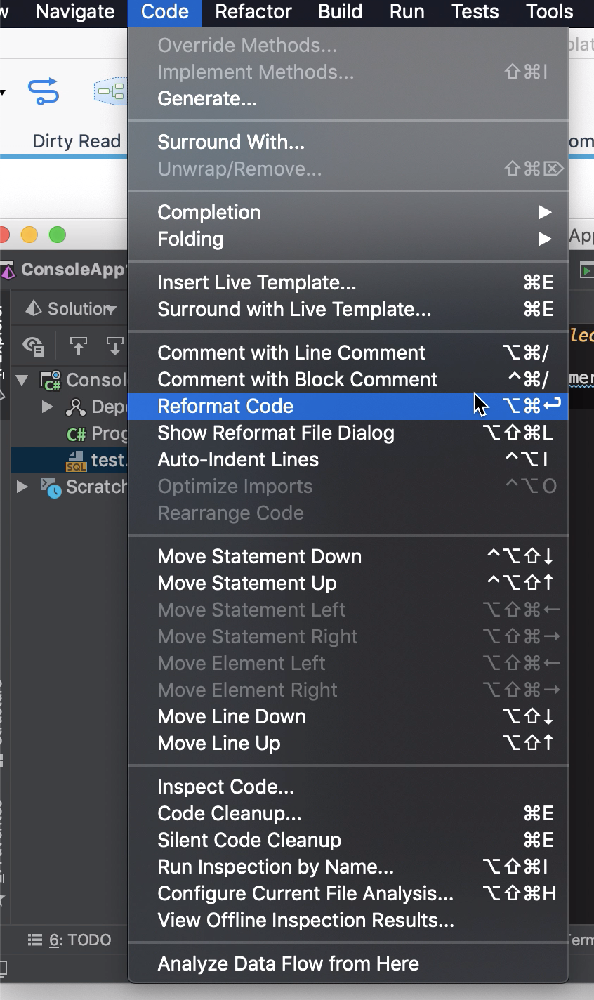
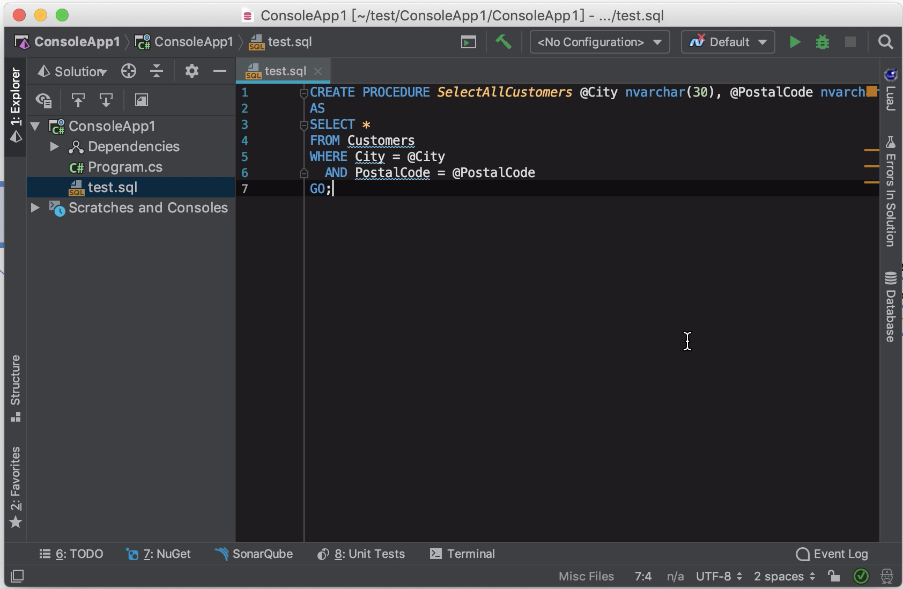

Rider 如果沒設定 SQL dialect，開啟 SQL 檔時上方會有提示訊息，按下 Change dialect to... 按鈕即可設定 SQL dialect。

或是透過滑鼠右鍵快顯選單也可以。

SQL dialect 的設定可分為 Global、Project、與 File 幾個層級。

設定好後按下 Save 按鈕儲存。

SQL dialect 設好後 Rider 就會知道怎麼正確解讀 SQL 檔。

因此能做些對應的支援處理，像是排版、...等。

