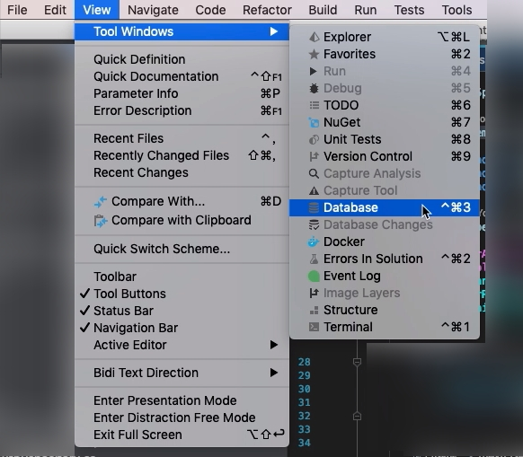
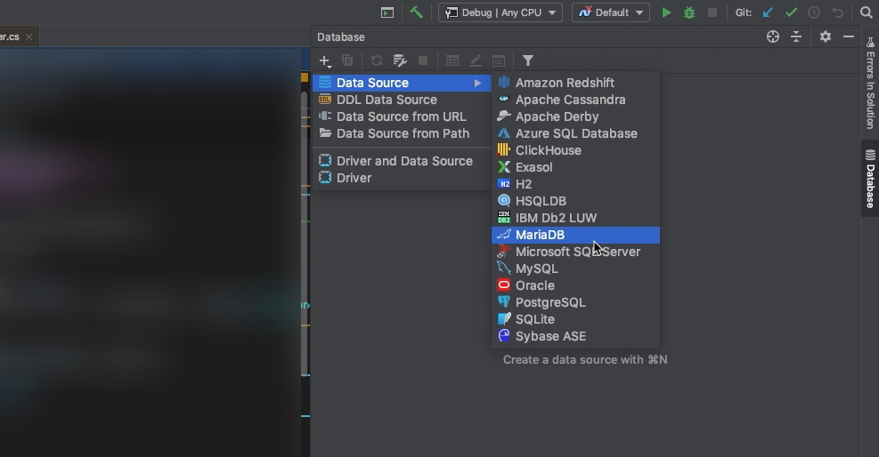
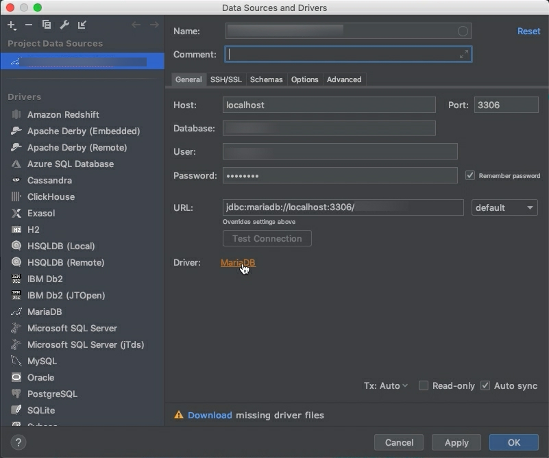
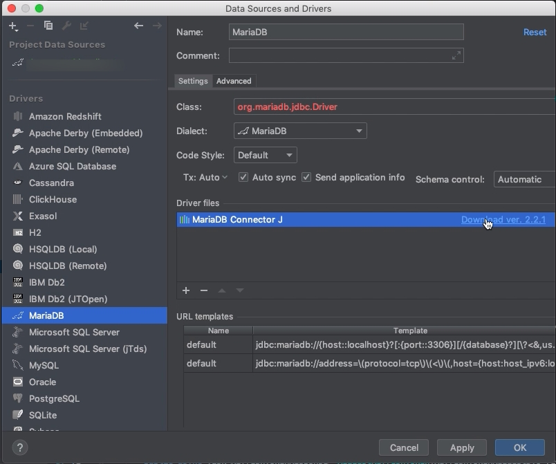
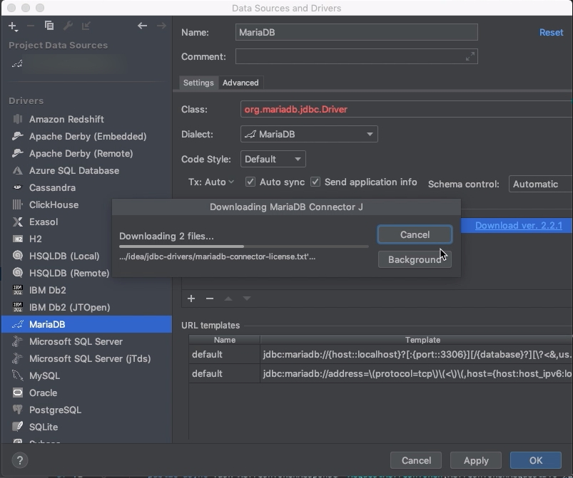
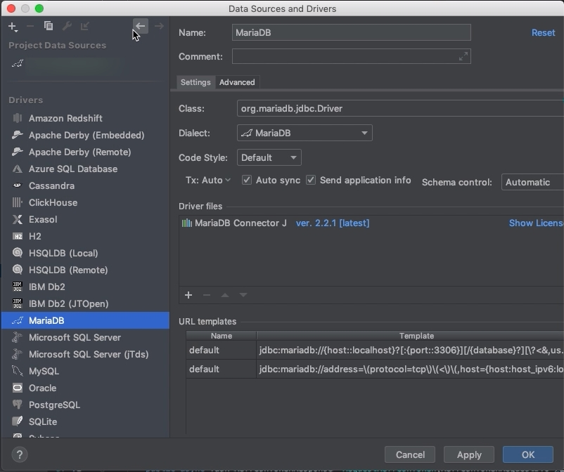
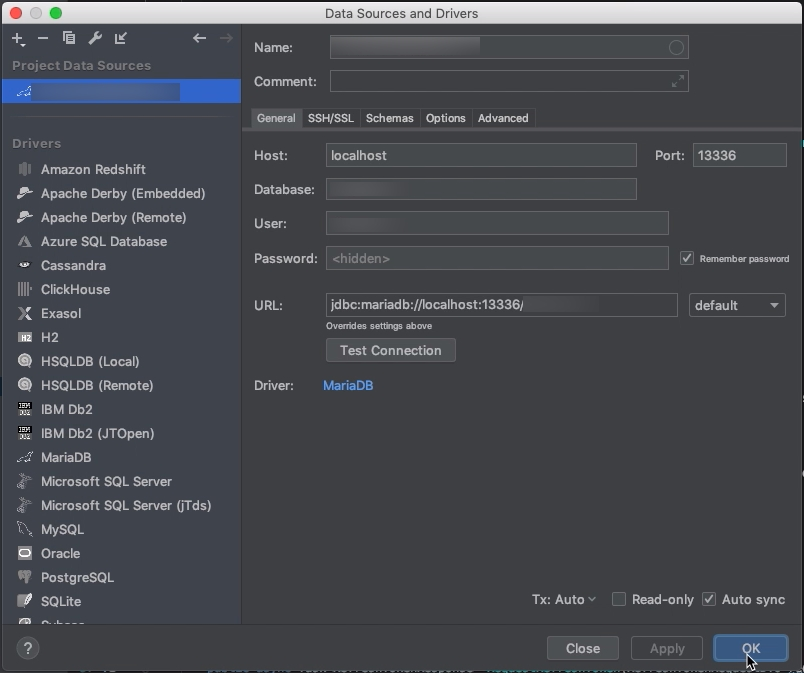
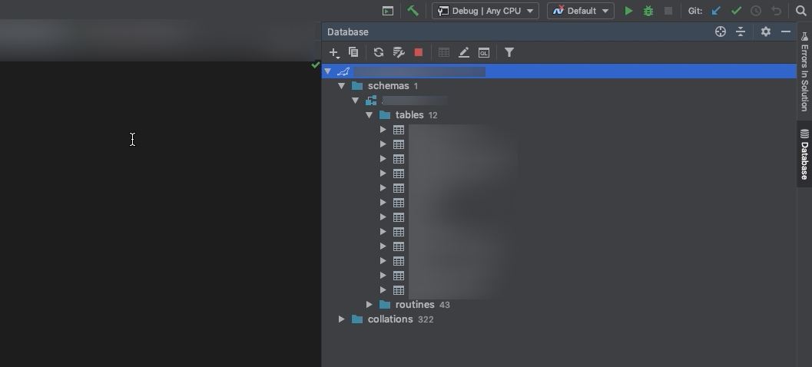

要透過 Rider 連線 MariaDB 做些操作，可以點選 [ View | Tool Windows | Database ] 主選單選項，開啟 Database 視窗。  

<!-- More -->

 

然後點選 Database 視窗工具列上的新增按鈕，新增 MariaDB 的 Data Source。  

 

點選 Data Sources and Drivers 視窗中的 MariaDB Driver 按鈕，或是自行切到 MariaDB Driver 頁籤。  

 

在 Driver files 那邊點選下載 Driver。  

 

 

下載完回到 Data Source。  

 

帶入 Data Source 的資訊後按下 OK 按鈕。

 

即可在 Database 視窗透過加入的 Data Source 連線到 MariaDB，並進一步對資料庫進行操作。  

