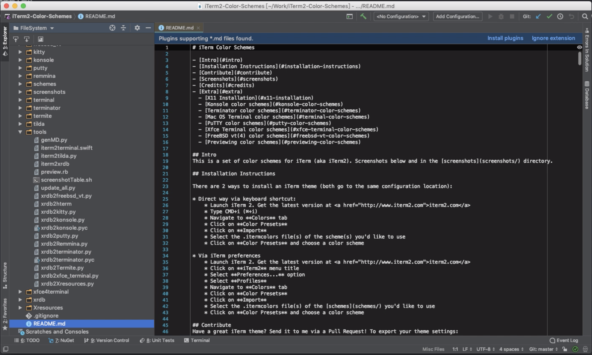
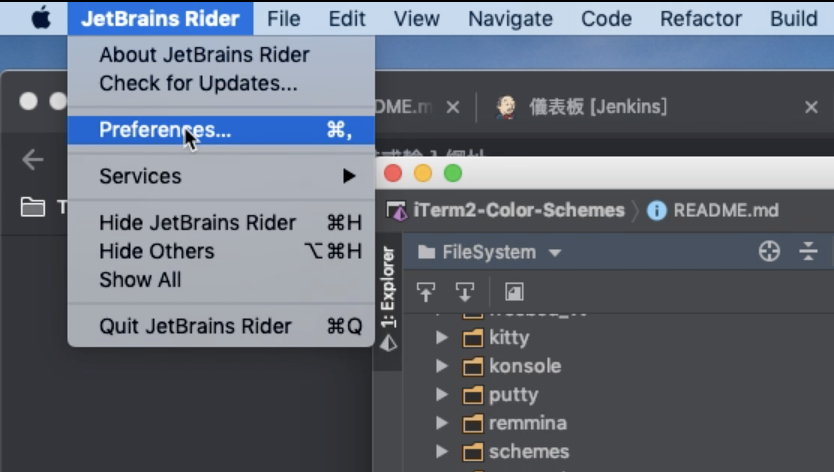
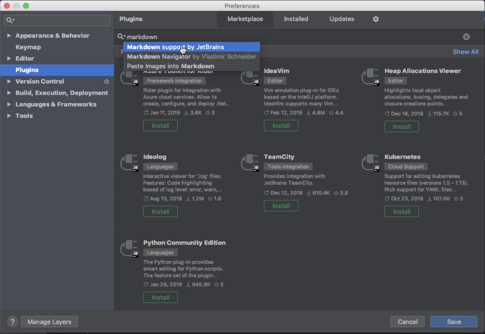
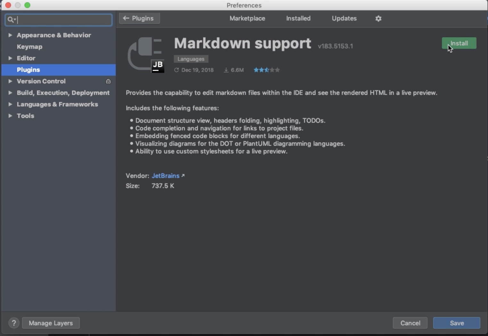
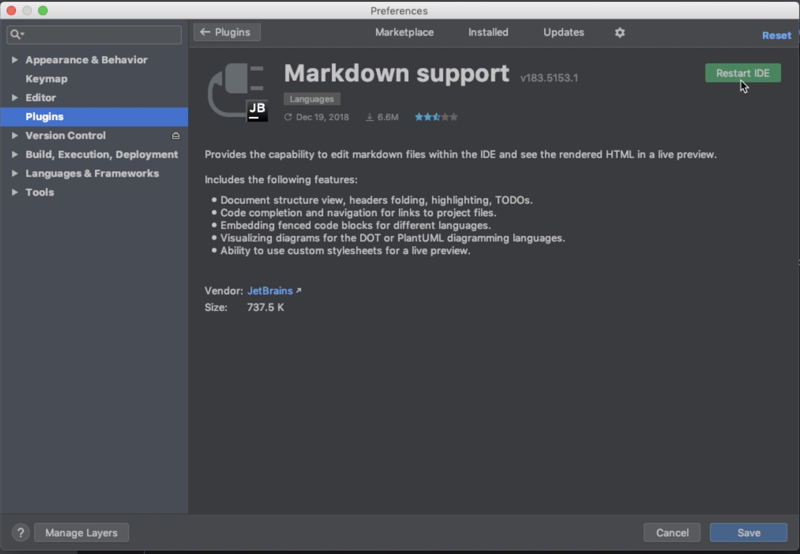
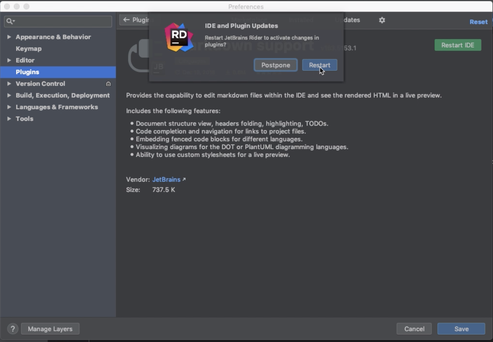
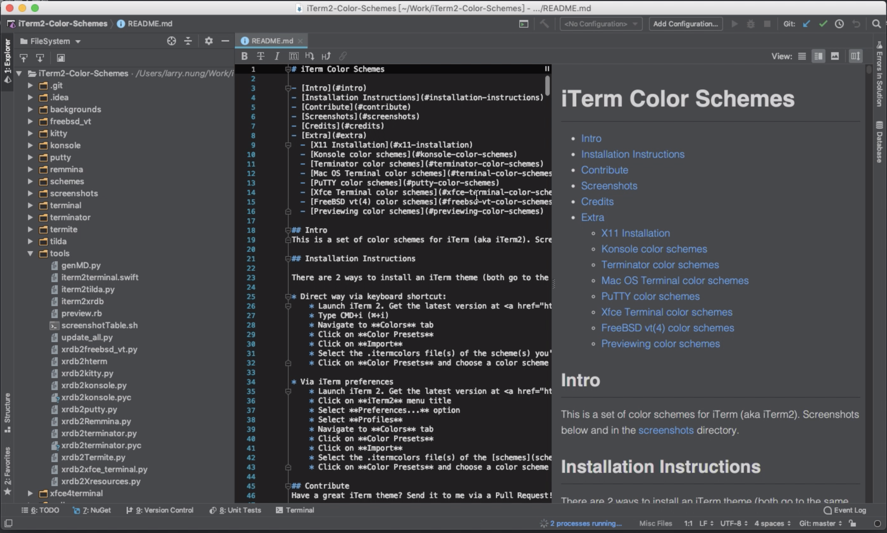

Rider 原生對 Markdown 並未支援，在 Markdown 的編寫上就是類似一般的文字編輯器。

<!-- More -->

 

撰寫起來並不是特別方便。如果要讓 Rider 支援 Markdown，可加裝 Markdown support plugin。  

 

點選 [JetBrains Rider | Perferences...] 主選單選項開啟 Perferences 視窗。  

 

點選切換到 Plugins，搜尋 Markdown support 套件。  

 

點選 Install 按鈕進行套件的安裝。  

 

安裝完後重啟 Rider。  

 

 

Rider 就可以支援 Markdown 了，像是可以直接看到 Markdown 的預覽。

 

Link
----
* [Markdown support - Plugins | JetBrains](https://plugins.jetbrains.com/plugin/7793-markdown-support)
