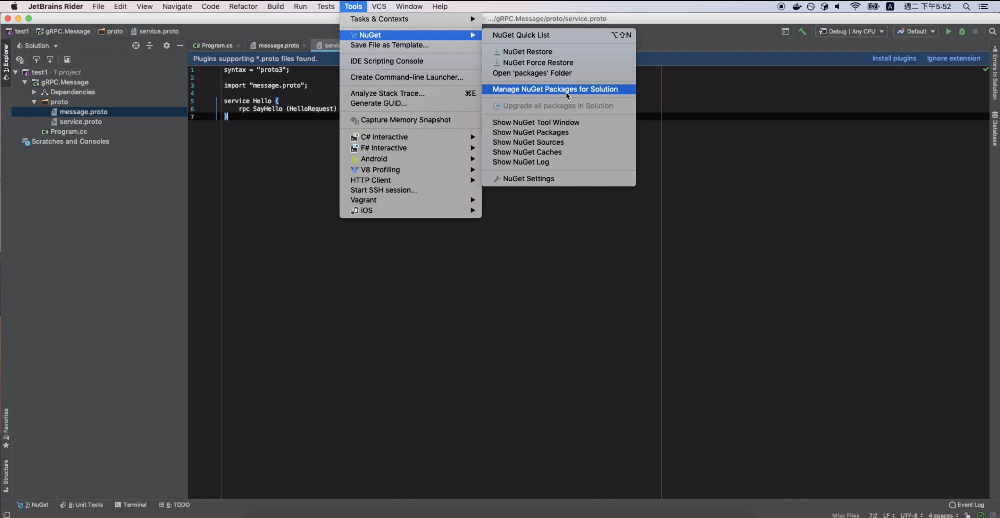
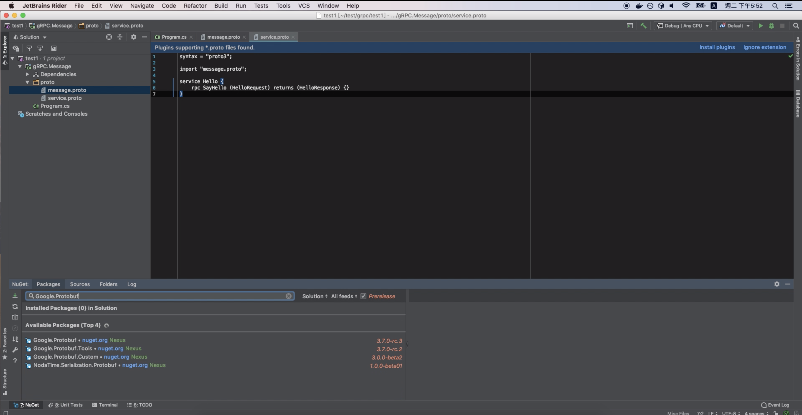
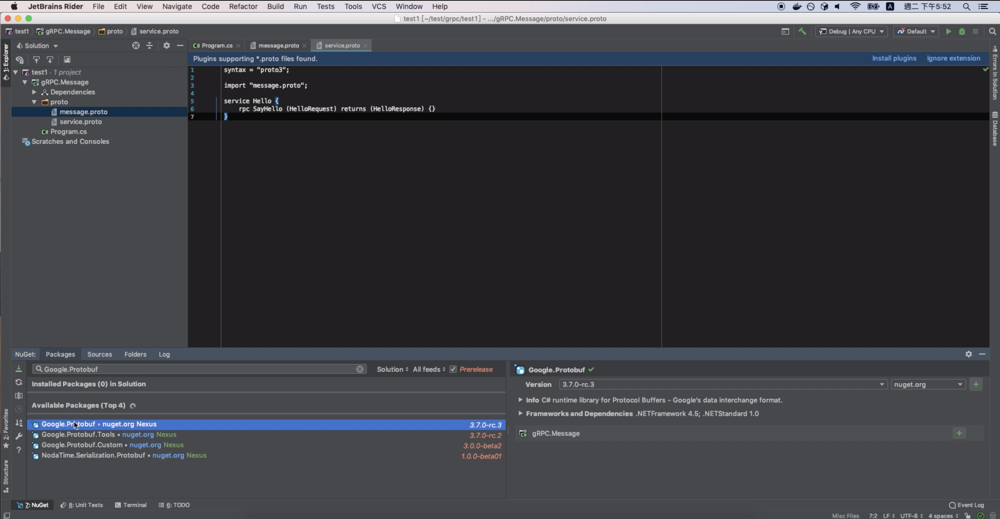
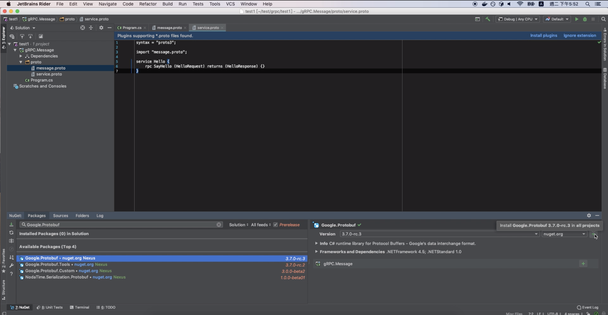
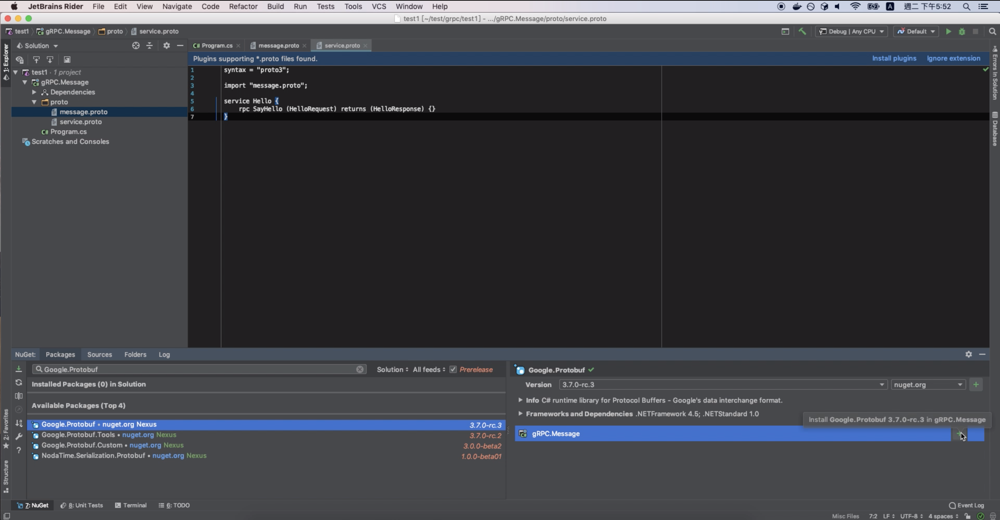
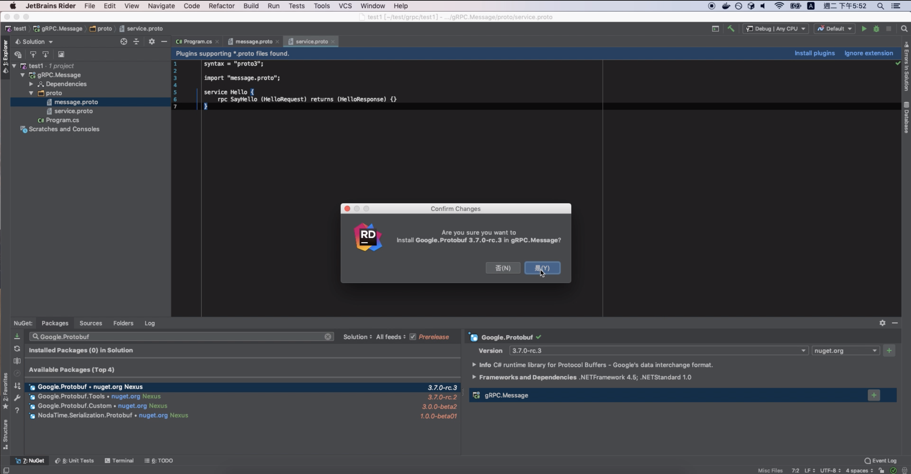
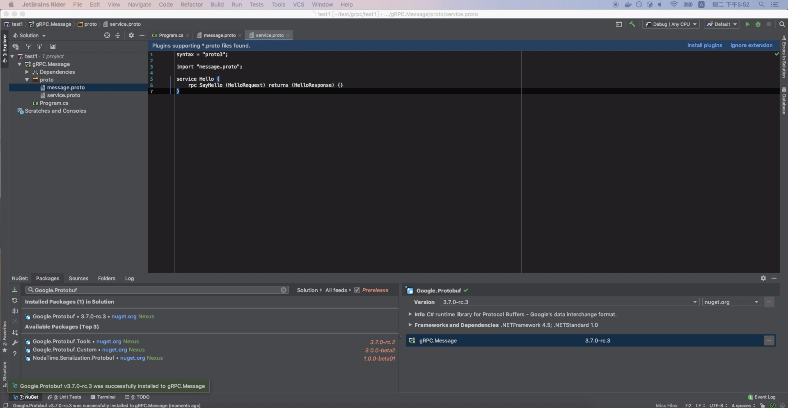

要用 Rider 管理 Nuget 套件，可點選 [Tools | NuGet | Manage NuGet Packages for Solution] 主選單選項。  

<!-- More -->

 

NuGet Tool Window 會被帶出，在搜尋框中搜尋要安裝的套件。  

 

在 Available Packages 那邊選取要安裝的套件。  

 

這邊可以選取要安裝的版本與 Registry，選取後面的 + 按鈕安裝套件到方案中。  

 

或是選取下面專案後方的 + 按鈕安裝套件到指定專案中。  

 

 

安裝完後安裝的套件會在 NuGet Tool Window 的 Installed Packages 那邊，剛剛的 + 按鈕會變為 - 按鈕，按下後可進行套件的移除。

 
