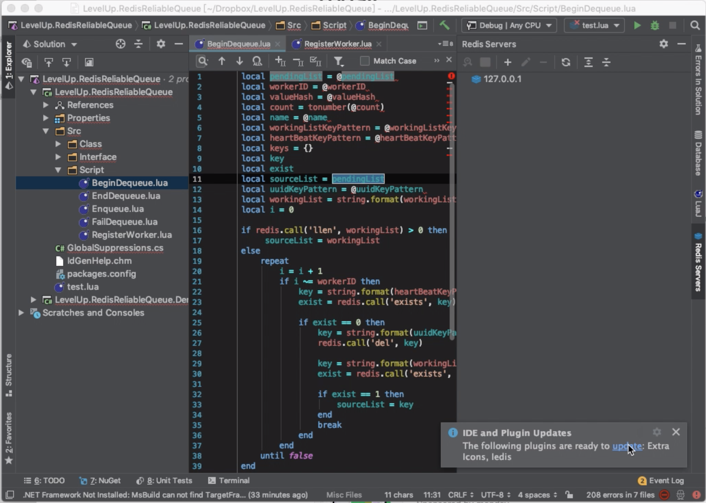
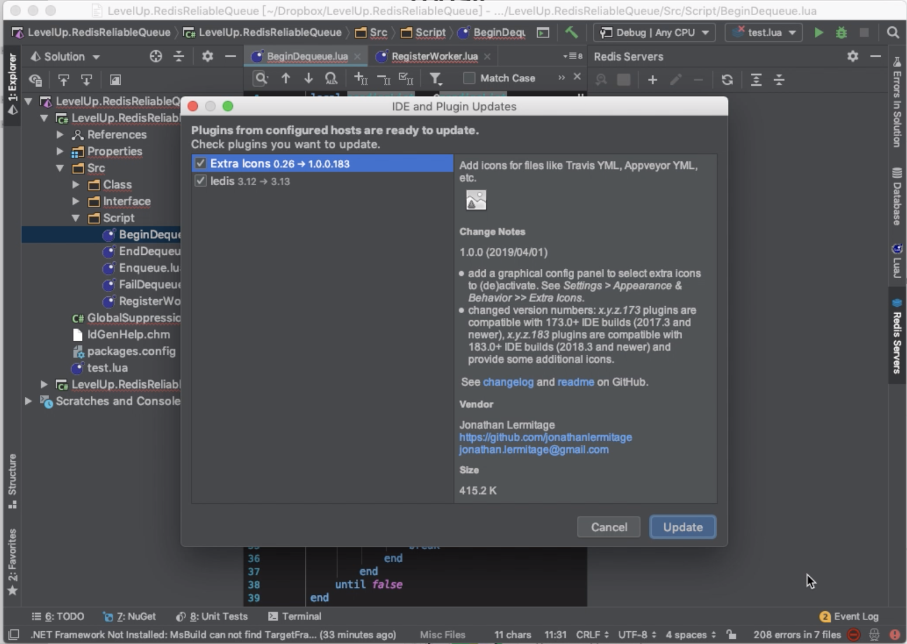
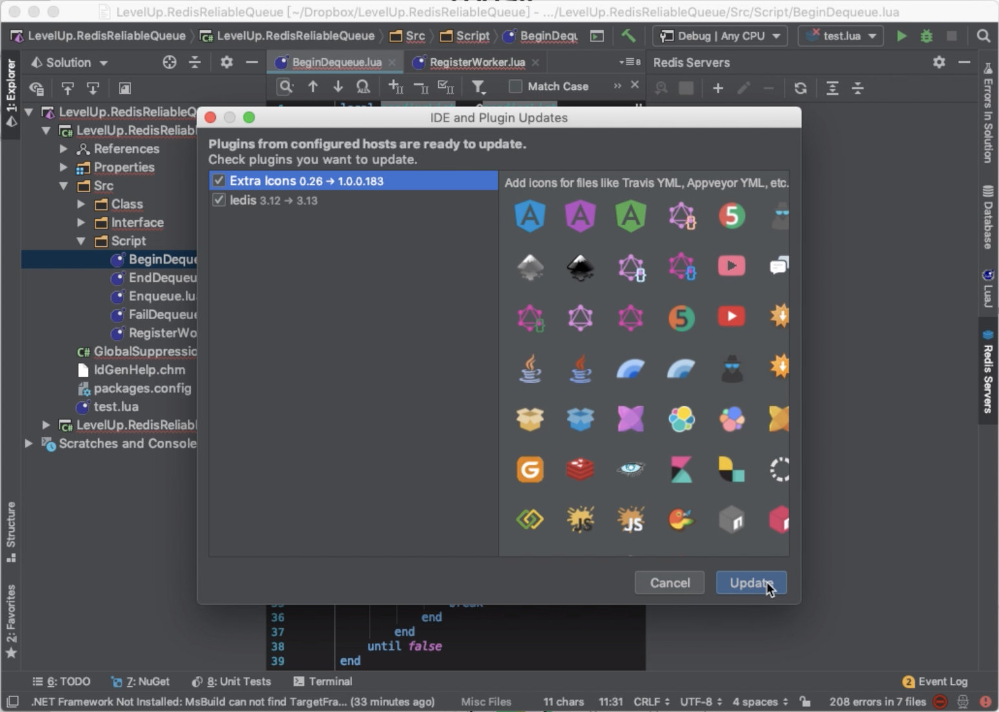
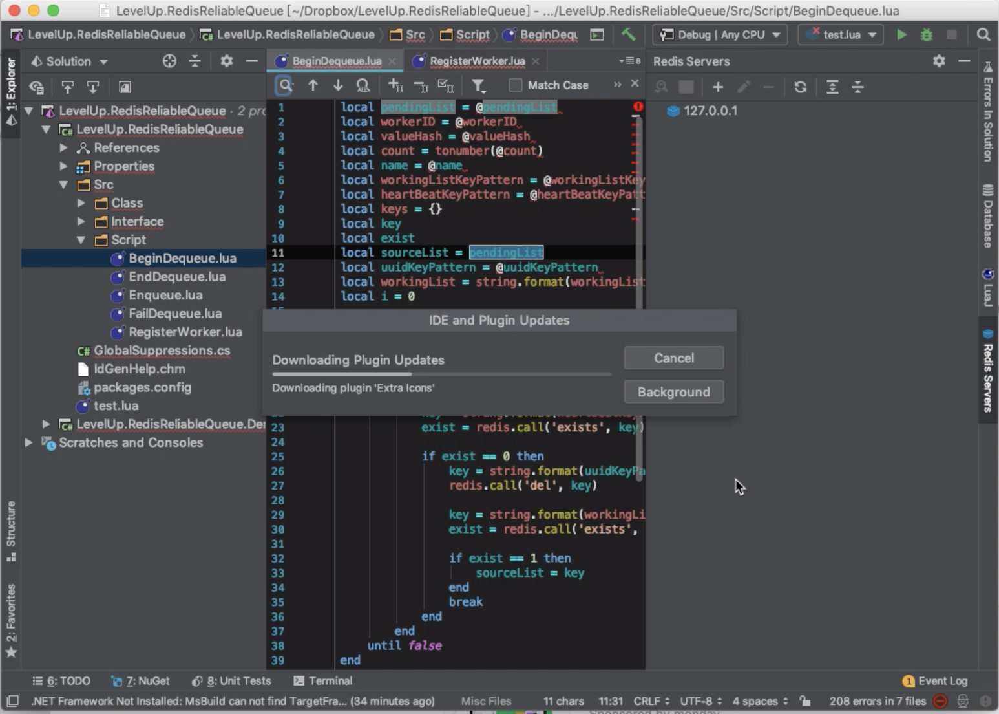
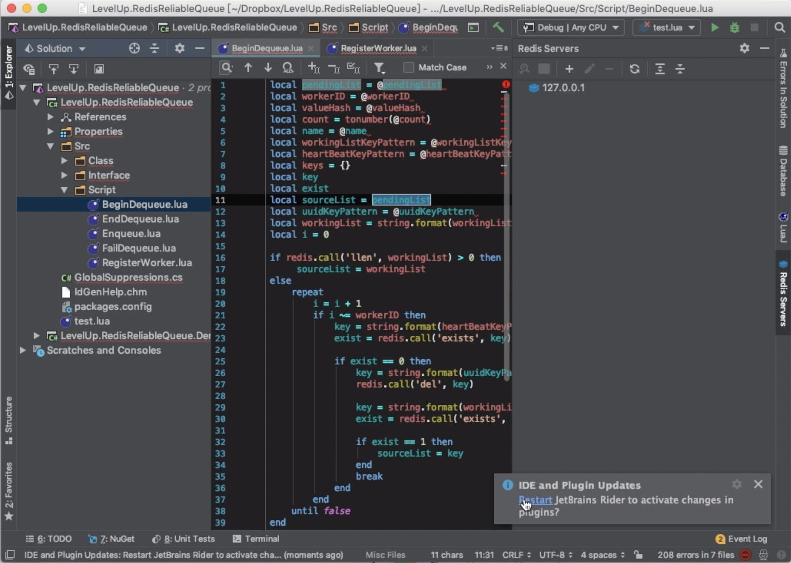
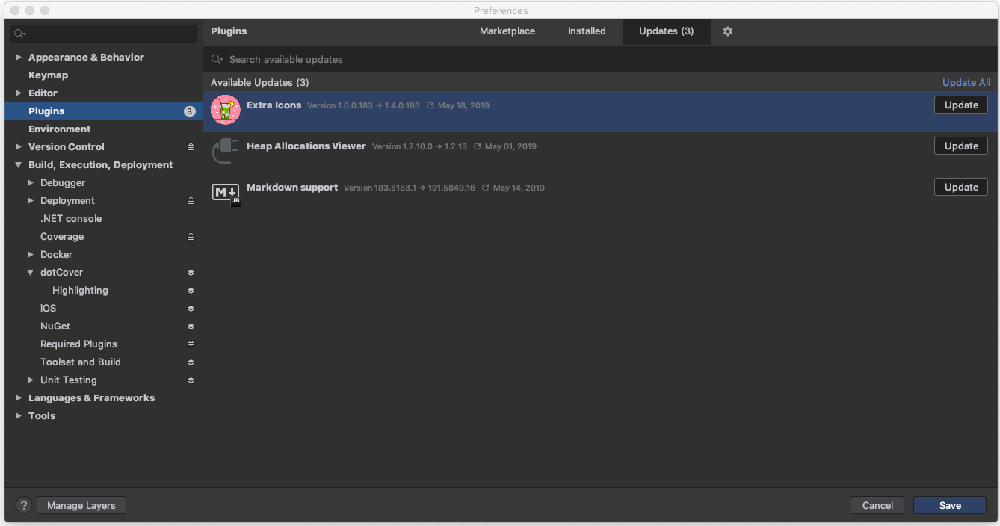

要更新 Rider 的套件，可以透過 Rider 的更新自動偵測，當偵測到套件有更新時，Rider 的右下方會看到更新通知框，人框告知哪些套件可供更新，點選更新通知框內的 update 連結。   

<!-- More -->

 

在 IDE and Plugin Updates 對話框中查閱套件的更新資訊。  

 

勾選要套用更新的套件，然後按下 Update 按鈕。  

 

套件即會開始進行更新的動作。  

 

更新完成重啟 Rider，套件更新即會生效。  

 

除了透過更新通知框，也可以將 Preferences 對話框，左側切到 Plugins 頁籤，右側切到 Updates，挑選要更新的套件按下 Update 按鈕進行套件的更新。  

