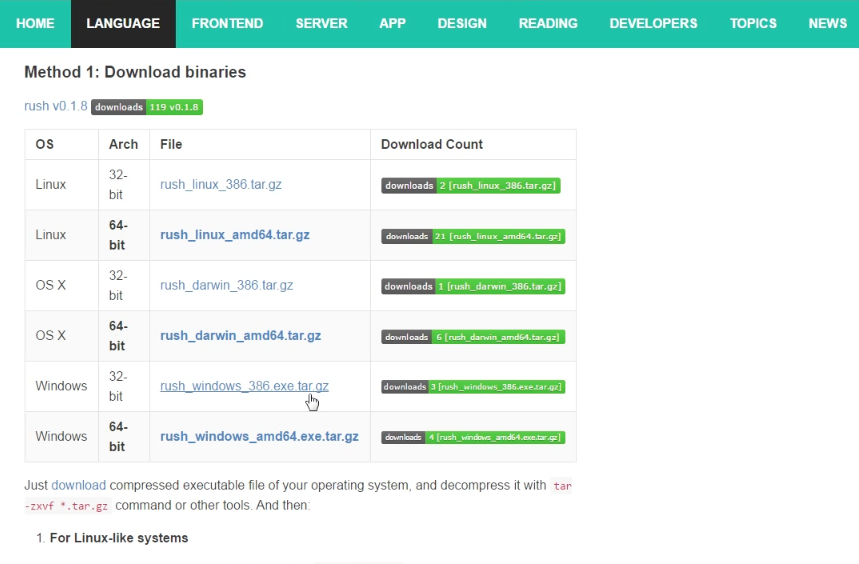
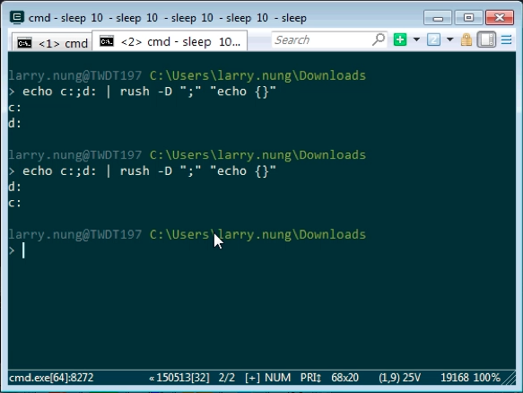
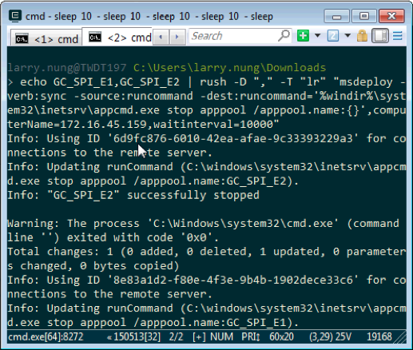

rush 是一跨平台的命令列工具，能用來並行指定的命令。  

<!-- More -->

<br/>


自官網上下載下來後解壓縮即可使用。  



<br/>


其使用方式如下：  

```
rush -- a cross-platform command-line tool for executing jobs in parallel

Version: 0.1.9

Author: Wei Shen <shenwei356@gmail.com>

Homepage: https://github.com/shenwei356/rush

Usage:
  rush [flags] [command] [args of command...]

Examples:
  1. simple run, quoting is not necessary
      $ seq 1 10 | rush echo {}
  2. keep order
      $ seq 1 10 | rush 'echo {}' -k
  3. timeout
      $ seq 1 | rush 'sleep 2; echo {}' -t 1
  4. retry
      $ seq 1 | rush 'python script.py' -r 3
  5. dirname & basename & remove suffix
      $ echo dir/file_1.txt.gz | rush 'echo {/} {%} {^_1.txt.gz}'
          dir file.txt.gz dir/file
      6. basename without last or any extension
          $ echo dir.d/file.txt.gz | rush 'echo {.} {:} {%.} {%:}'
          dir.d/file.txt dir.d/file file.txt file
      7. job ID, combine fields and other replacement strings
          $ echo 12 file.txt dir/s_1.fq.gz | rush 'echo job {#}: {2} {2.} {3%:^_1}'
          job 1: file.txt file s
      8. capture submatch using regular expression
          $ echo read_1.fq.gz | rush 'echo {@(.+)_\d}'
          read
      9. custom field delimiter
          $ echo a=b=c | rush 'echo {1} {2} {3}' -d =
          a b c
      10. custom record delimiter
          $ echo a=b=c | rush -D "=" -k 'echo {}'
          a
          b
          c
          $ echo abc | rush -D "" -k 'echo {}'
          a
          b
          c
      11. assign value to variable, like "awk -v"
          $ seq 1 | rush 'echo Hello, {fname} {lname}!' -v fname=Wei -v lname=Shen
          Hello, Wei Shen!
      12. preset variable (Macro)
          # equal to: echo read_1.fq.gz | rush 'echo {:^_1} {:^_1}_2.fq.gz'
          $ echo read_1.fq.gz | rush -g -v p={:^_1} 'echo {p} {p}_2.fq.gz'
          read read_2.fq.gz
      13. save successful commands to continue in NEXT run
          $ seq 1 3 | rush 'sleep {}; echo {}' -c -t 2
          [INFO] ignore cmd #1: sleep 1; echo 1
          [ERRO] run cmd #1: sleep 2; echo 2: time out
          [ERRO] run cmd #2: sleep 3; echo 3: time out
    
      More examples: https://github.com/shenwei356/rush
    
    Flags:
      -v, --assign stringSlice        assign the value val to the variable var (format: var=val, val also supports replacement strings)
      -c, --continue                  continue jobs. NOTES: 1) successful commands are saved in file (given by flag -C/--succ-cmd-file); 2) if the file does not exist, rush saves data so we can continue jobs next time; 3) if the file exists, rush ignores jobs in it and update the file
          --dry-run                   print command but not run
      -d, --field-delimiter string    field delimiter in records, support regular expression (default "\s+")
      -i, --infile stringSlice        input data file, multi-values supported
      -j, --jobs int                  run n jobs in parallel (default value depends on your device) (default 4)
      -k, --keep-order                keep output in order of input
      -n, --nrecords int              number of records sent to a command (default 1)
      -o, --out-file string           out file ("-" for stdout) (default "-")
      -D, --record-delimiter string   record delimiter (default is "
") (default "
")
      -J, --records-join-sep string   record separator for joining multi-records (default is "
") (default "
")
      -r, --retries int               maximum retries (default 0)
          --retry-interval int        retry interval (unit: second) (default 0)
      -e, --stop-on-error             stop all processes on first error(s)
      -C, --succ-cmd-file string      file for saving successful commands (default "successful_cmds.rush")
      -t, --timeout int               timeout of a command (unit: second, 0 for no timeout) (default 0)
      -T, --trim string               trim white space (" 	
") in input (available values: "l" for left, "r" for right, "lr", "rl", "b" for both side)
          --verbose                   print verbose information
      -V, --version                   print version information and check for update
```

<br/>


比較重要的參數有 -D、-k、-T。  

<br/>


在 Windows 上使用只要用 echo 將參數透過 pipline 送進 rush，如有多個參數，rush 可用 -D 帶入分隔符號，透過 pipline 帶入 rush 的參數即會用設定的分隔符號切割帶入 rush 後面設定的命令，命令的中要使用參數的部分可用 {} 替代。  

<br/>


所以如果要併發列出參出，我們可以像下面這樣調用：  

    echo <Param1><Seperater><Param2>[...] | rush -D "<Seperater>" "<Command>"



<br/>


像是上圖這樣調用，rush 後面接的是 echo 命令，所以 rush 會幫我們併發列出帶入的參數，也就是併發列出 c: 與 d:，執行完成的順序並無固定。  

<br/>


如果要控制完成的順序，可加帶 -k 參數。  

    echo <param1><seperater><param2>[...] | rush -D "<seperater>" -k "<command>"


<br/>


這樣的工具能幫我們併發做很多事情，像是透過 Web Deploy 並行停止遠端的站台。

    echo <Site1>,<Site2> | rush -D "," -T "lr" "msdeploy -verb:sync -source:runcommand -dest:runcommand='%windir%\system32\inetsrvppcmd.exe stop apppool /apppool.name:{}',computerName=<IPAddress>,waitinterval=10000"



<br/>


Link
----
* [shenwei356/rush: A cross-platform command-line tool for executing jobs in parallel](https://github.com/shenwei356/rush)
