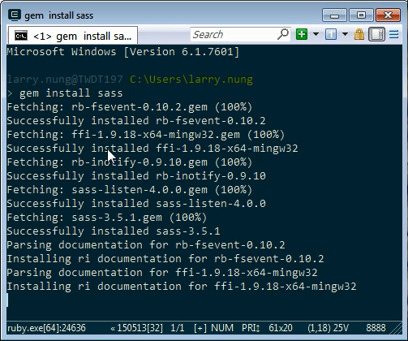
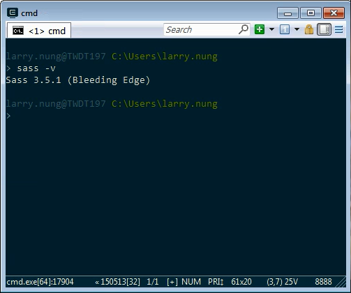

Sass 依賴於 Ruby，Sass 安裝前需先安裝 Ruby。  

<!-- More -->

Ruby 安裝完後再用 RubyGems 安裝 sass 套件即可。  

    gem install sass

 

安裝完後可查詢 Sass 版本做個確認，沒意外的話應該可以看到 Sass 命令正常運作，會顯示當前 Sass 版本。  

    sass -v

 

Link
----
* [Sass: Install Sass](http://sass-lang.com/install)
