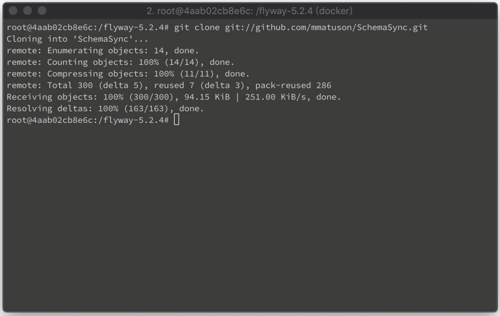
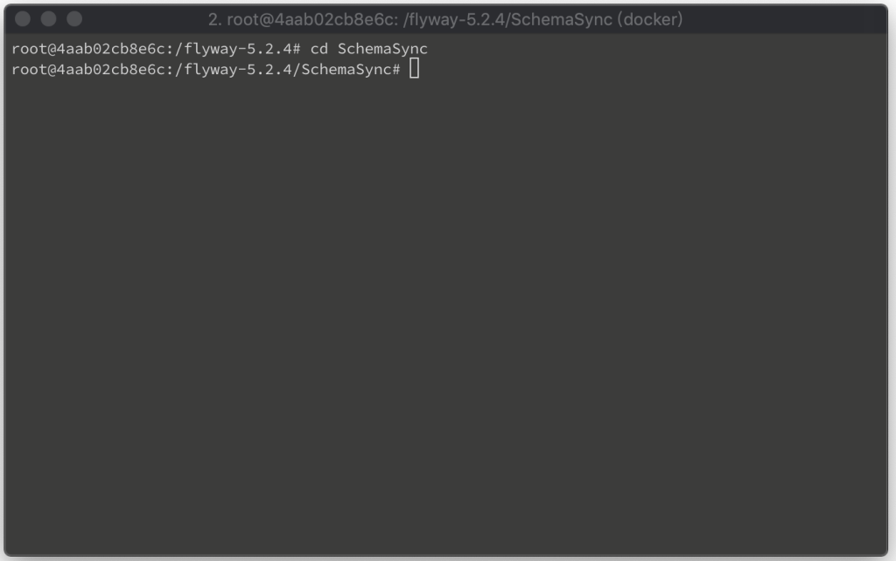
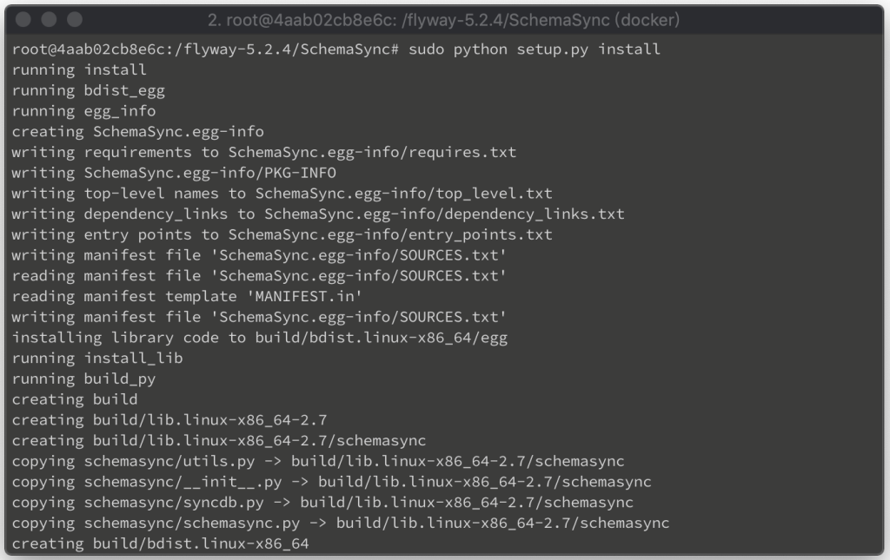
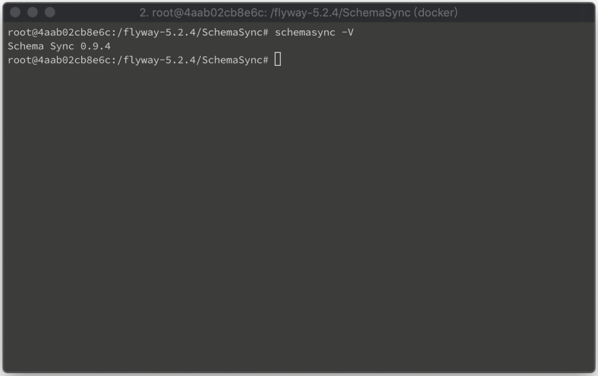

要安裝 SchemaSync 最新的開發版，先將 SchemaSync 用 git clone 下來。

git clone git://github.com/mmatuson/SchemaSync.git

然後切到 clone 下來的目錄。

cd SchemaSync

透過 Python 調用 setup.py 進行安裝。

sudo python setup.py install

安裝完可調用命令查驗版本，確認安裝無誤。

schemasync -V

Link
=====
* [Schema Sync a MySQL Schema Versioning and Migration Utility](http://mmatuson.github.io/SchemaSync/)