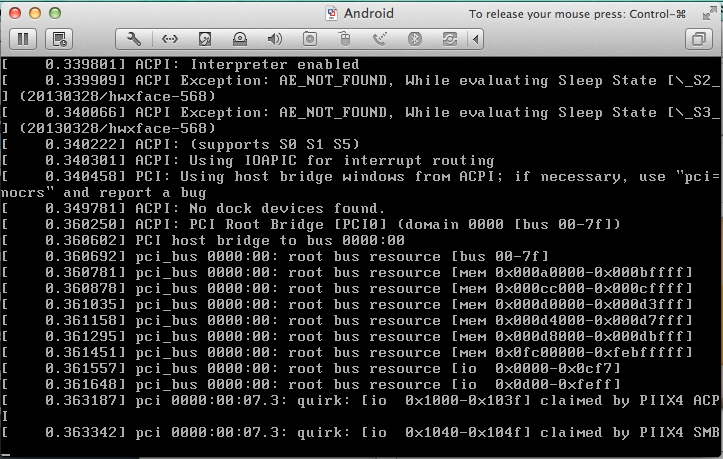
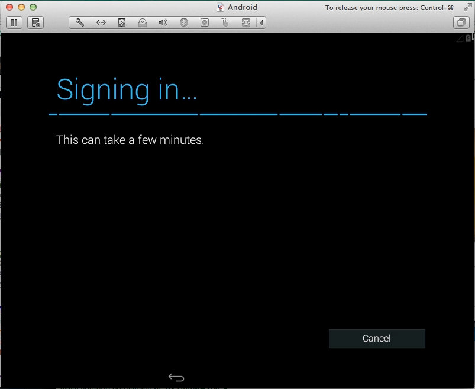

使用 Virtual Machine 安裝 Android X86，先要下載 Android X86 的映像檔。  

<!-- More -->

 

接著增加一個新的虛擬機。  

 

由剛下載的映像檔進行安裝。  

 

 

 

 

安裝前可調整一下虛擬機的設定。  

 

 

設定虛擬機名稱存檔。  

 

 

選取 `Installation - Install Android-x86 to harddisk` 進行安裝。  

 

 

安裝前要先切割 partition。  

 

 

 

 

 

 

 

 

 

接著選取剛建立的 Partition 進行安裝。  

 

選擇檔案系統的格式。  

 

 

 

 

 

 

安裝完後就可以開始運行 Android 系統。  

 

 

 

 

 

 

 

 

 

 

 

 

 

 

 

 

 

 

Link
----
* [Android-x86 - Porting Android to x86](http://www.android-x86.org/)
