Sikulix 程式可到[這邊](https://launchpad.net/sikuli/sikulix/1.1.0)下載。  

<!-- More -->

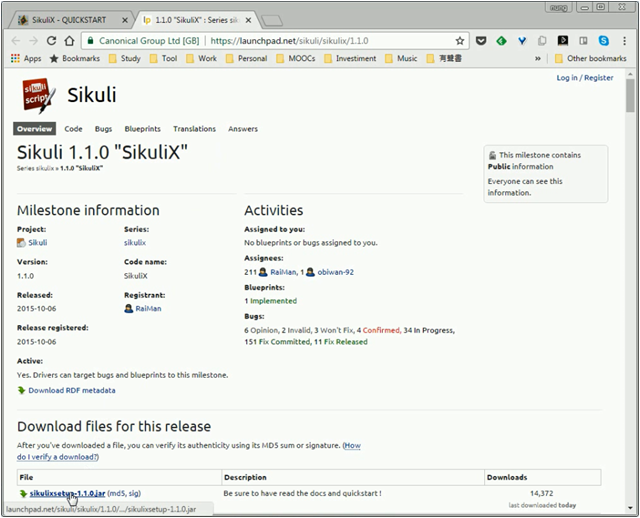

 

下載下來後將 sikulixsetup-1.1.0.jar 放至欲安裝的位置，點選兩下進行安裝。    

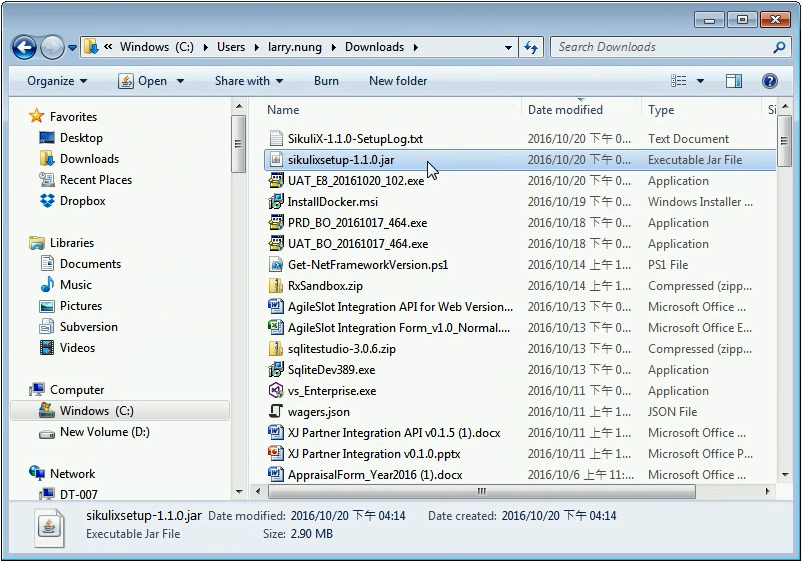

 

選擇要安裝的項目後按下 `Setup Now` 按鈕。  

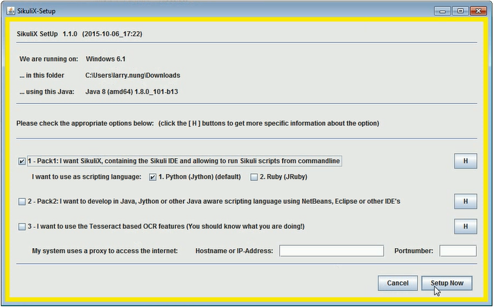

 

按下後會顯示要安裝的項目，如果正確無誤則按下 `Yes` 按鈕繼續即可。  

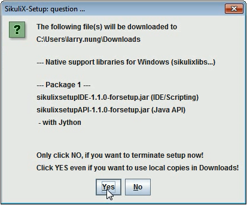

 

接著會問是否需要安裝到 Python 2.7 版，視需求決定即可。這邊筆者公司電腦安裝 2.7 會有問題，所以筆者是選 `No`。  

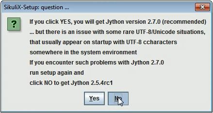

 

程式開始進行安裝...  

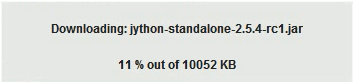

 

安裝完會做些 functional test 驗證安裝是否成功。  

 

安裝成功我們會看到這個畫面，按下 `OK` 按鈕繼續。  

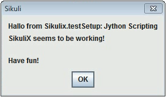

 

最後還會提醒安裝的細節可以查閱 log 檔。  

 

安裝完後檔案都會跟安裝檔放在一起，所以一開始決定好要安裝的位置後在安裝很重要。  

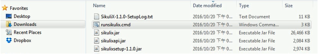

 

點選 runsikulix.cmd 即可開始運行程式。

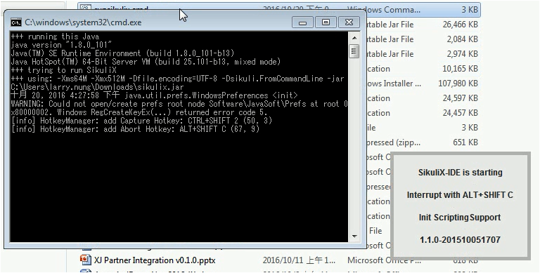

 

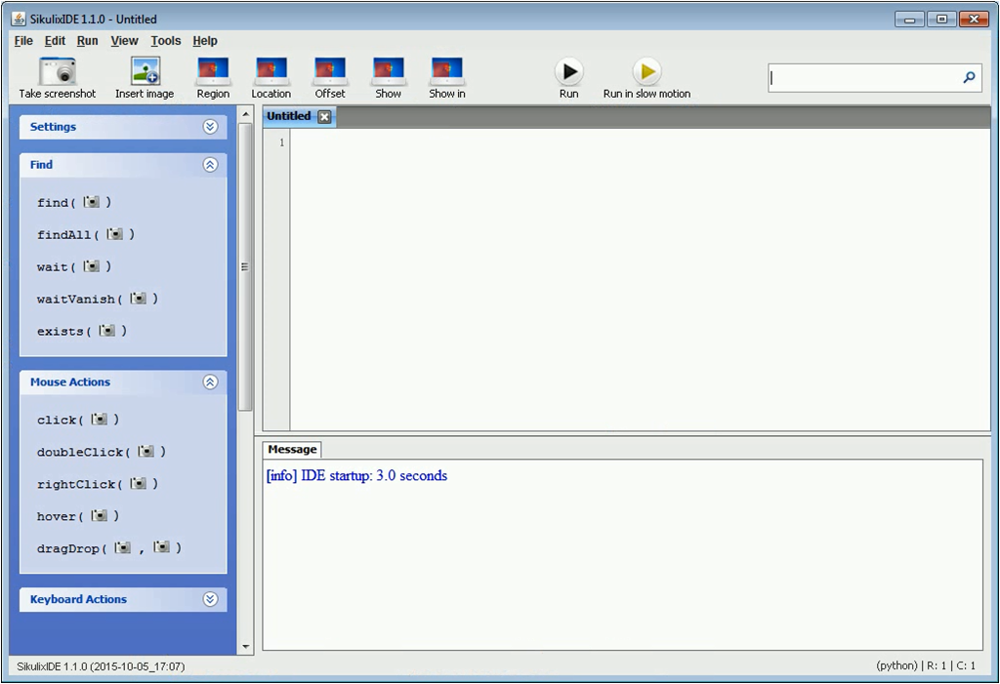

 

最後提醒一下，若安裝上有碰到問題，記得查閱 log 檔(SikuliX-1.1.0-SetupLog.txt)。  

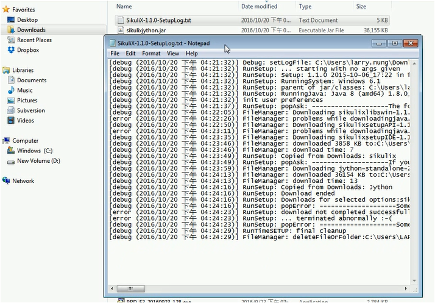

 

Link
-----
* [1.1.0 "SikuliX" : Series sikulix : Sikuli](https://launchpad.net/sikuli/sikulix/1.1.0)
