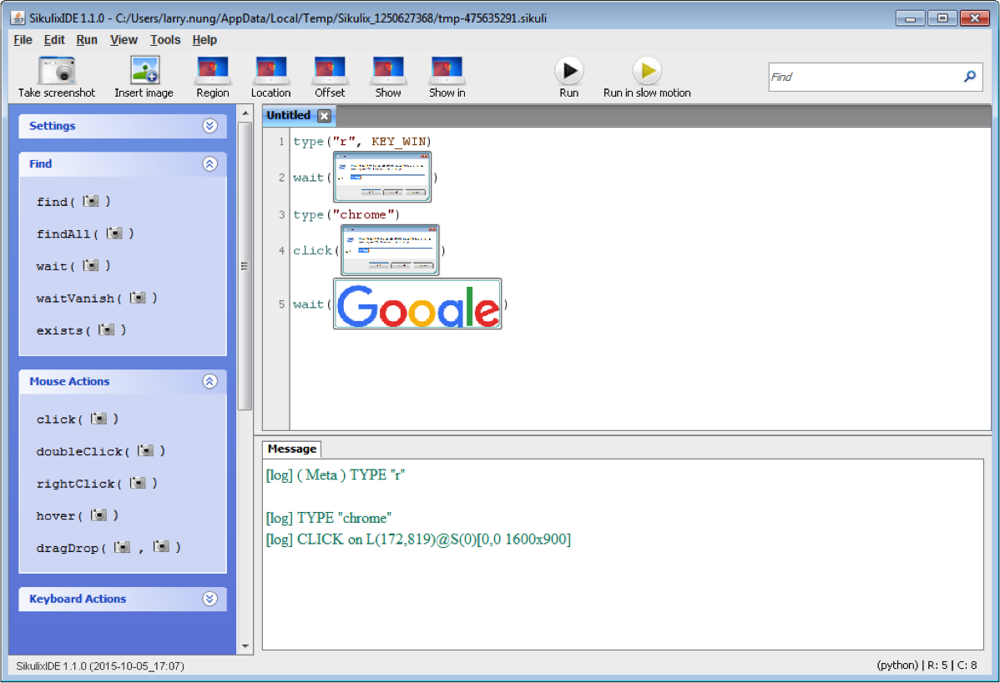
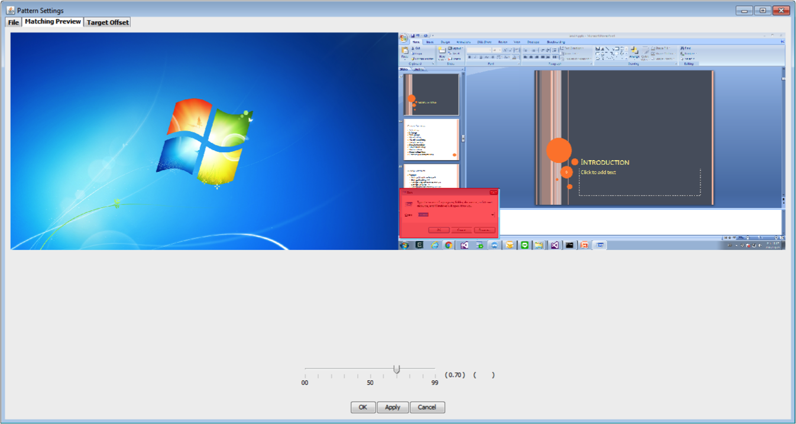
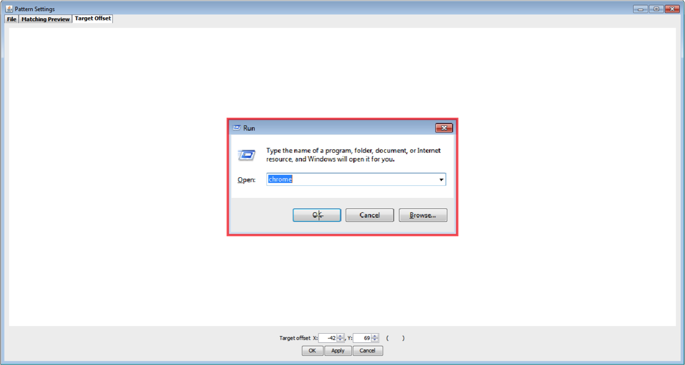

SikuliX 在撰寫上提供了些彈性，能讓圖片在比對時提供模糊比對，或是要決定圖片被按下的位置。  

<!-- More -->

 

像是下面這邊筆者稍微修改了前面帶到的範例，這邊用執行視窗整個畫面截圖。  

	
 

那麼執行視窗輸入框內的字樣不一樣時，SikuliX 怎麼比對的到呢？而 Click 時 SikuliX 怎麼知道要點在哪個位置呢？  

 

以這個例子來說，我們可以點選 SikuliX 程式上的圖片，在 Pattern Settings 這頁設定模糊比對的比例。調整模糊比對後如果在畫面中有被成功比對到，被比對到的地方會被遮罩起來。像是這邊將比對的比例調低，輸入框的字樣不論是什麼就都可以比對的到了。    

        
 

Target Offset 頁面這邊決定著圖片被 Click 的位置，在圖片中點選即可決定圖片被點選的位置。像是這邊筆者就讓它等同點擊 OK 按鈕。  

        
 

善用這兩個功能我們在撰寫 SikuliX 就可以少擷取很多圖片，除了節省儲存的空間，也會更好撰寫。  
