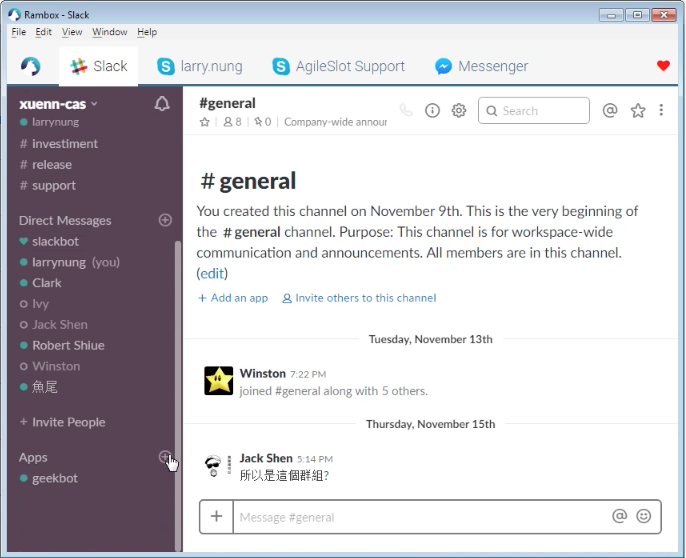
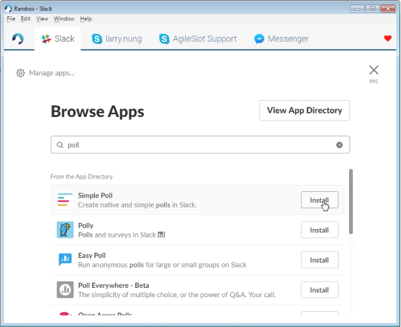
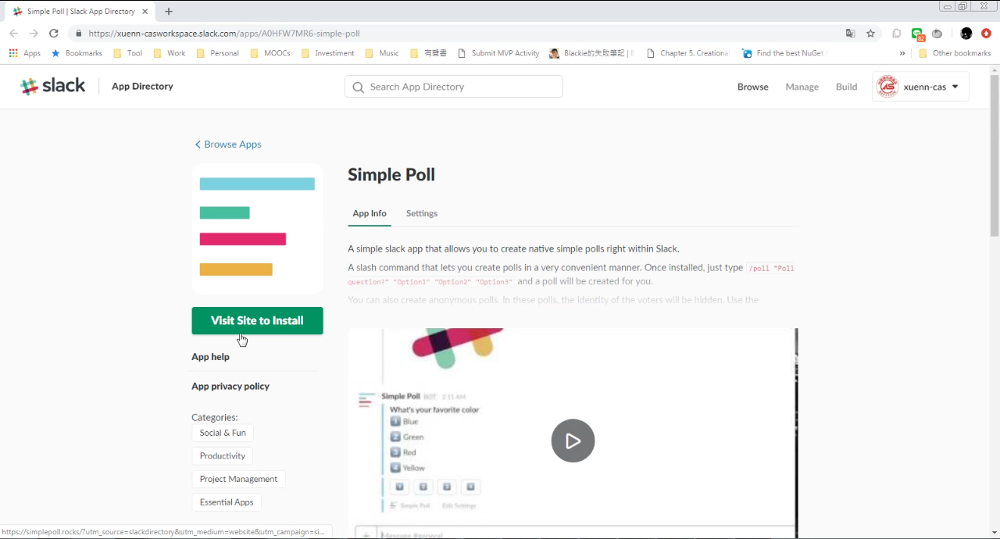
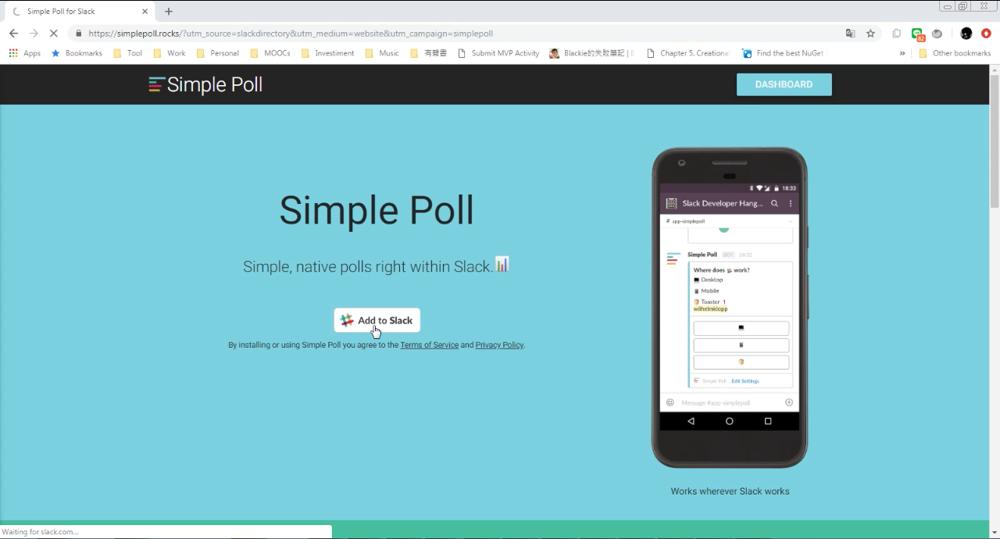
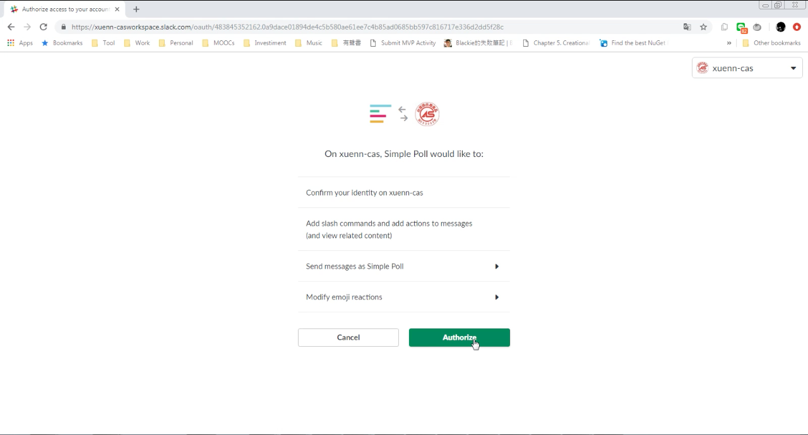
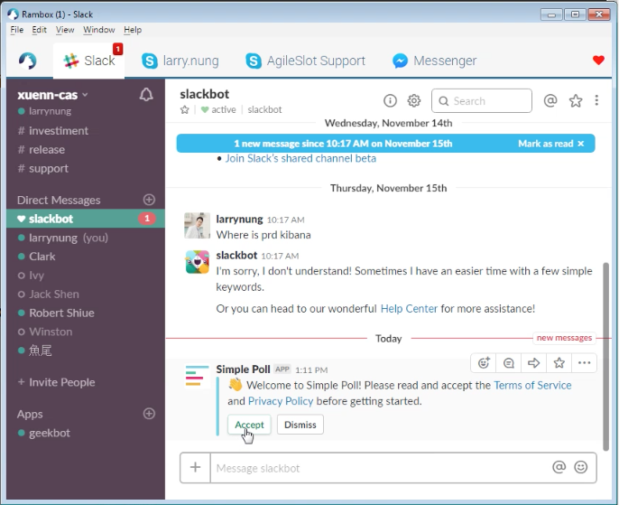
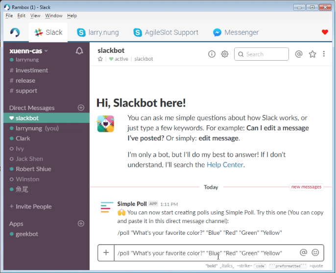
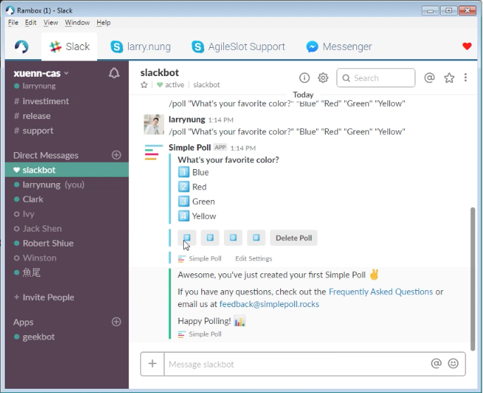
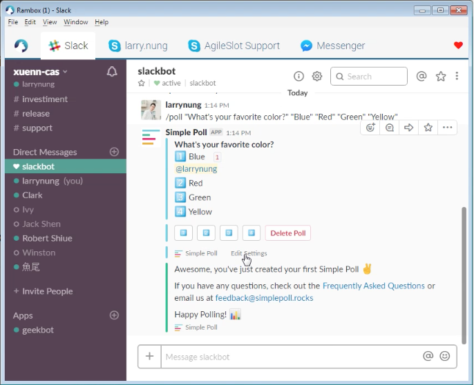

要在 Slack 使用投票功能，可在 Slack 中加入 Simple Pool App。  

<!-- More -->

 

 

 

 

App 加入時會需要授權，若可以接受 App 要求授予的權限的話，按下 Authorize 按鈕。  

 

回到 Slack 會看到 App 詢問是否接受 Terms of Service and Private Policy，若允許的話則按下 Accept 按鈕。  

 

接著使用 pool 命令發起投票即可。  

    /pool "<Question>" ["<Option1>" ... "<OptionN>"]

 

 

 

Link
----
* [Simple Poll | Slack App Directory](https://slack.com/apps/A0HFW7MR6-simple-poll)
* [Simple Poll for Slack](https://simplepoll.rocks/)
