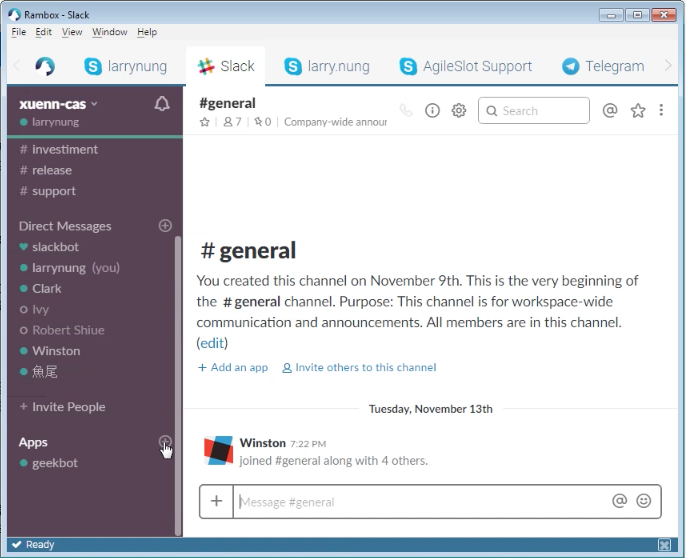
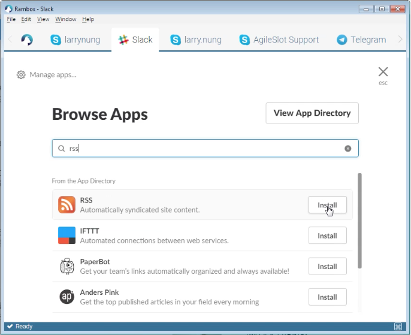
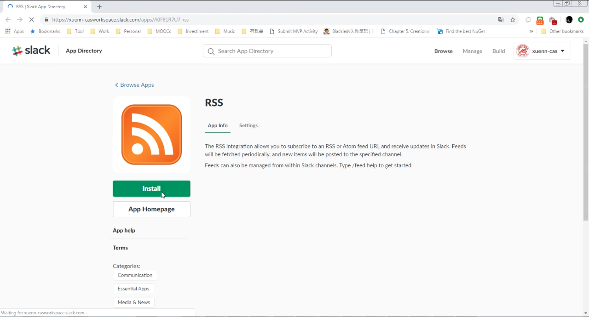
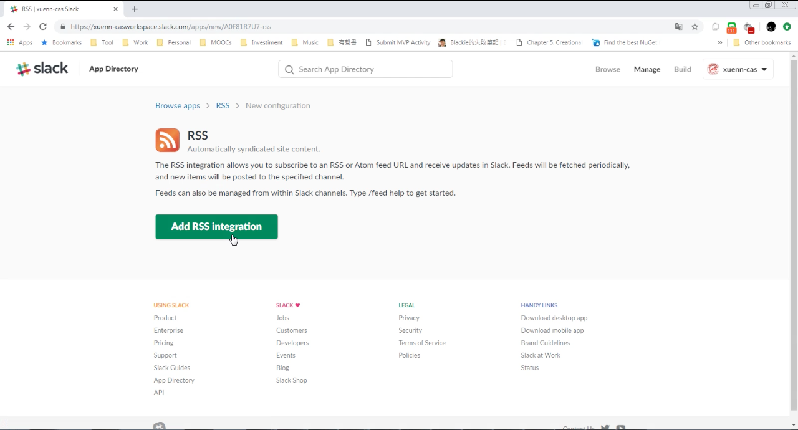
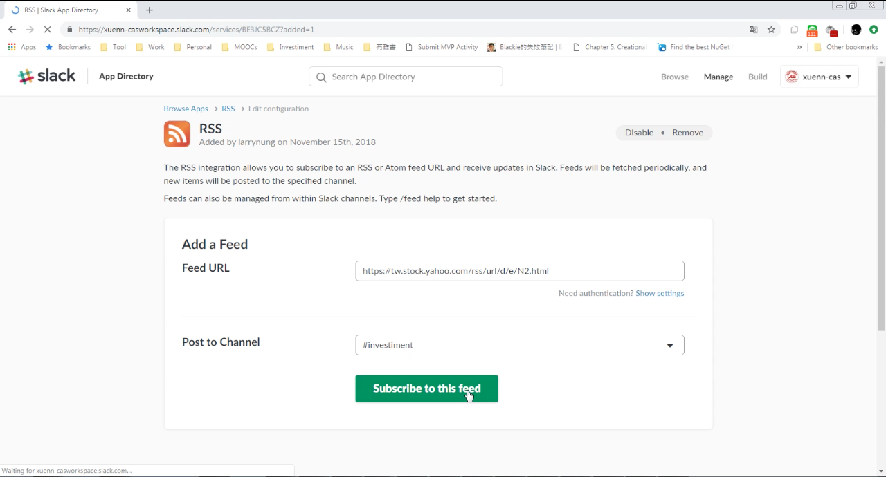
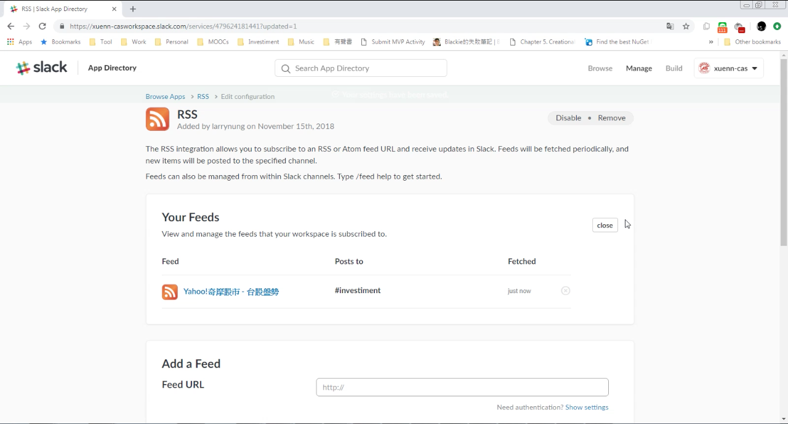
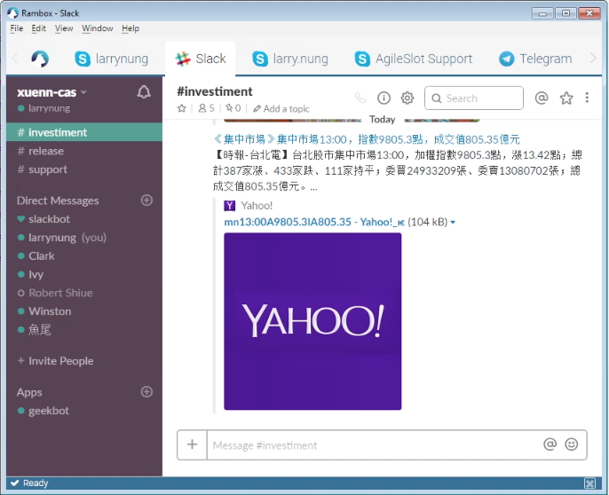

要整合 Slack 與 RSS feeds，可在 Slack 中加入 RSS app。  

<!-- More -->

 

 

 

按下 Add RSS Integration 按鈕。  

 

設定要訂閱的 RSS feed 以及要發送到的 Channel。  

 

 

訂閱的 RSS 資料就會送到 Slack 的指定 Channel 上。  

 

Link
----
* [Add RSS feeds to Slack – Slack Help Center](https://get.slack.help/hc/en-us/articles/218688467-Add-RSS-feeds-to-Slack)
* [RSS | Slack App Directory](https://slack.com/apps/A0F81R7U7-rss)
