要整合 Slack 與 OneDrive，可在 Slack 中加入 Microsoft OneDrive App。

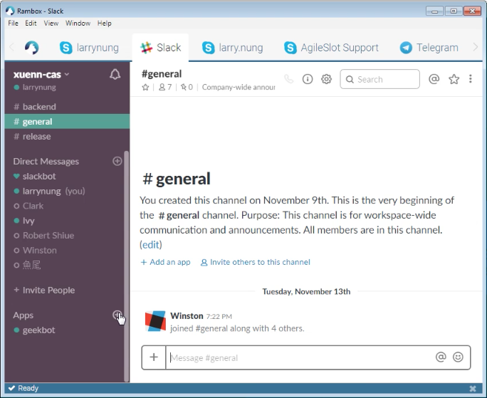

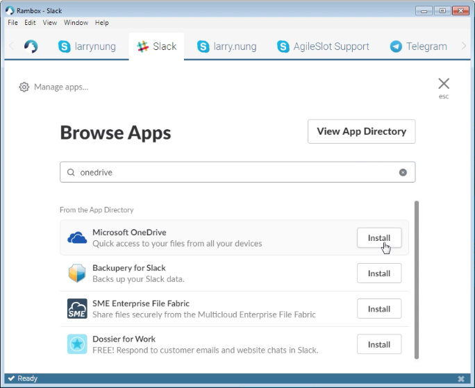

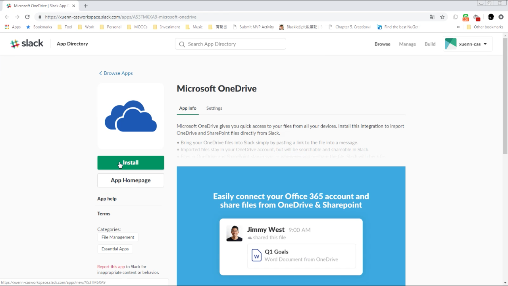

按下 Authentcate your OneDrive account 按鈕進行 OneDrive 的授權。

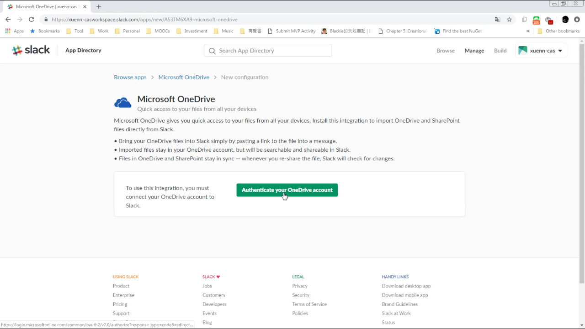

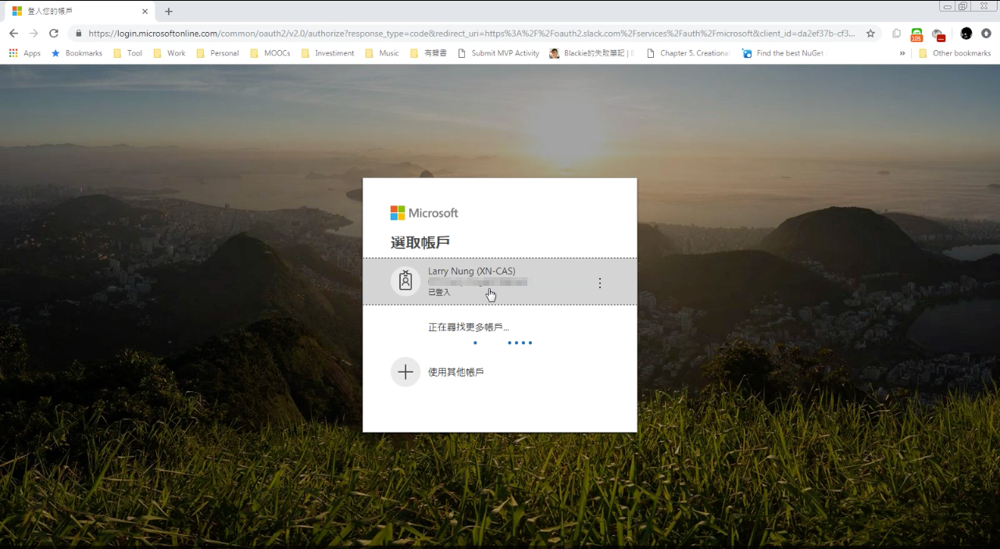

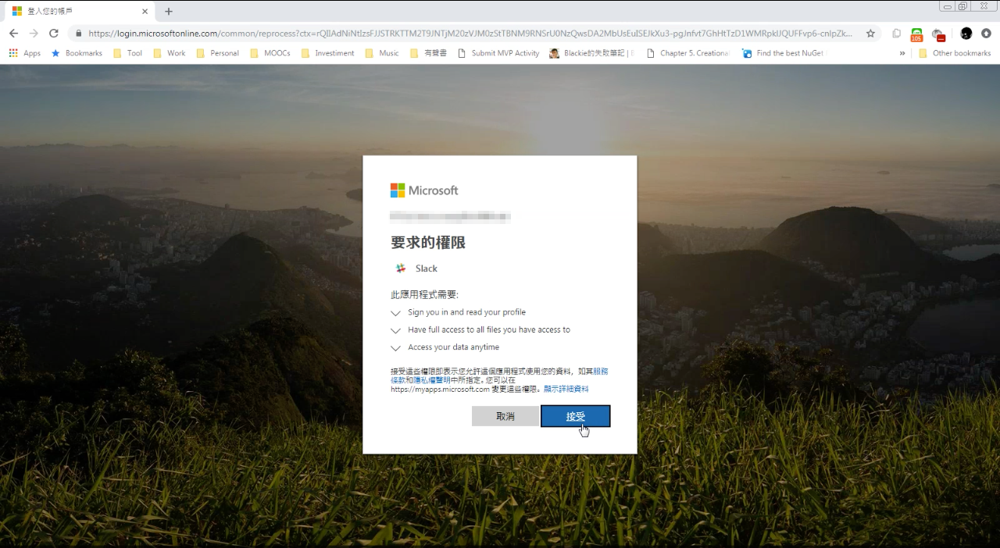

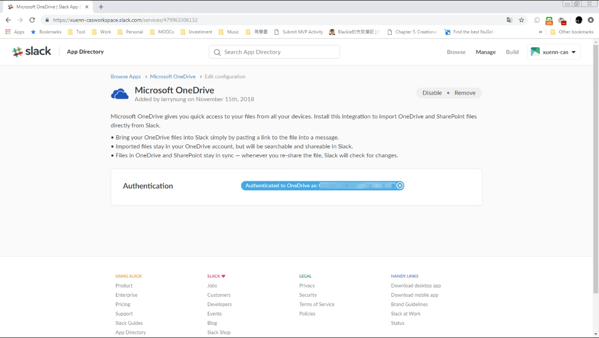

OneDrive 授權完 Slack 與 OneDrive 的整合就完成了。

在 Slack 中貼入 OneDrive 檔案的位置，Slack 會詢問是否將之匯入，按下 Yes, allow 按鈕。

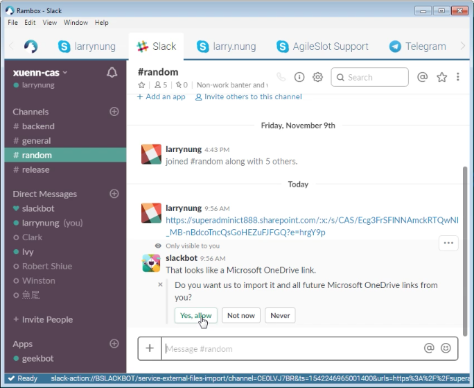

就會幫我們帶上對應的檔案。

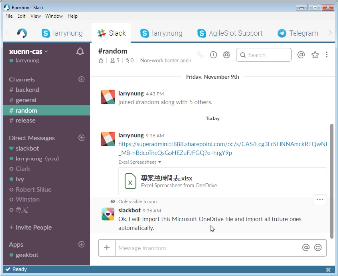

帶入的檔案可被搜尋。

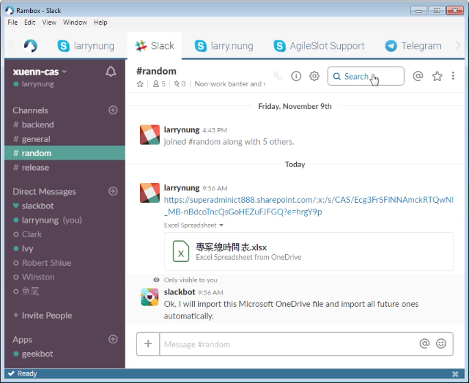

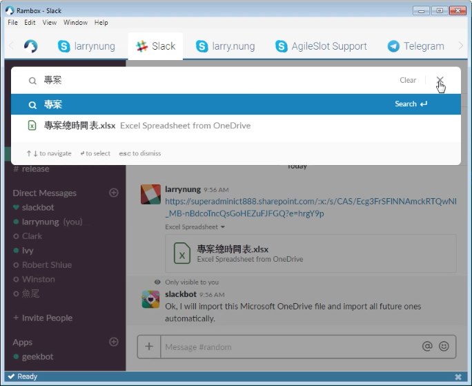

也可在 Files 這邊查閱。

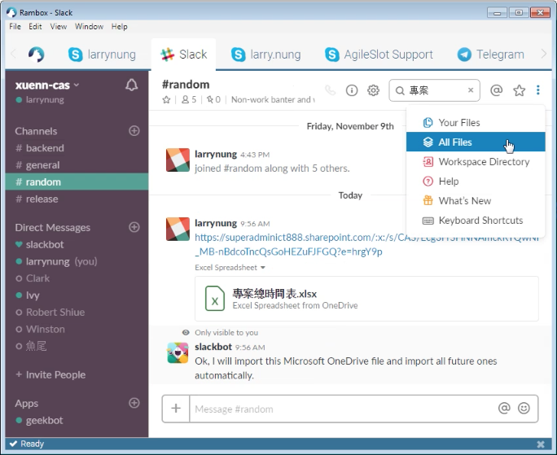

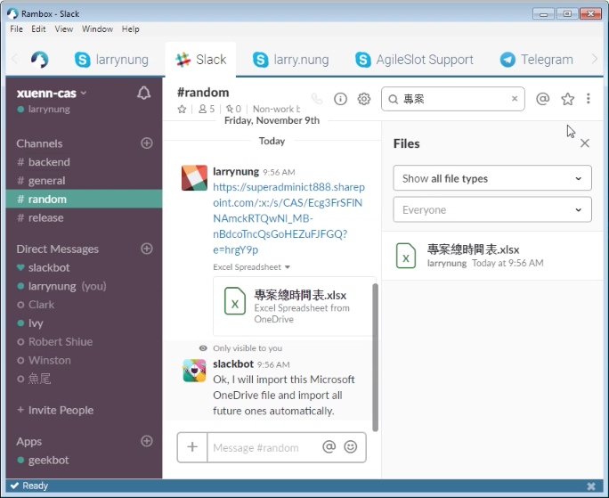

同樣的檔案不會被放入多份。

檔案的 Detail 這邊可查閱被參照的點。

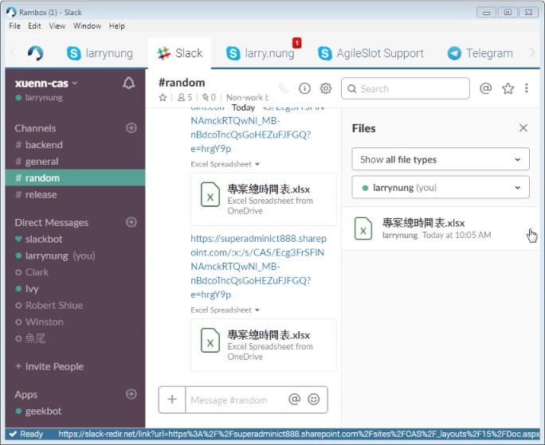

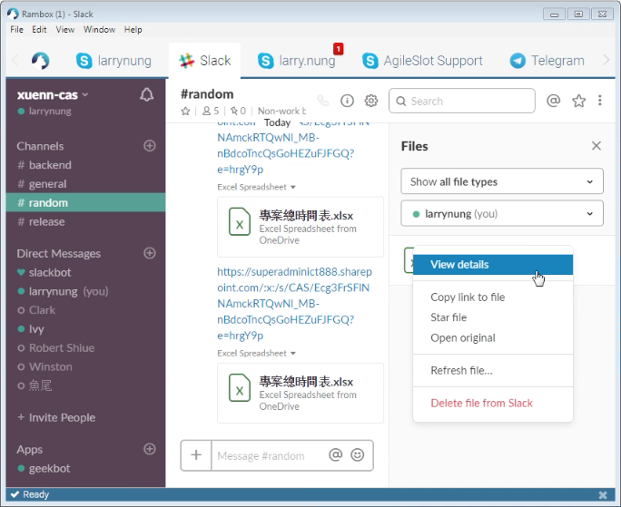

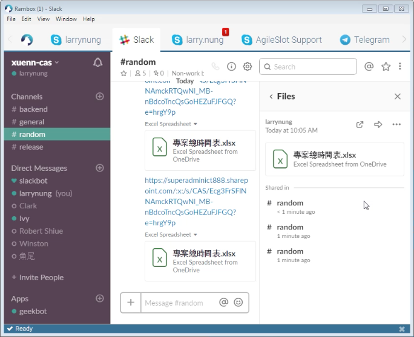

Link
----
* [Microsoft OneDrive | Slack App Directory](https://slack.com/apps/A53TM6XA9-microsoft-onedrive)
* [OneDrive for Slack – Slack Help Center](https://get.slack.help/hc/en-us/articles/115002272646-OneDrive-for-Slack)