要使用 Slack 接收 Jenkins CI 的建置通知訊息，可在 Slack 中加入 Jenkins CI App。

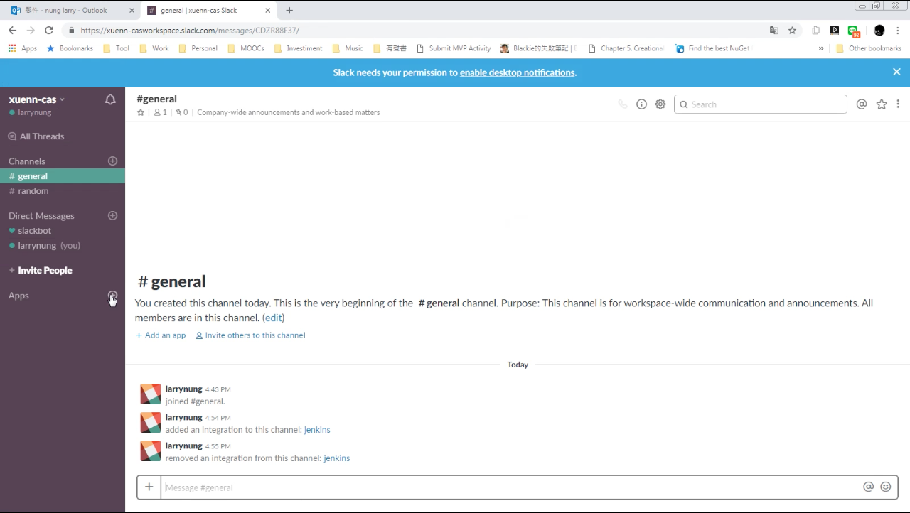

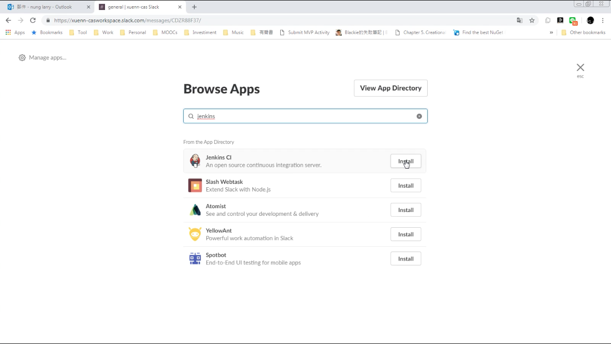

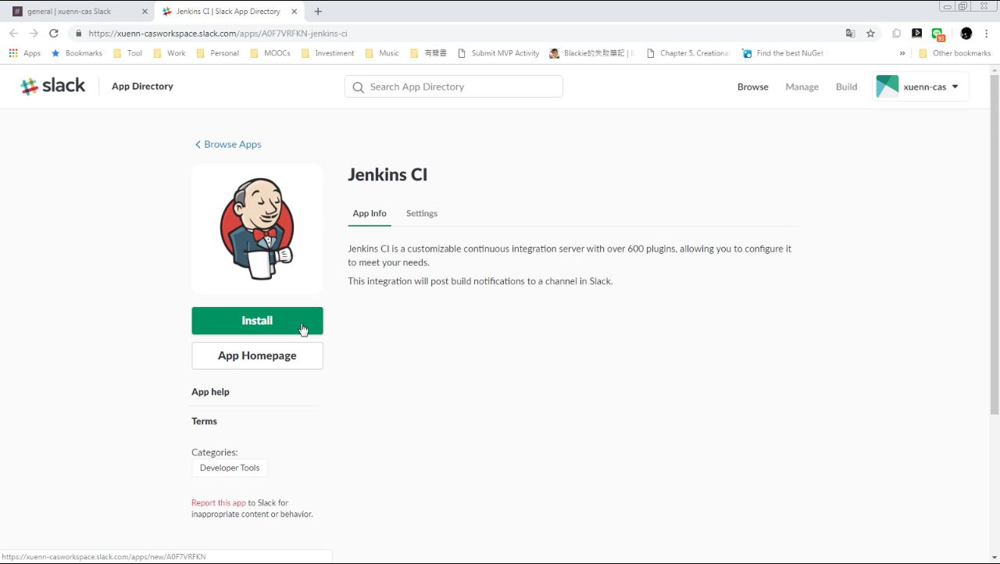

選取 Jenkins CI 建置通知訊息收到後要顯示在哪個 Channel，然後按下 Add Travis CI Integration 按鈕。

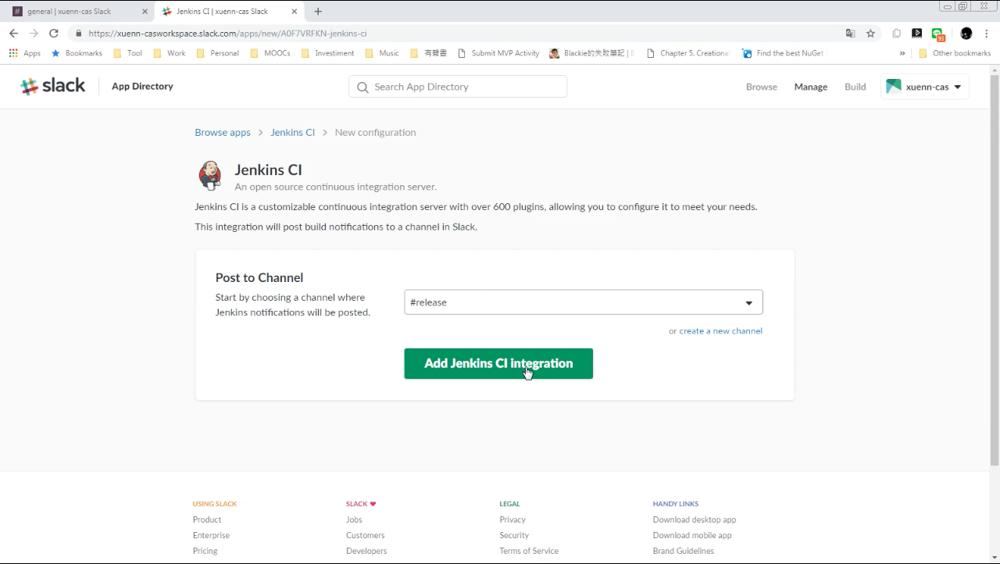

然後照著指示設定 Jenkins。

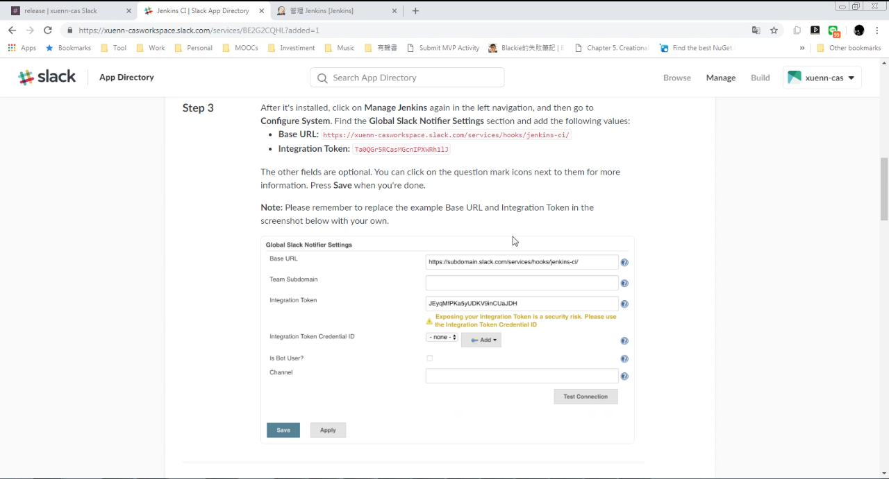

像是透過 Jenkins 的外掛程式管理為 Jenkins 加裝 Slack Notification 套件。

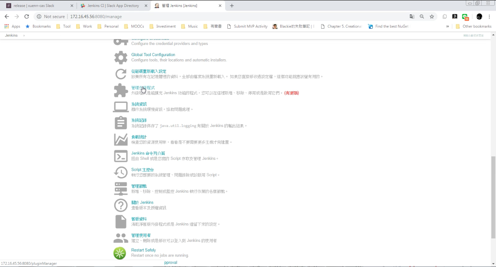

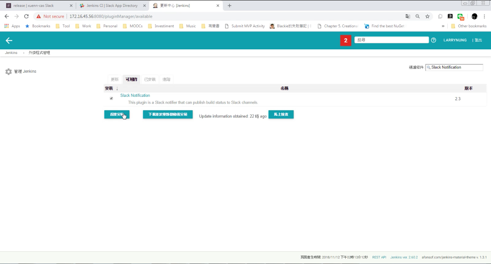

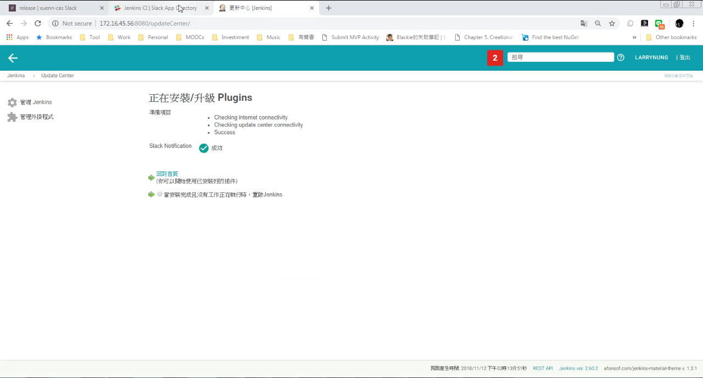

接著進入設定系統。

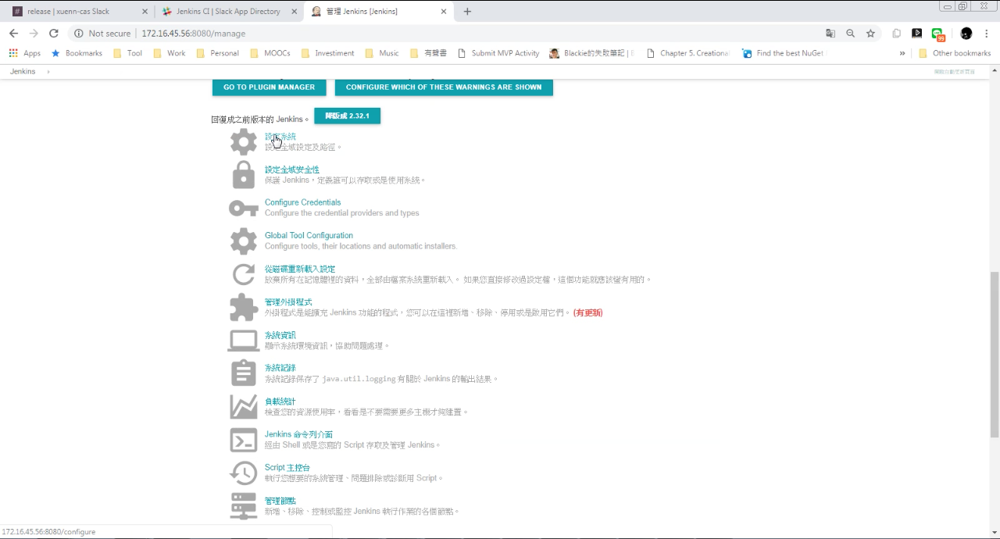

設定 Global Slack Notifier Settings 的 Base URL 與 Integration
Token，按下儲存按鈕。

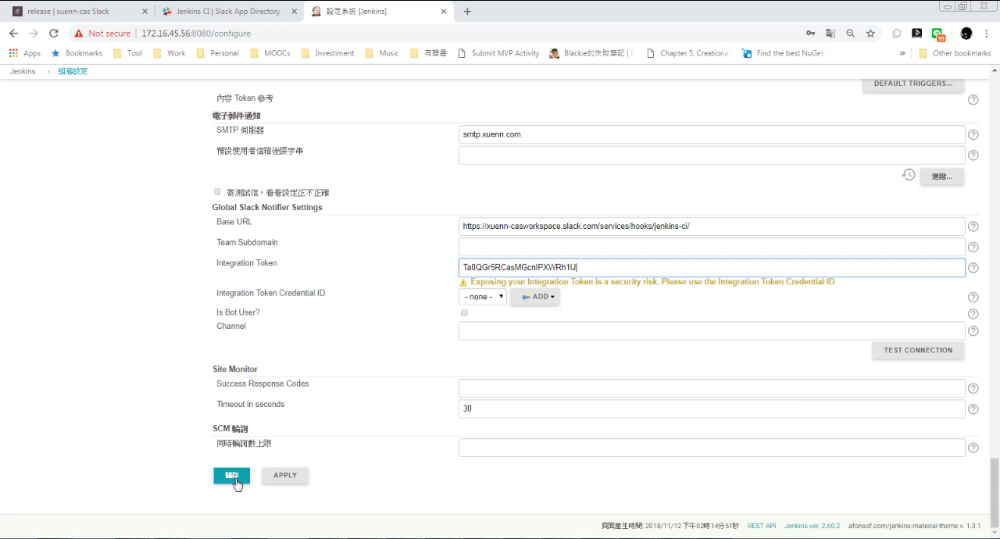

進到 Job 的組態設定。

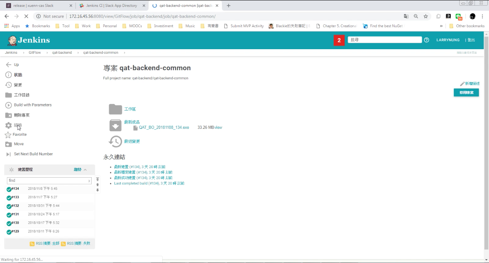

在建置後動作加入 Slack Notifications。

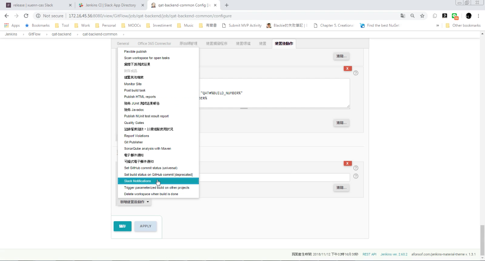

設定要通知的事件。

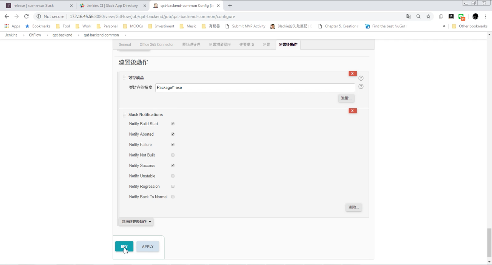

當對應事件發生時 Slack 就會收到 Jenkins 的通知訊息。

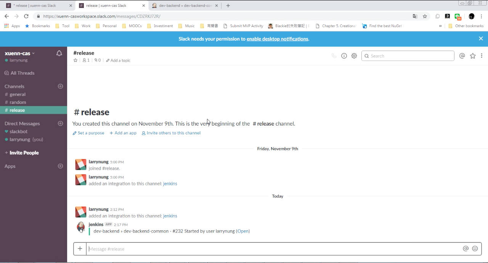

Link
----
* [Jenkins CI | Slack App Directory](https://slack.com/apps/A0F7VRFKN-jenkins-ci)