要使用 Slack 接收 Jenkins CI 的建置通知訊息，可在 Slack 中加入 Jenkins CI App。  

<!-- More -->

 

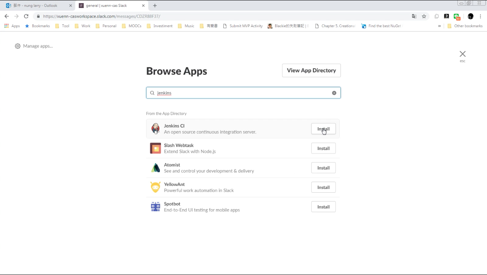

 

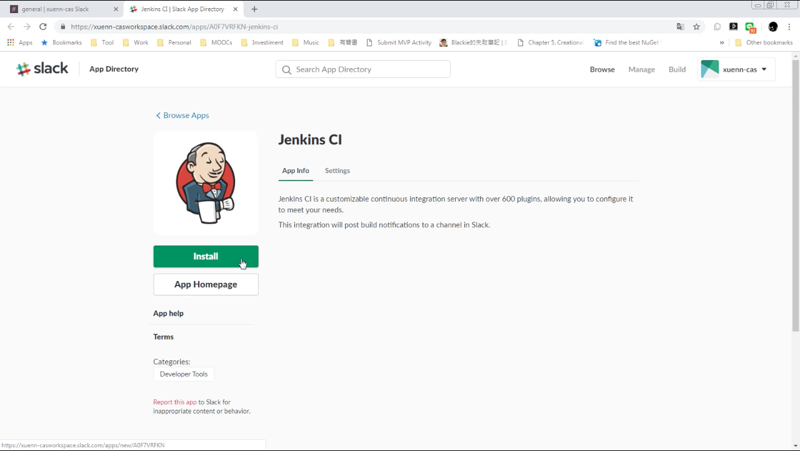

 

選取 Jenkins CI 建置通知訊息收到後要顯示在哪個 Channel，然後按下 Add Travis CI Integration 按鈕。  

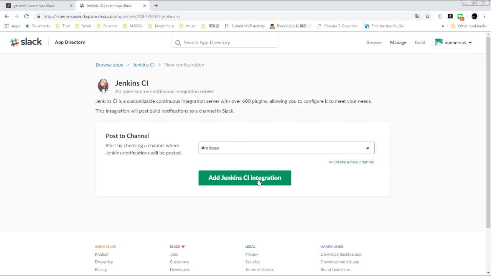

 

然後照著指示設定 Jenkins。  

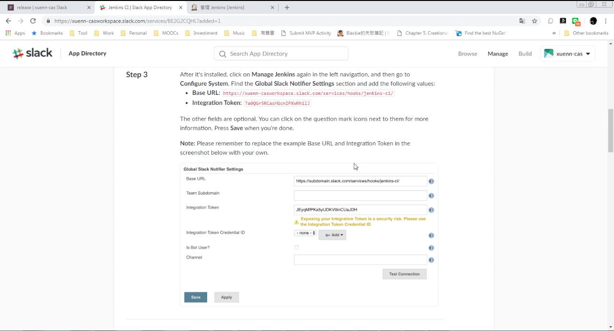

 

像是透過 Jenkins 的外掛程式管理為 Jenkins 加裝 Slack Notification 套件。  

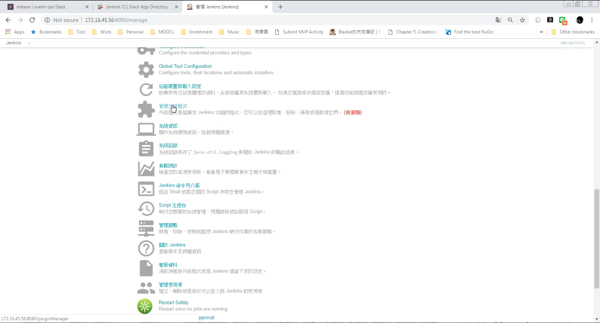

 

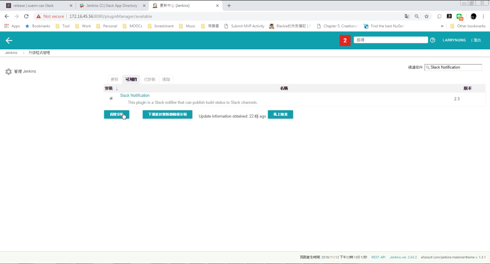

 

 

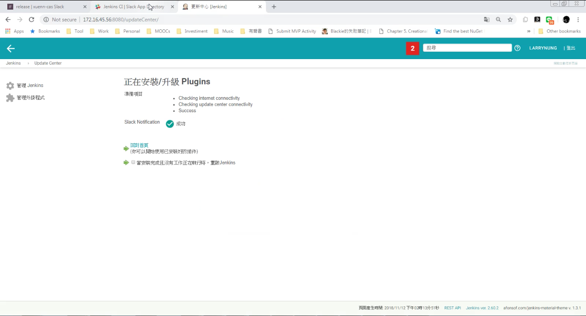

 

接著進入設定系統。  

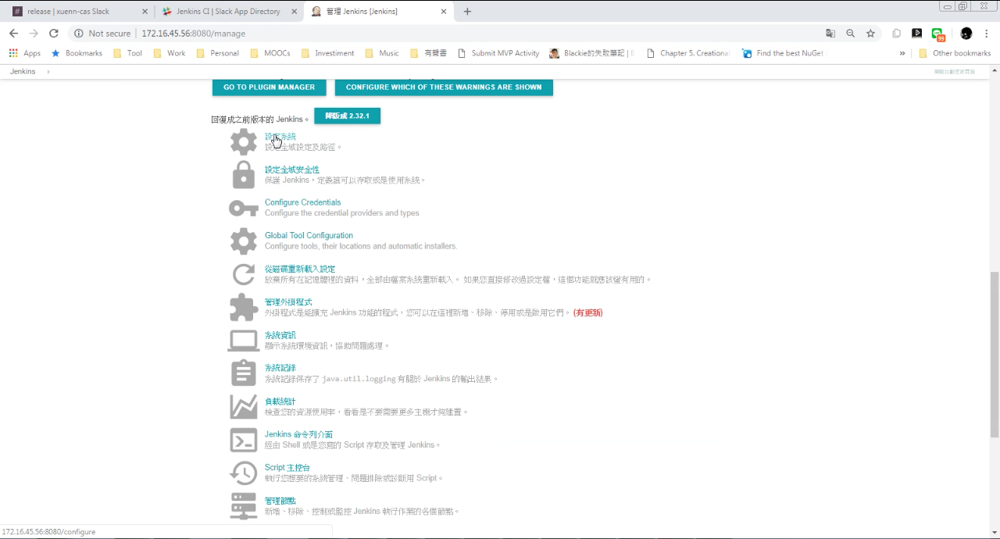

 

設定 Global Slack Notifier Settings 的 Base URL 與 Integration
 Token，按下儲存按鈕。  

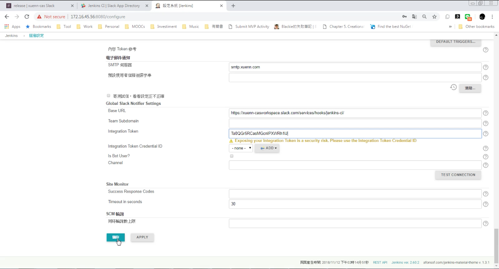

 

進到 Job 的組態設定。  

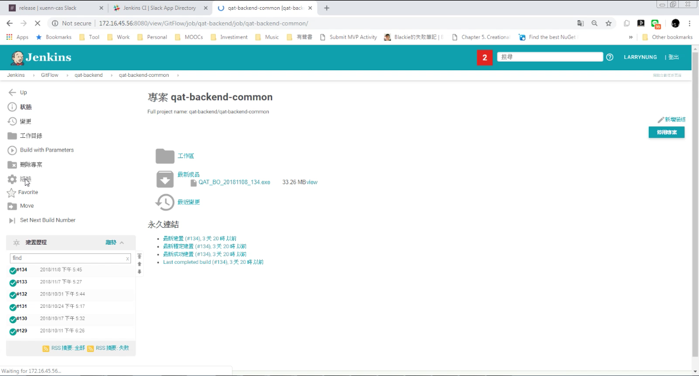

 

在建置後動作加入 Slack Notifications。  

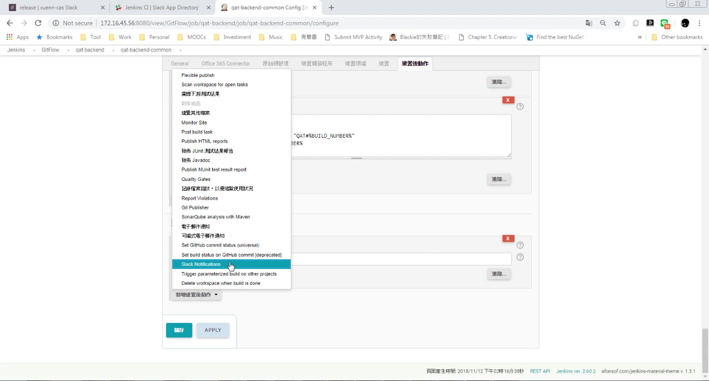

 

設定要通知的事件。  

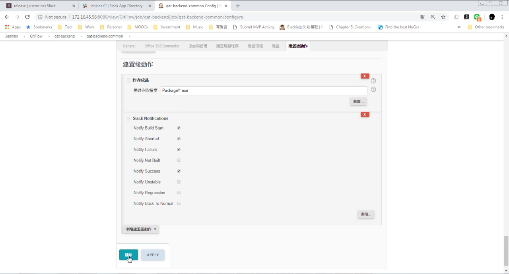

 

當對應事件發生時 Slack 就會收到 Jenkins 的通知訊息。  

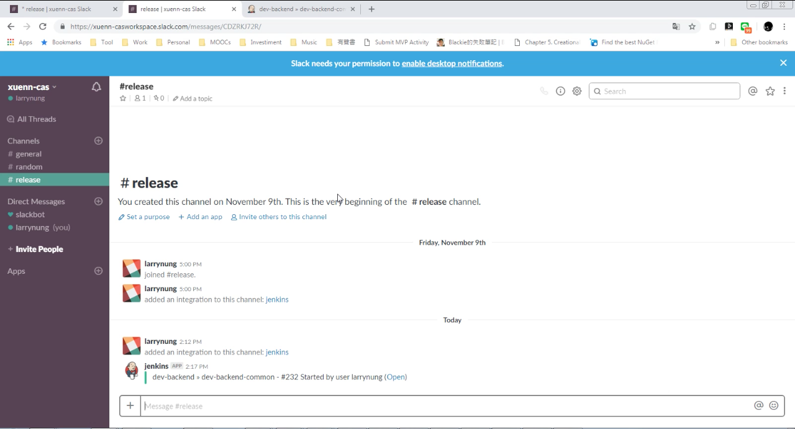

 

Link
----
* [Jenkins CI | Slack App Directory](https://slack.com/apps/A0F7VRFKN-jenkins-ci)
