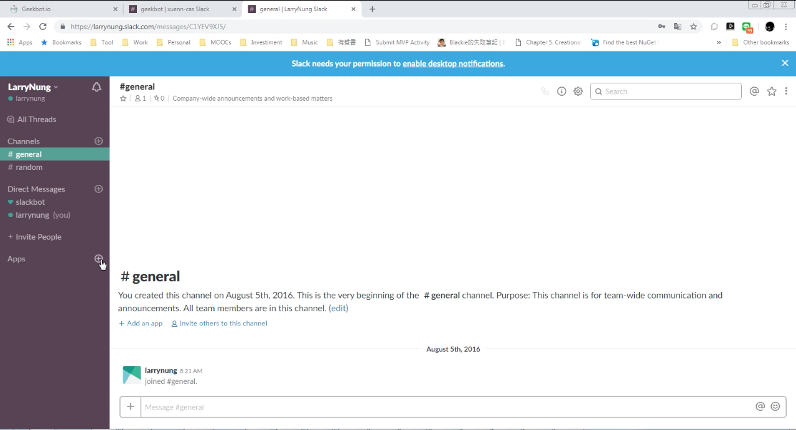
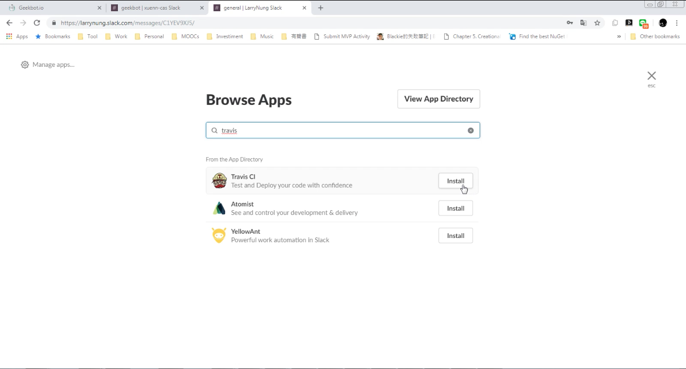
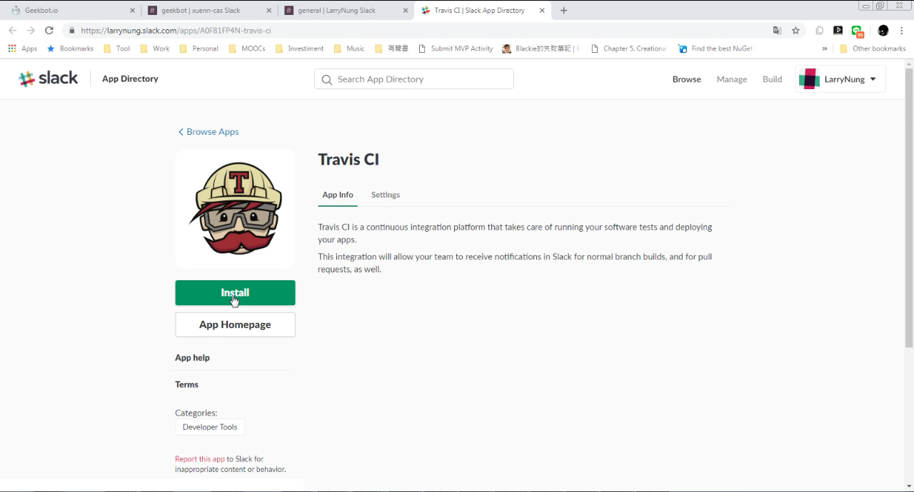
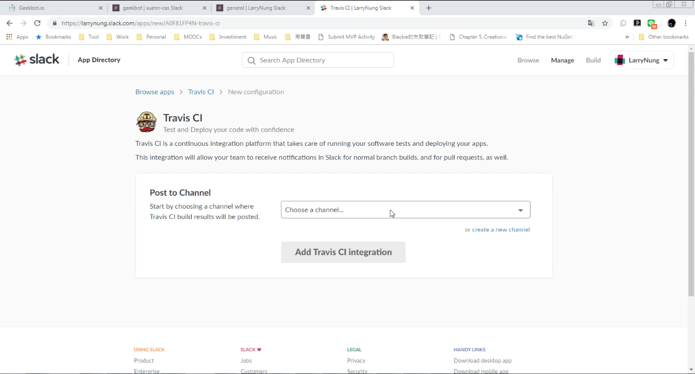
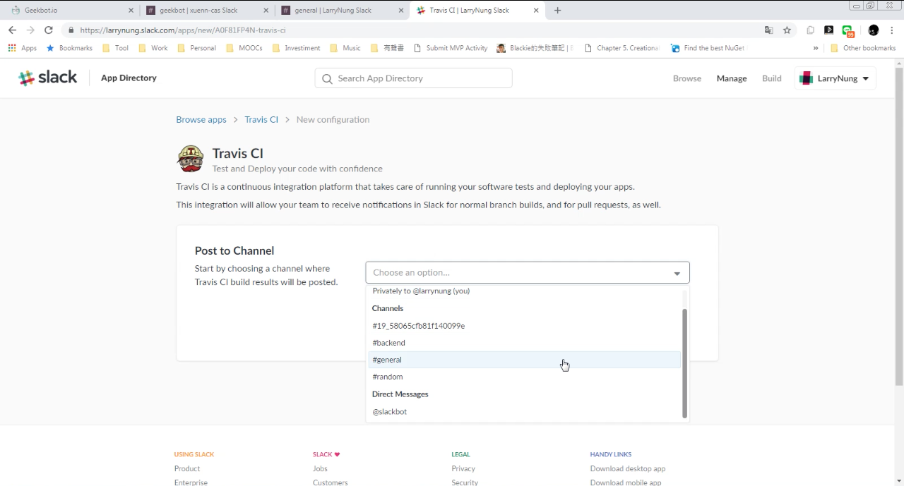
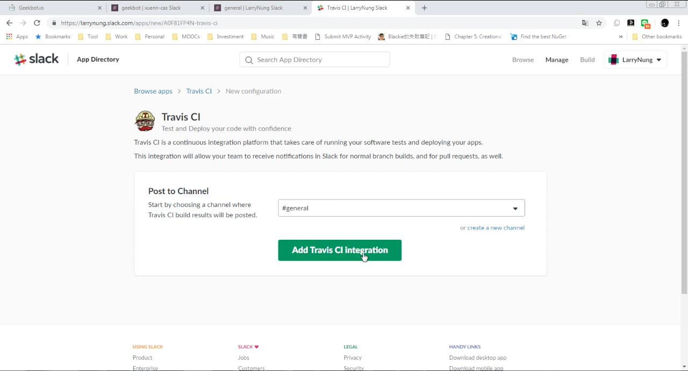
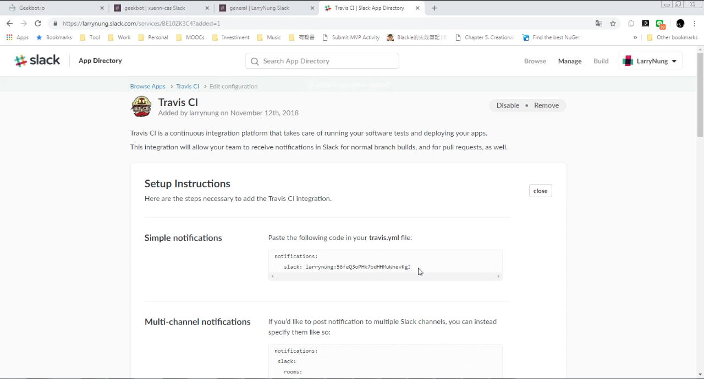
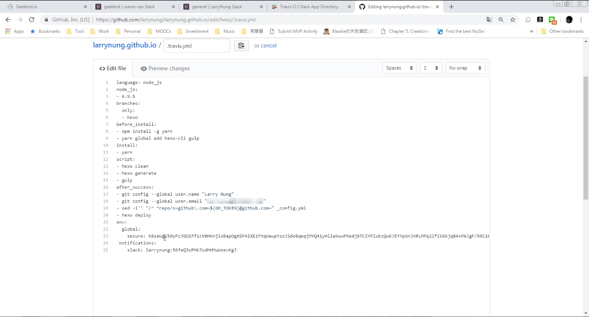
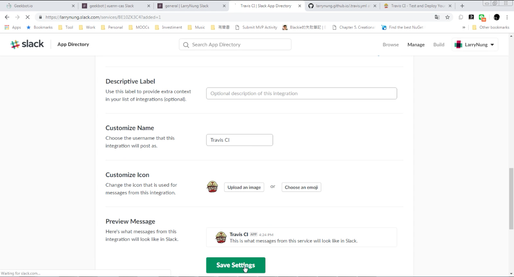
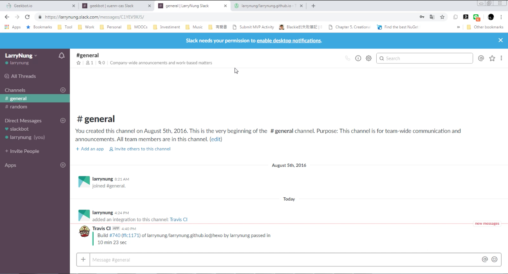

要使用 Slack 接收 Travis CI 的建置通知訊息，可在 Slack 中加入 Travis CI App。

選取 Travis CI 建置通知訊息收到後要顯示在哪個 Channel。

選好後按下 Add Travis CI Integration 按鈕。

接著照著教學設置 Travis CI 的設定檔。

再接著設置 Travis CI App 的名字、描述、圖示等，設置完後按下 Save Settings 按鈕存檔。

後續 Travis CI 建置時。Slack 就可以在指定的 Channel 收到對應的建置通知。

Link