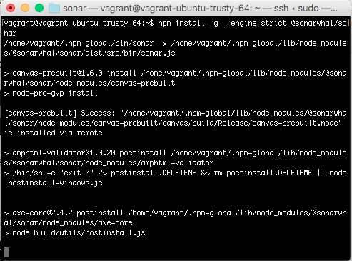

在用 npm 進行 sonar 的安裝時，有可能會碰到 permission denied 的錯誤。  

<!-- More -->

 

這時可以修改 npm 的預設目錄，再次用 npm 運行 sonar 的安裝即可。  

 

Link
----
* [User guide | sonar documentation](https://sonarwhal.com/docs/user-guide/)
