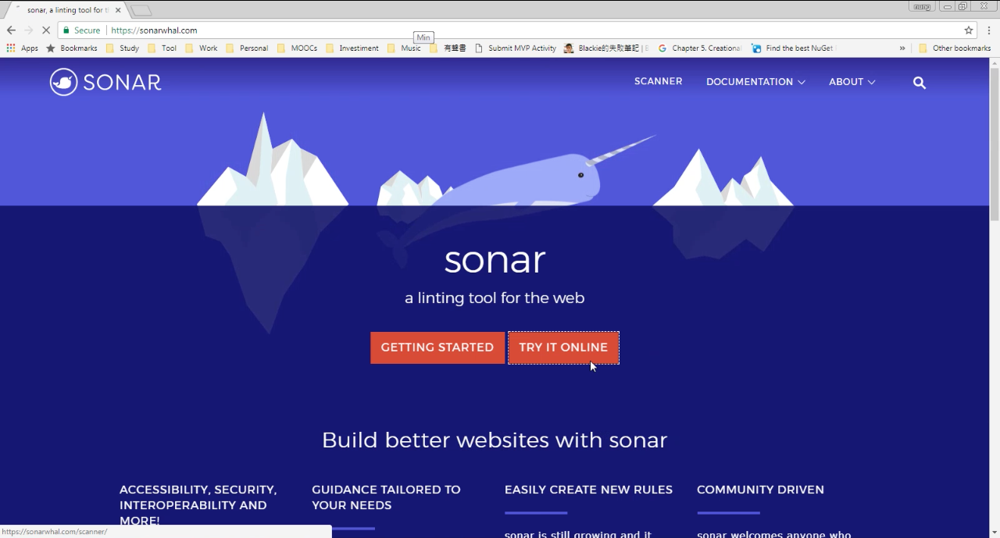
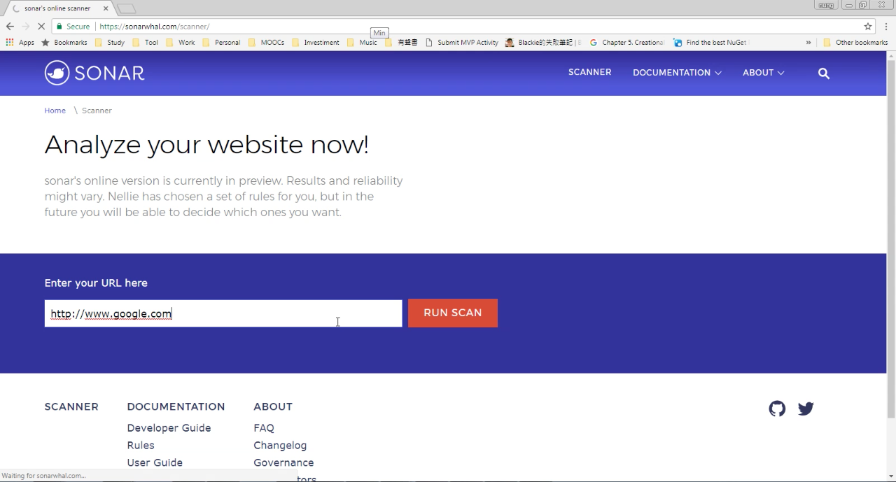
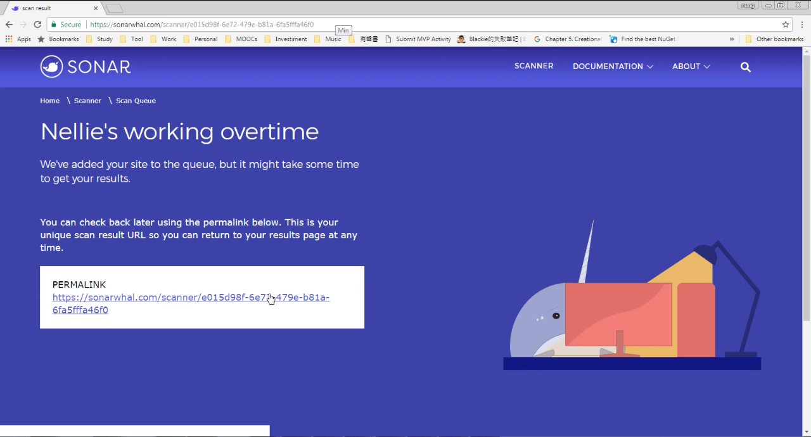
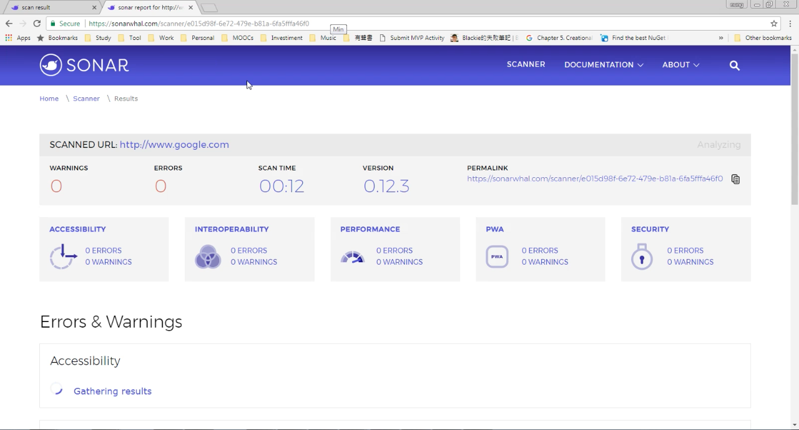
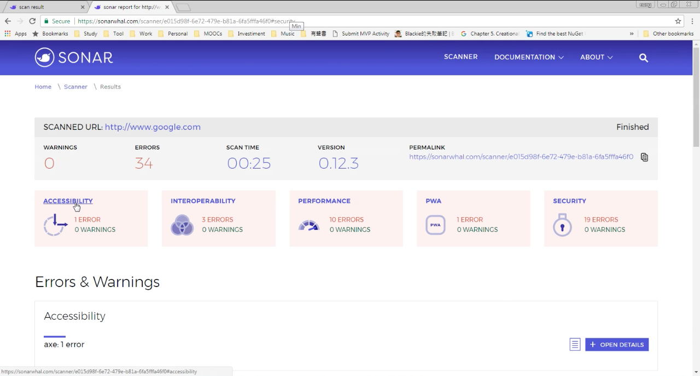
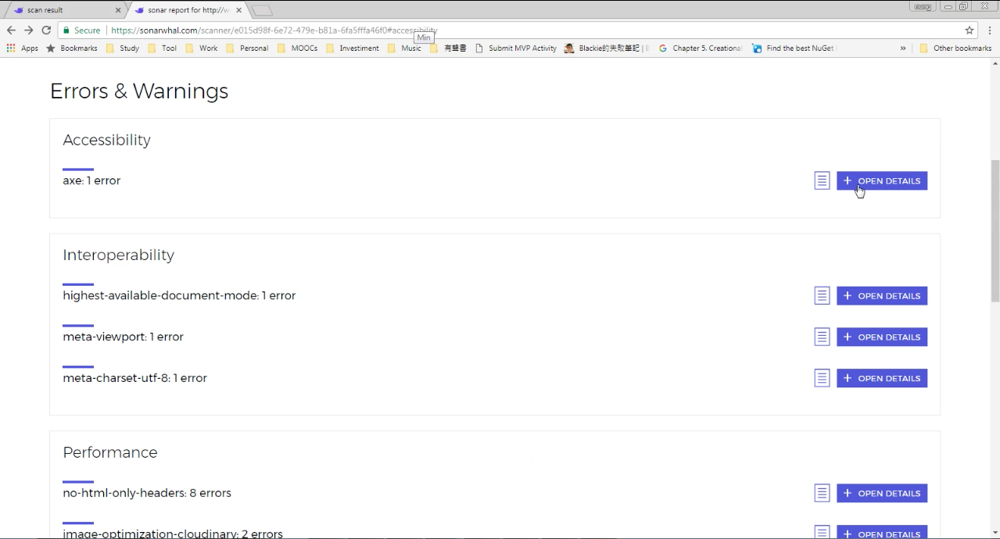
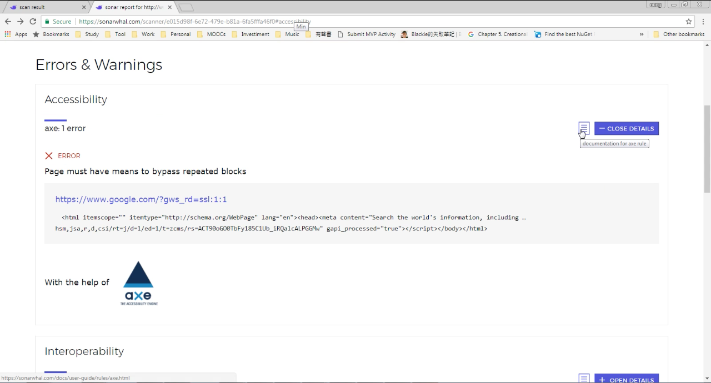
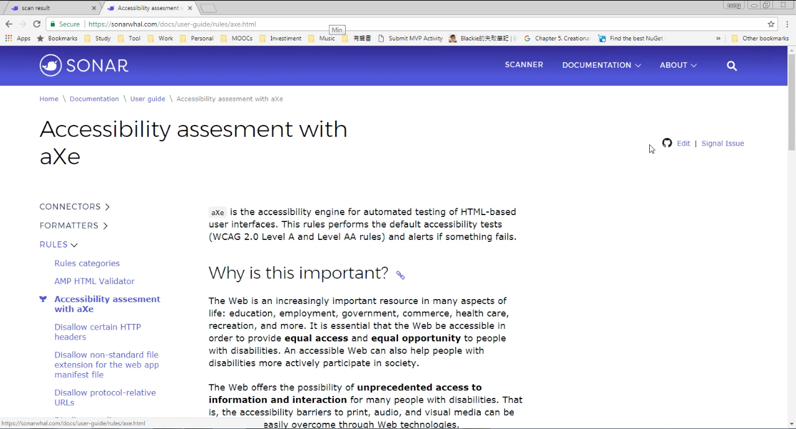

要使用 sonar 網站針對網站進行分析，可切到 online scanner 頁面。  

<!-- More -->

 

輸入要分析的網站後按下 Enter 或是後方的 RUN SCAN 按鈕進行網站的分析。  

 

sonar 會給一個 PERMALINK，點選該連結進到網站分析頁面。  

 

等待網站分析完成。  

 

分析完成該分析頁面會顯示分析的網站、Warning 數、Error 數、分析的時間、分析的位置、不同分類下的 Warning 與 Error 數...等。  

 

點選感興趣的分類即可跳至該分類下查看對應的 Warning 與 Error。  

 

若要查看 Warning 與 Error 的細節，可點選後方的 + OPEN DETAILS 按鈕。  

 

若還是不理解 Warning 與 Error 為何要檢測或是要如何修正，可點選後方的按鈕查閱對應的 sonar Rule 說明。   

 

 

Link
----
* [sonar, a linting tool for the web](https://sonarwhal.com/)
