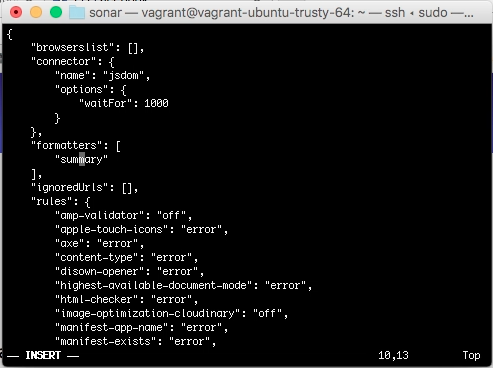
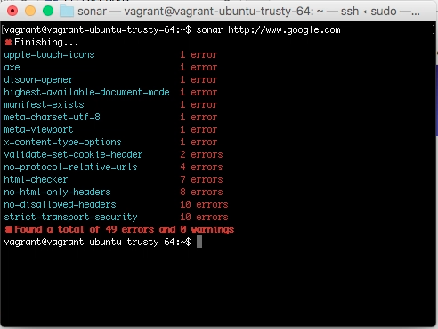
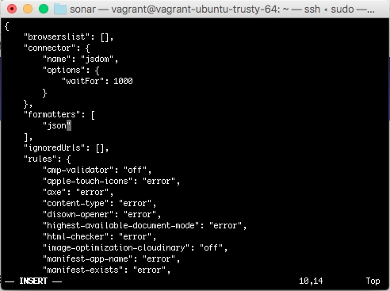
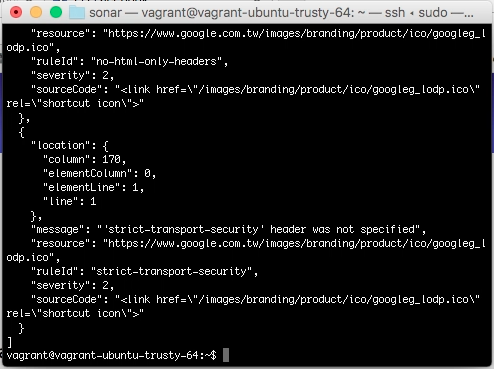
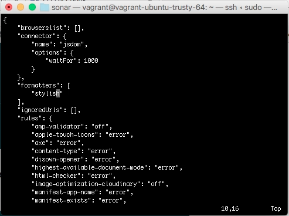
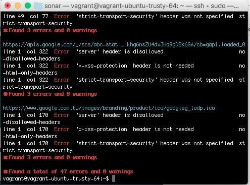
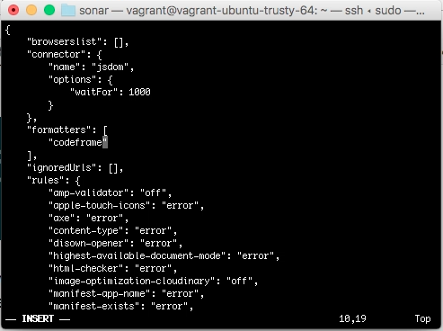
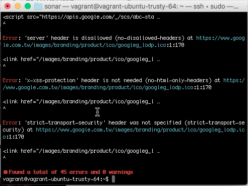

sonar 的 formatter 可用來設定 sonar 分析結果的格式，目前提供 summery、json、stylish、codeframe 這幾個 formatter，可透過 sonar 設定檔指定使用。

像是指定 summary formatter 的話，sonar 分析完就只會摘要出各個 rule 的 warning 與 error 數。

使用 json formatter 的話，sonar 分析結果會用 json 格式呈現。

使用 stylish formatter 的話，sonar 分析結果會依 resource 告知哪一列哪一行及違反的 rule。

使用 codeframe formatter 的話，sonar 分析結果會顯示違反的 rule 以及出問題的程式碼。

Link
----
* [List of official formatters | sonar documentation](https://sonarwhal.com/docs/user-guide/formatters/)