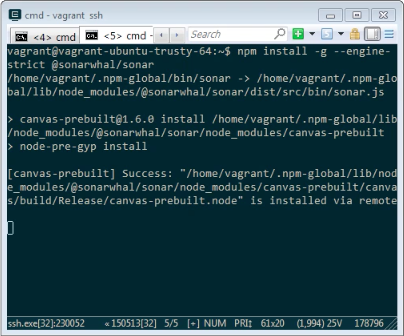
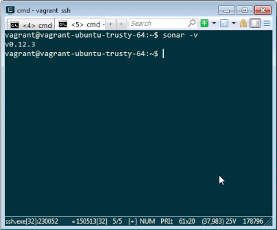
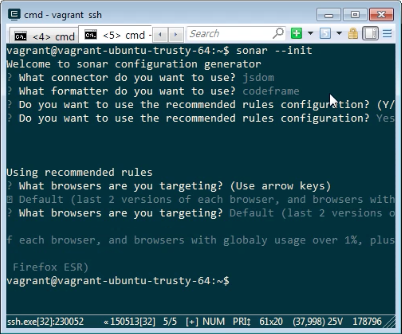
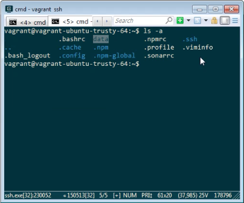
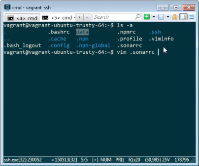
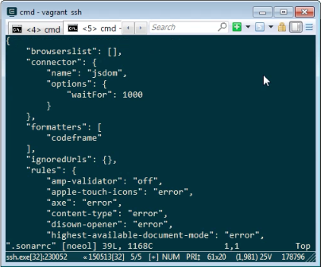
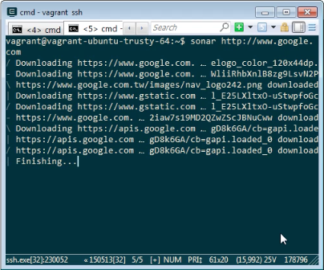
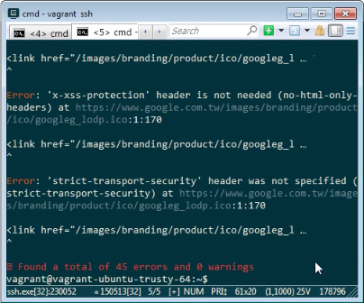

要使用 sonar CLI，需先要有 Node.js v8.x 以上的版本。   

<!-- More -->

 

再透過 npm 安裝 sonar 到全域。   

    npm install -g --engine-strict @sonarwhal/sonar

 

安裝完可查詢 sonar 版本確認安裝的狀態。  

    sonar -v

 

若安裝無誤可用 sonar 命令產生 sonar 的設定檔。  

    sonar --init

 

設定完 sonar 的設定檔 (.sonarrc) 就會產生在當前目錄。    

 

若有需要可將設定檔開啟修改。  

 

 

最後調用 sonar 命令並帶上要分析的網址，即可使用 sonar 分析指定的網站。  

    sonar [URL]

 

 

Link
----
* [User guide | sonar documentation](https://sonarwhal.com/docs/user-guide/)
