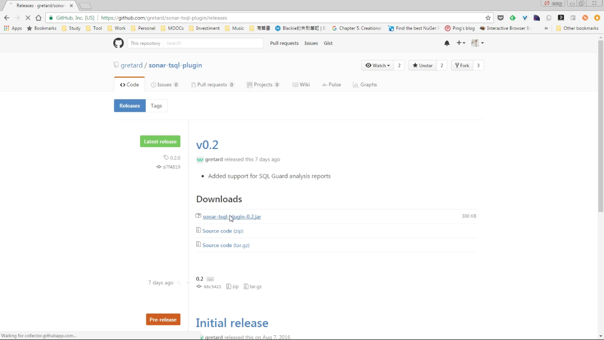
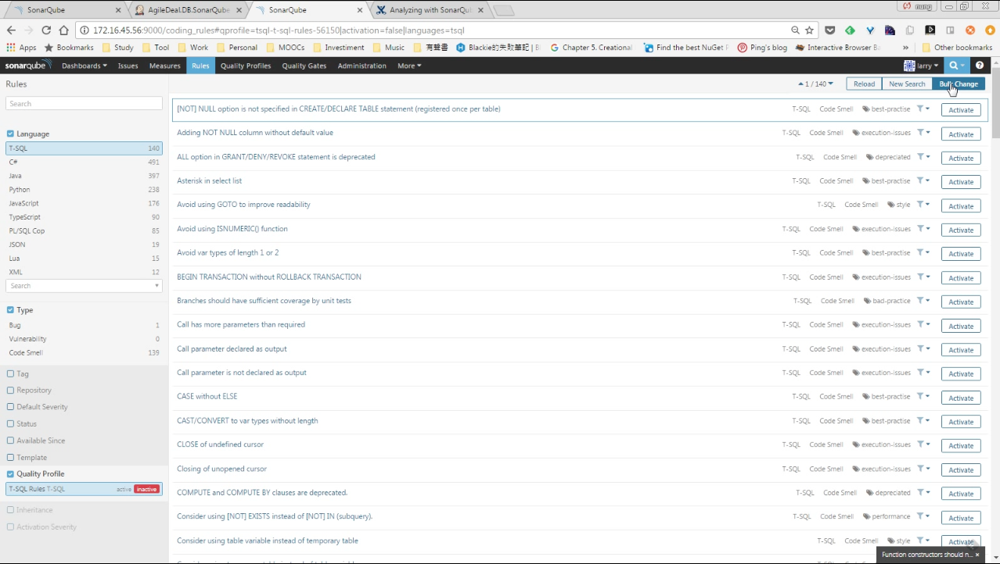
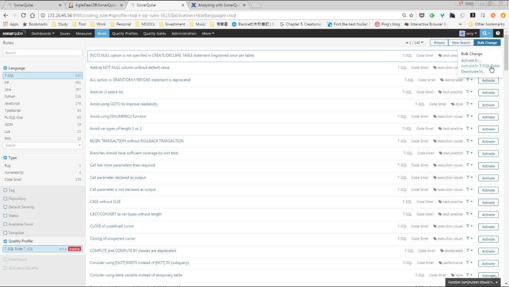
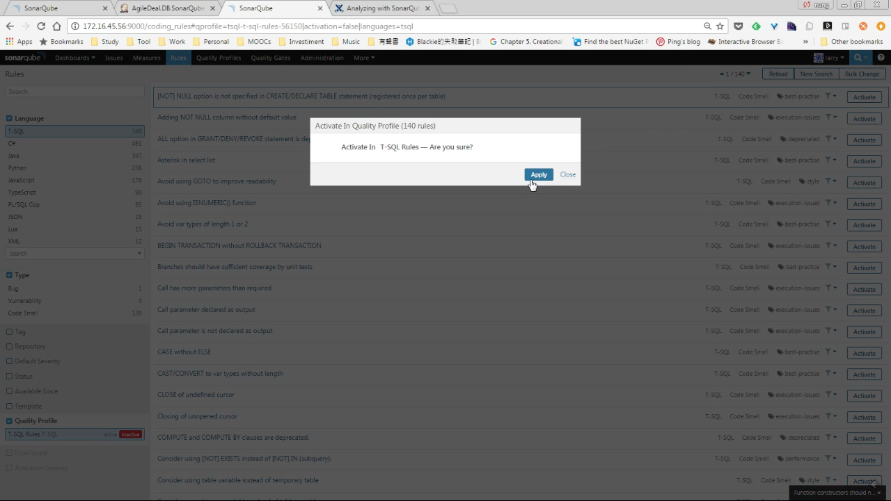
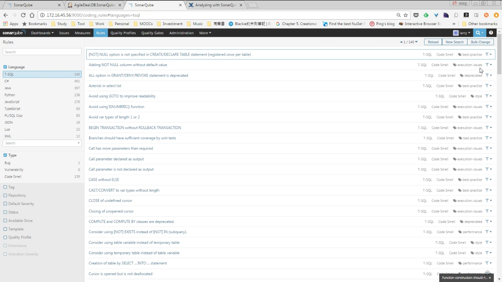

sonar-tsql-plugin 是用來分析 T-SQL 的 SonarQube 套件，支援 [14 的微軟內建的 analysis rules](https://msdn.microsoft.com/en-us/library/dd172133(v=vs.100).aspx)，以及 [120 個 SQL Code Guard analysis rule](http://sqlcodeguard.com/index-database-issues.html)。  

<!-- More -->

 

套件可在 [GitHub - gretard/sonar-tsql-plugin: Repository for T-SQL language plugin for Sonar](https://github.com/gretard/sonar-tsql-plugin) 這邊下載，並透過手動的方式安裝套件。  

 
 

套件安裝完後因為該套件無實作設定頁面，因此要到 Rules 頁面確認套件的安裝狀態，安裝成功的話應該可以在左側看到 T-SQL。Rule 預設是未啟用的，這邊也可以順帶啟用。  

 
 

 
 

 
 

 
 

除了 Rule 的設定外，因為該套件只是簡單的將他跟 Visual Studio 的資料庫專案與 SQL Code Guard 整合，所以用 MSBuild建置時需加帶 /p:RunSqlCodeAnalysis=true 參數，且在 SonarQube 設定檔中加設定 sonar.tsql.cg.path，將該設定值指到 SQL Code Guard 運行檔的位置。  

 

最後一提，如同上面所述，該套件並未實作設定頁面，所以一切設定都設在設定檔，要查閱該套件可做的設定的話，可參閱[Configuration · gretard/sonar-tsql-plugin Wiki · GitHub](https://github.com/gretard/sonar-tsql-plugin/wiki/Configuration)這邊。  

Link
----
* [GitHub - gretard/sonar-tsql-plugin: Repository for T-SQL language plugin for Sonar](https://github.com/gretard/sonar-tsql-plugin)
