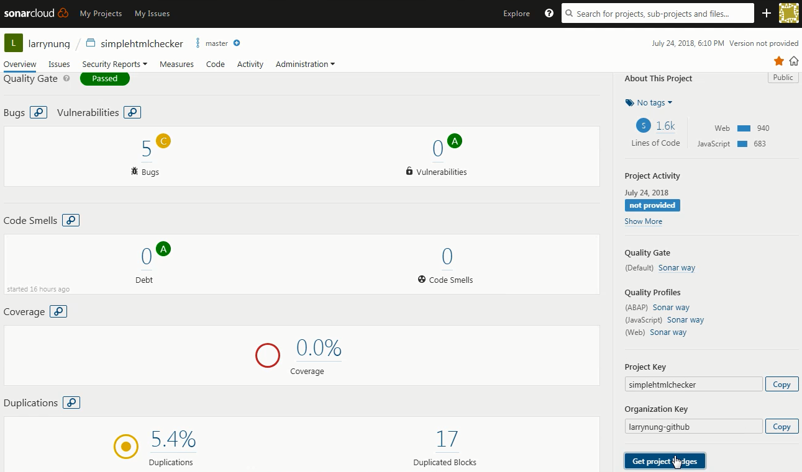
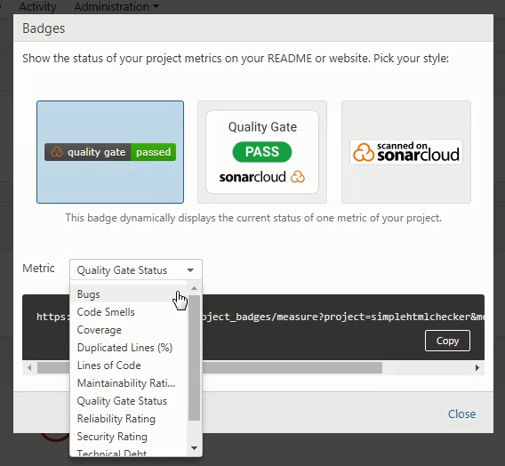
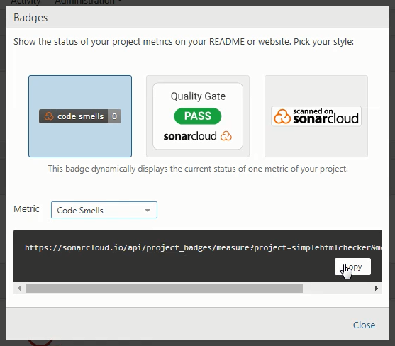
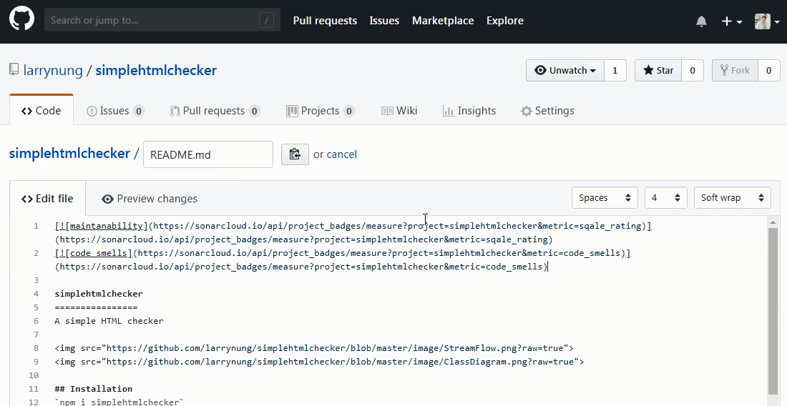
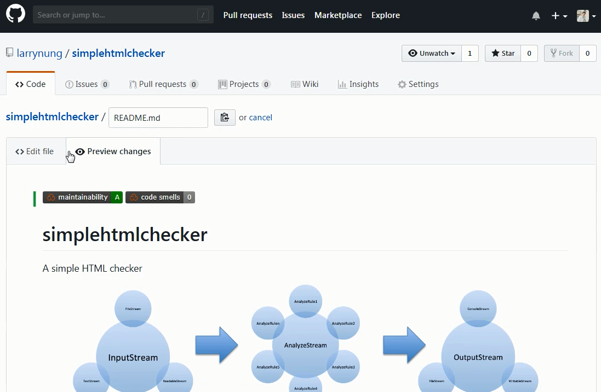

要使用 SonarCloud 的 Project badges，可以到 SonarCloud 的 Project 頁面，點選右下角的 Get project badges 按鈕。

選取要使用的 Project badges 與 Metric。

按下 Copy 按鈕複製 Project badges 的位置。

在要放置 Project badges 的位置上將之視為圖檔放置。

放置完後續我們就可以透過該 Project badges 知道目前專案的狀況。

