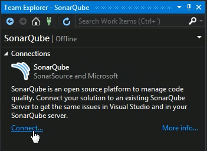
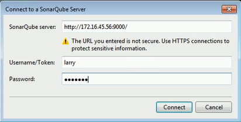
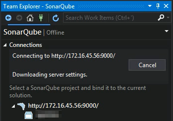
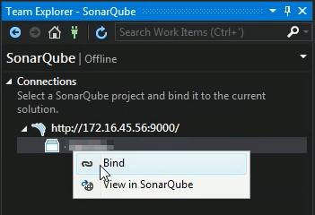
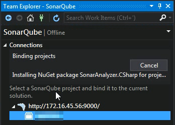
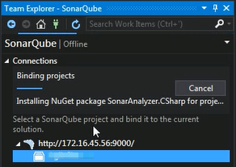
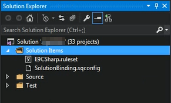
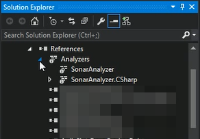
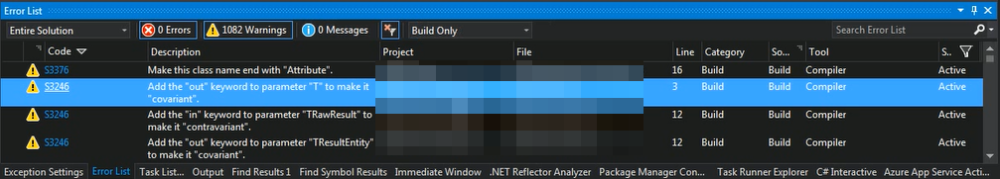

SonarLint for Visual Studio 能讓 Visual Studio 與 SonarQube 整合，將 SonarQube 的 Rule 透過 Analyzer 的方式整進 Visual Studio，讓 Visual Studio 能用 SonarQube 的 Rule 下去對程式進行分析。  

<!-- More -->

 

套件直接透過 Extension Manager 安裝即可。  

   

安裝完開啟 Team Explorer 連接 SonarQube。  

 

 

 

連結上 SonarQube 後將專案與 SonarQube 上的 Project Bind 在一起。  

 

 

 

Bind 完後 Solution Folder 會放置 Rule 的設定。  

 

專案也會被加入 Analyzer。  

 

運行分析時也會套用 SonarQube 的 Rule。  

 
