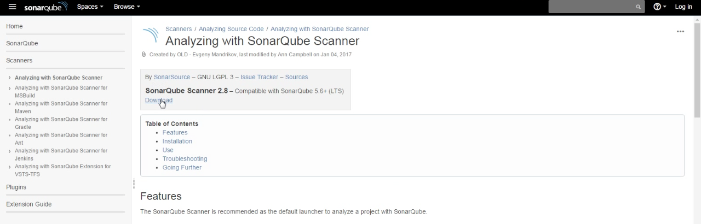
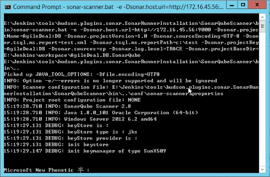
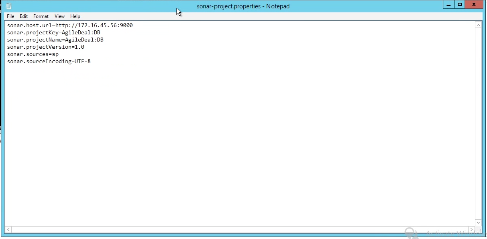
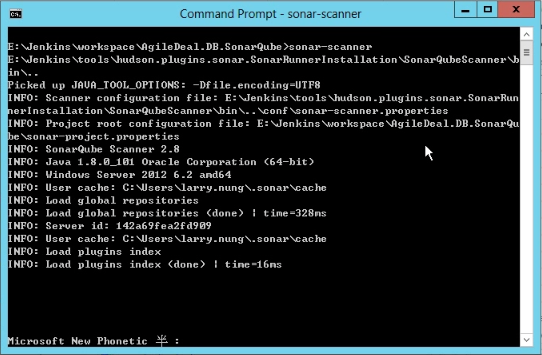

要使用 SonarQube 進行程式碼分析，並將分析結果送至 SonarQube Server，最簡單的就是使用 SonarQube Scanner。  

<!-- More -->

 

先至官網將 SonarQube Scanner 下載下來。  

 

下載下來後直接解壓即可使用，其命令使用方式如下：  

    usage: sonar-scanner [options]
     
    Options:
     -D,--define <arg>     Define property
     -e,--errors           Produce execution error messages
     -h,--help             Display help information
     -v,--version          Display version information
     -X,--debug            Produce execution debug output
 

其中比較常用的就是參數 -D,--define，可用來定義 SonarQube 分析所需要的屬性，像是 sonar.host.url 屬性用來指定 SonarQube 的位置、sonar.projectName 用來指定 SonarQube 的 Project name、sonar.projectVersion 用來指定 SonqrQube 的 Project version、sonar.projectKey 用來指定 Sonarqube 的 Project key、sonar.log.level 用來指定分析運行時的 log 層級...等。    

 

除了透過 -D,--define 將這些屬性用參數帶入設定外，也可以使用設定檔，只要將屬性的設定寫在名為 sonar-project.properties 檔案。  

 

這樣運行分析時也只需要直接調用 sonar-scanner。  

 

Link
====
* [Analyzing with SonarQube Scanner - Scanners - SonarQube](https://docs.sonarqube.org/display/SCAN/Analyzing+with+SonarQube+Scanner)
