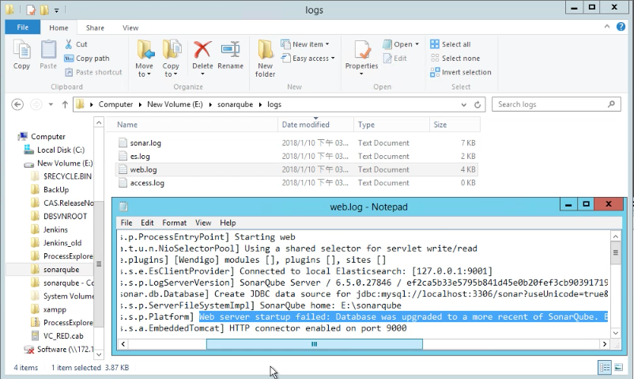
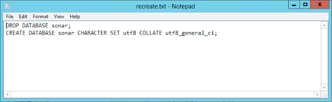
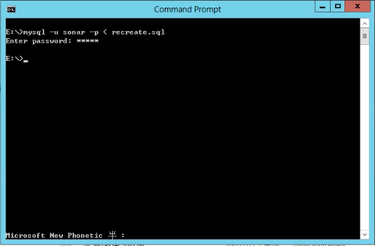
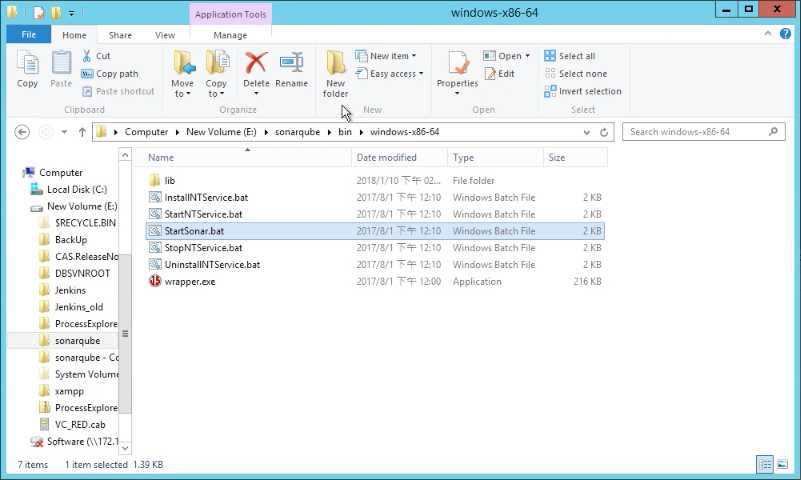
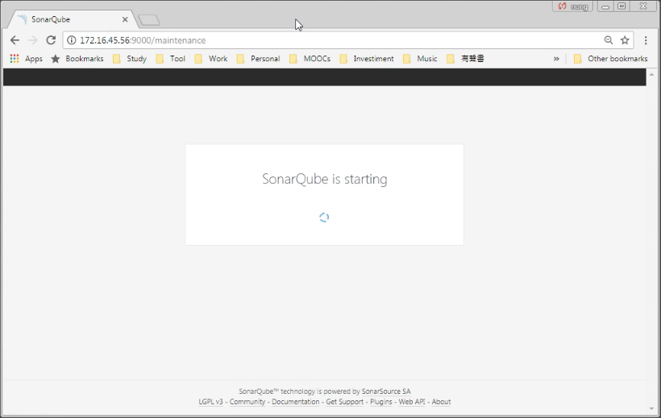

若 SonarQube DB 升級過後想要使用回舊版本的 SonarQube，會發現資料庫已經不相容於舊版本的 SonarQube DB。



這時將 SonarQube DB 刪除後重建。

```sql
DROP DATABASE sonar;
CREATE DATABASE sonar CHARACTER SET utf8 COLLATE utf8_general_ci;
```





舊版本的 SonarQube 服務就可以正常運作了。



