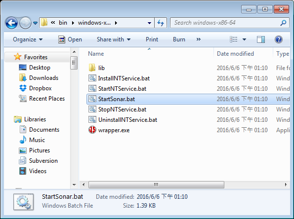
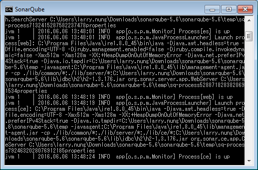
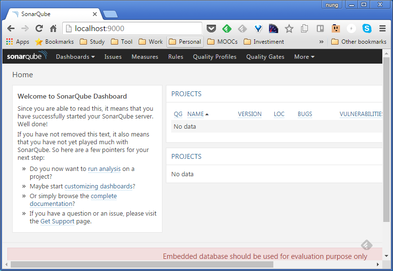
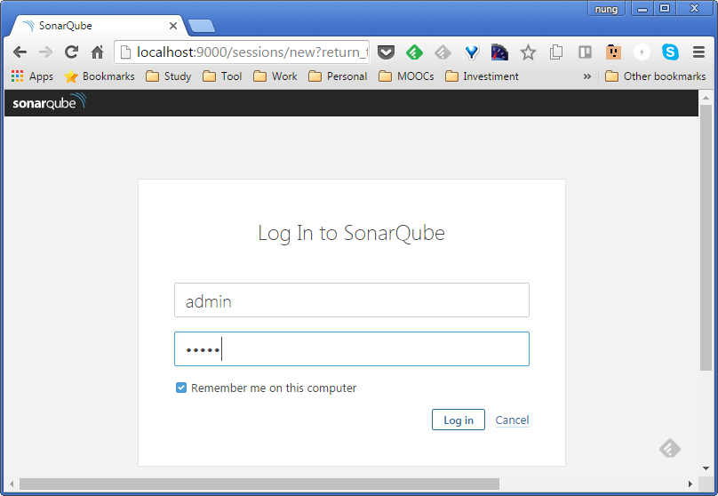
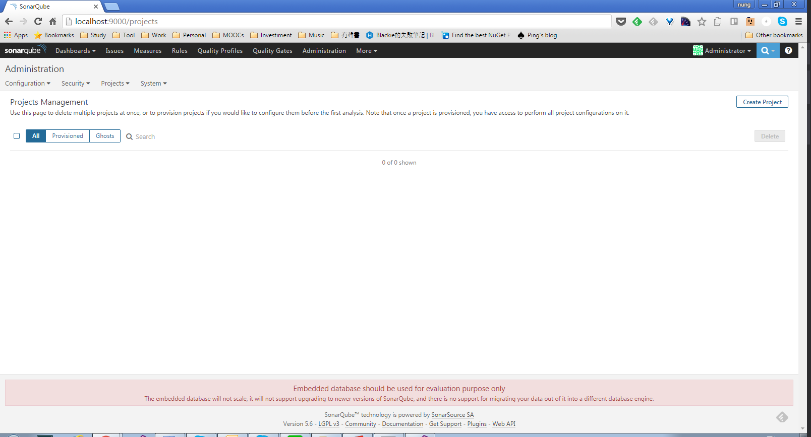

要試用 SonarQube 我們只需將 [SonarQube distribution](http://www.sonarqube.org/downloads/) 下載下來解壓縮，並運行 `StartSonar.bat`。

這樣服務就運行起來了。

接著用瀏覽器瀏覽 `http://localhost:9000` 即可開始體驗 SonarQube。

如果需要進一步管理 SonarQube，可以用 admin/admin 登入。

Link
----
* [SonarQube™ » Download](http://www.sonarqube.org/downloads/)
* [Get Started in Two Minutes - SonarQube Documentation - SonarQube](http://docs.sonarqube.org/display/SONAR/Get+Started+in+Two+Minutes)