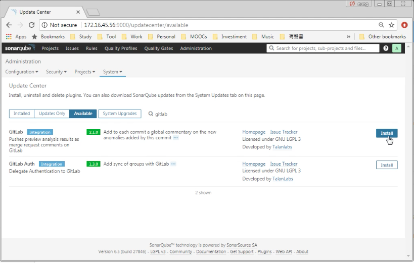
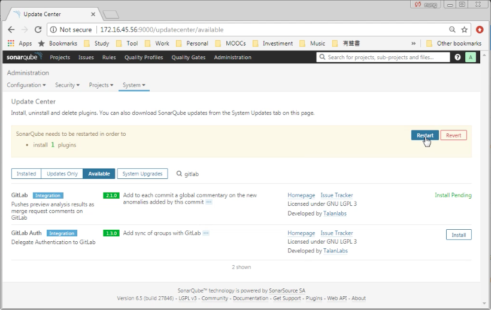
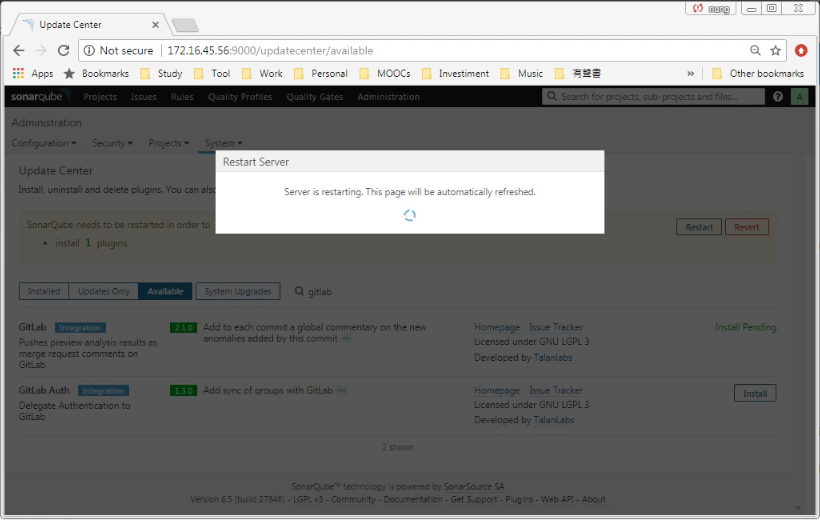
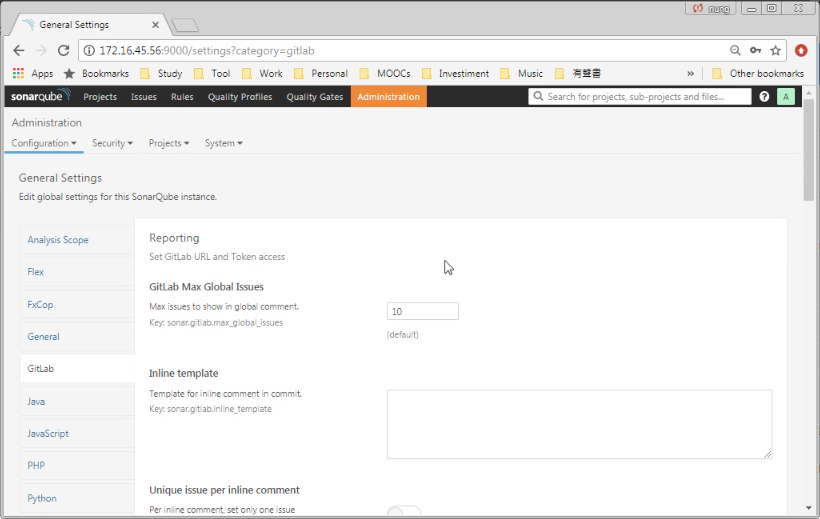
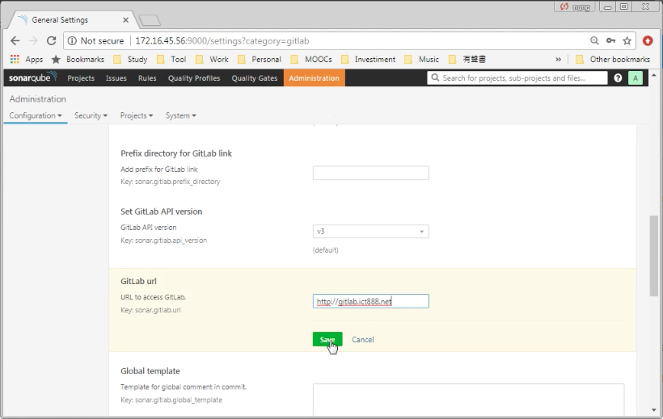
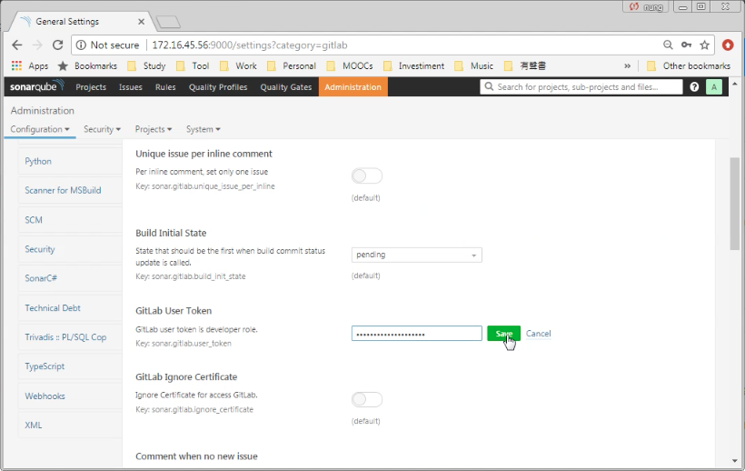
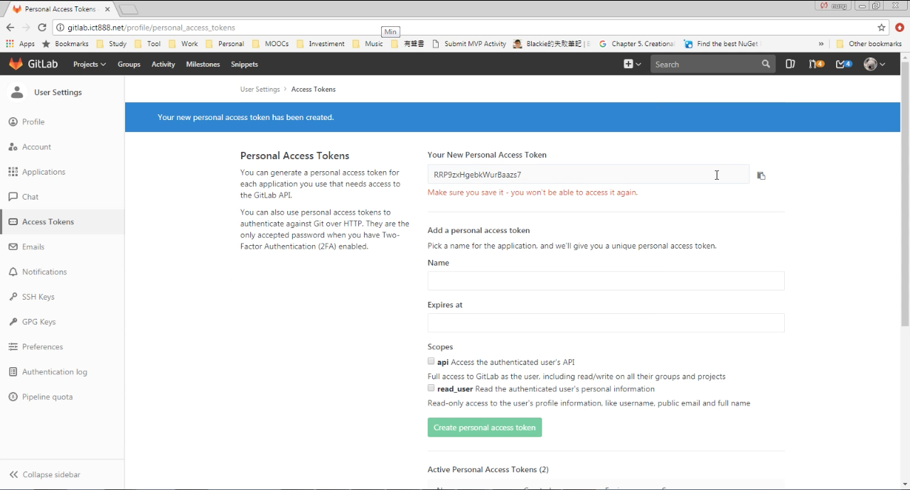
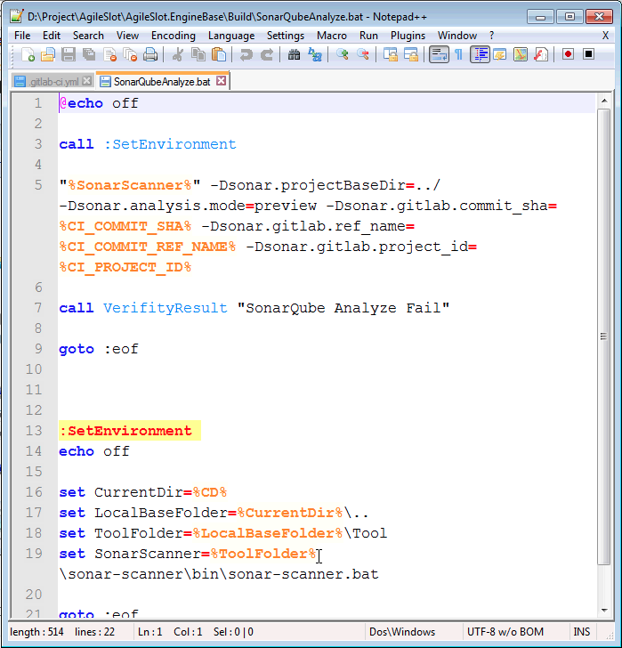
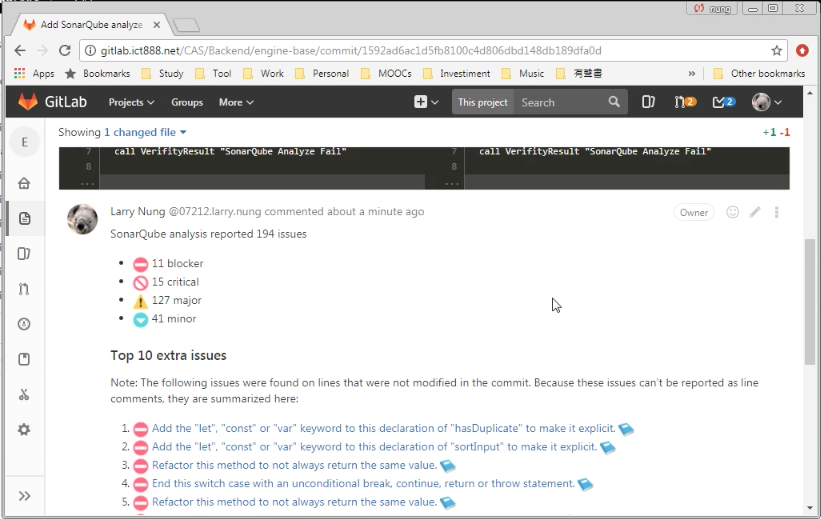

要將 SonarQube 與 GitLab 整合，讓 GitLab 簽入或是發送 MergeRequest 時可透過 SonqrQube 進行分析，即早發現程式的問題，SonarQube 需先透過 Update Center 安裝 GitLab 套件。  

<!-- More -->

 
 

SonarQube 的 GitLab 套件安裝好後進行 SonarQube 的重啟。   

 
 

 
 

重啟完後進入 Administration 的 General Settings 頁面，切至 GitLab 頁籤進行相關的設定。  

 
 

最主要的設定有兩個，一個是 GitLab url，需填入 GitLab 服務的位置。  

 
 

另外一個是 GitLab User Token，讓 SonarQube 可以存取 GitLab 用。這樣當 GitLab 觸發 SonarQube 分析完，SonarQube 才可以將分析的結果放至 GitLab 上。  

 
 

這邊輸入的 GitLab User Token 是 GitLab 的 Access Token，可在 GitLab 的 [UserSettings | Access Tokens] 取得。  

 
 

SonarQube 的 GitLab 套件安裝並設定好後，接著要進行 GitLab CI 的設定。只要在 GitLab CI 的設定檔中像下面這樣調用 SonarScanner 觸發 SonarQube 分析即可。  

    "%SonarScanner%" -Dsonar.projectBaseDir=../ -Dsonar.analysis.mode=preview -Dsonar.gitlab.commit_sha=%CI_COMMIT_SHA% -Dsonar.gitlab.ref_name=%CI_COMMIT_REF_NAME% -Dsonar.gitlab.project_id=%CI_PROJECT_ID%

 

 
 

-Dsonar.analysis.mode=preview 用來指定使用 Preview 分析，多半是 MergeRequest 時使用;-Dsonar.gitlab.commit_sha=%CI_COMMIT_SHA% 設定 GitLab Commit 的 SHA;-Dsonar.gitlab.ref_name=%CI_COMMIT_REF_NAME% 設定 GitLab Commit 的名稱;-Dsonar.gitlab.project_id=%CI_PROJECT_ID% 設定 GitLab CI 的專案識別碼。  

 

完成後當 GitLab CI 跑完就可以看到 SonarQube 分析完的結果。  
  

 
 
