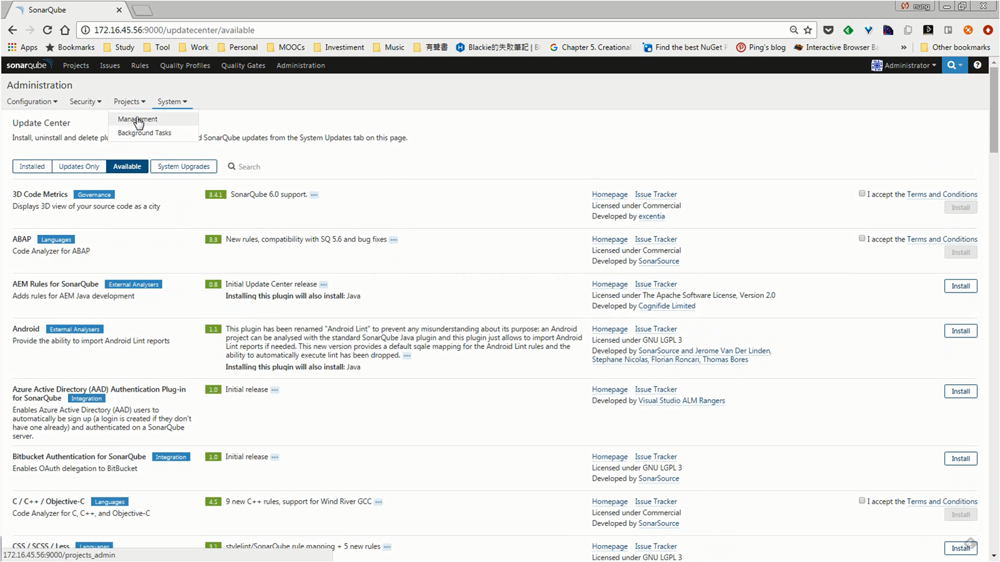
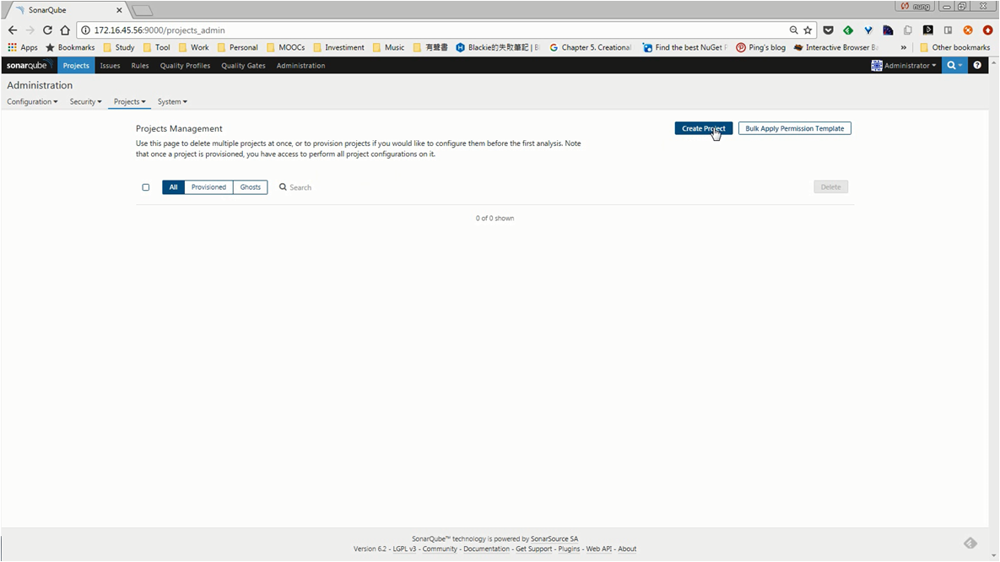
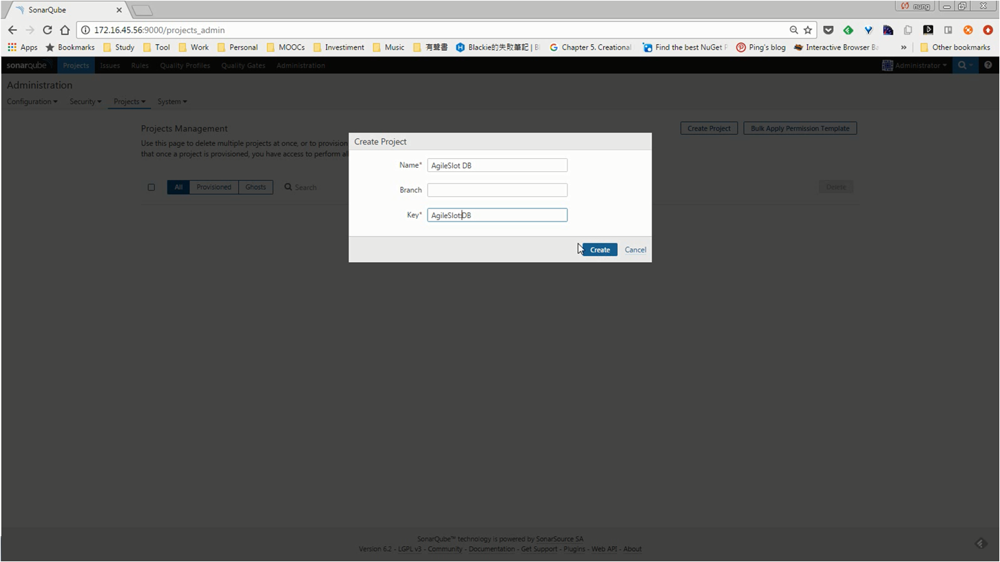
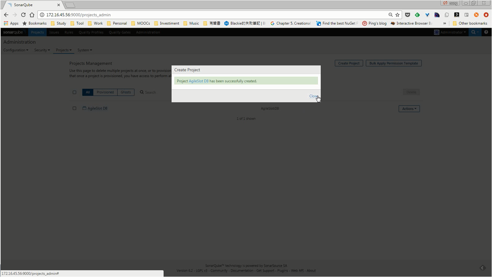
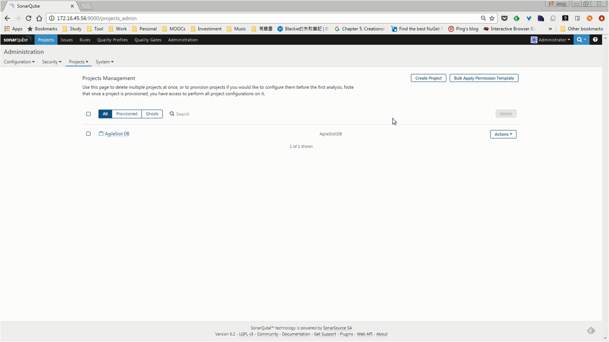
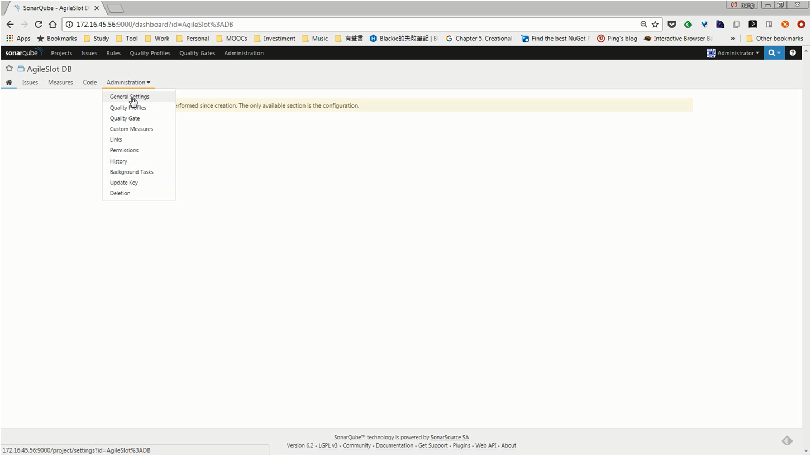
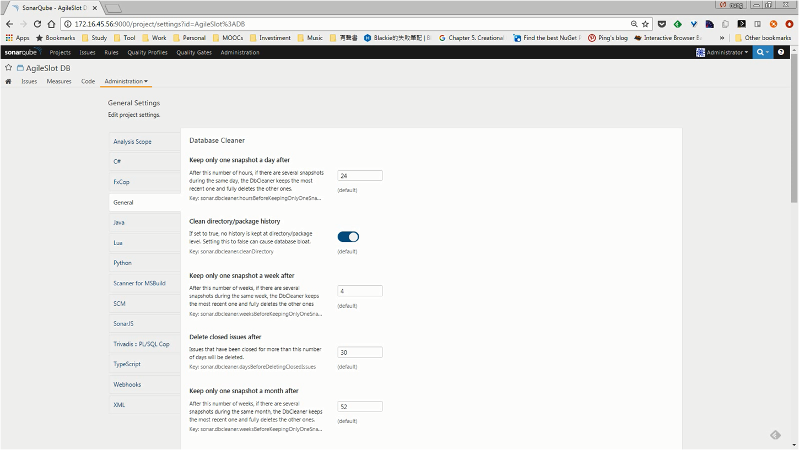
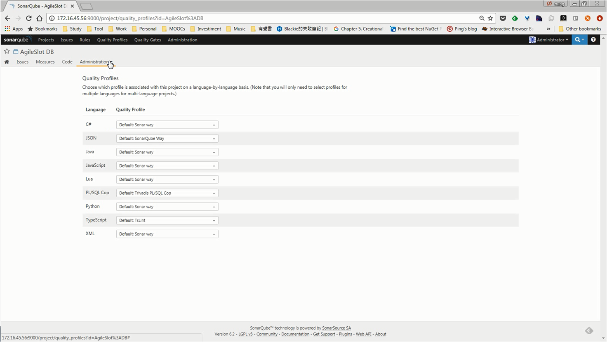
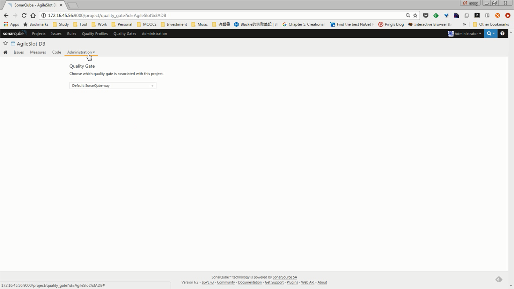

要將程式送到 SonarQube 進行分析，首先必須要在 SonarQube 建立 Project。

可點擊 [Administration | Projects | Management] 選單選項開啟 Project management 頁面。

點選 Project management 頁面右上方的 `Create Project` 按鈕。

設定 Project 的 Name 與 Key 後按下 `Create` 按鈕。

Project 即建立完成。

接著點選 Project 名稱進入 Project 管理頁面，這邊的 Administration 下有些設定可適需要做些調整。

像是可能要調整要分析的副檔名，就可以到 General Settings 頁面做對應的設定。

要指定專案所使用的 Quality Profile，可到 Quality Profiles 頁面設定。

要指定專案所使用的 Quality Gate，可到 Quality Gate 頁面設定。

