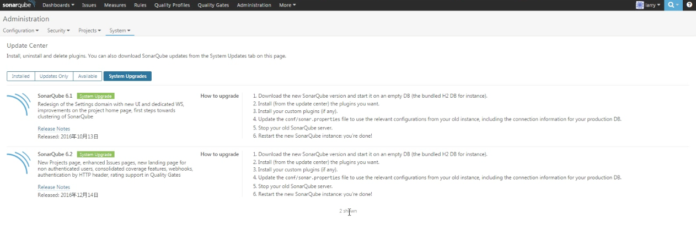
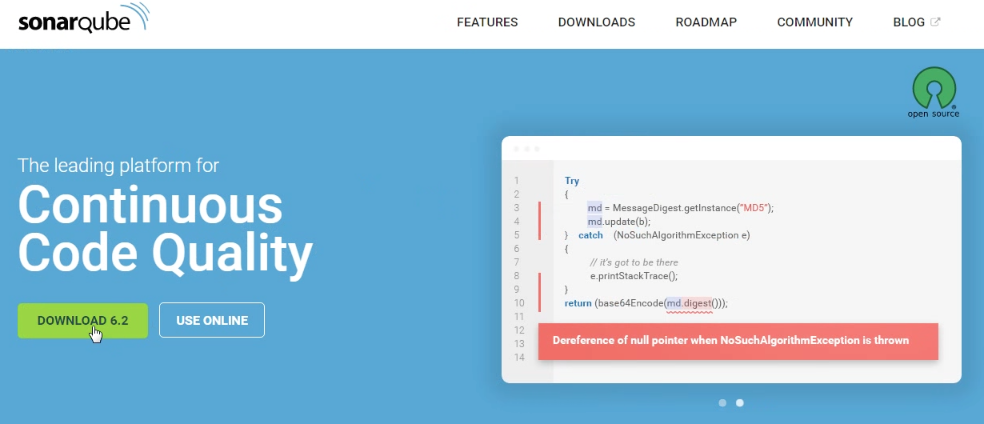
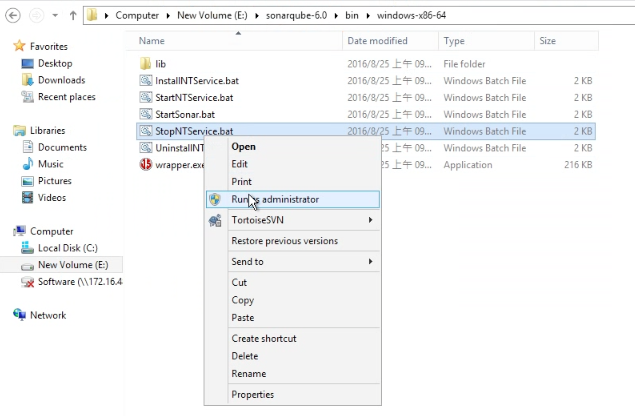
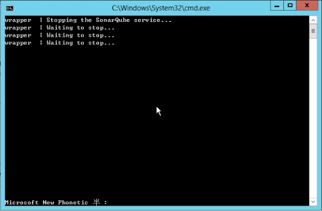
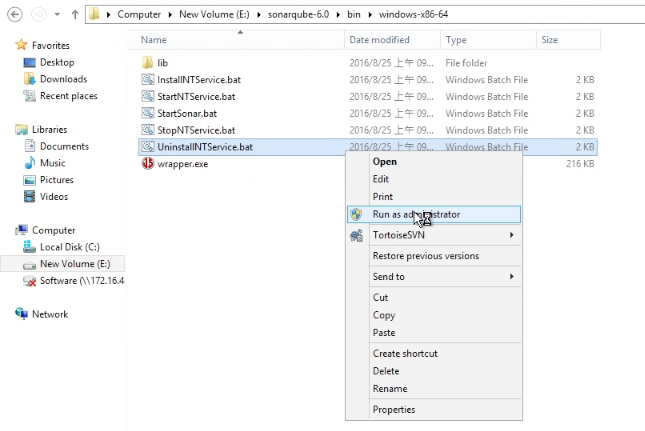
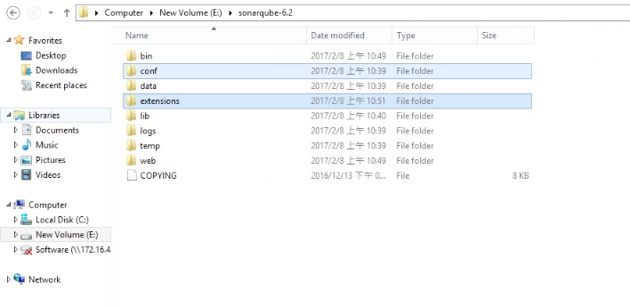
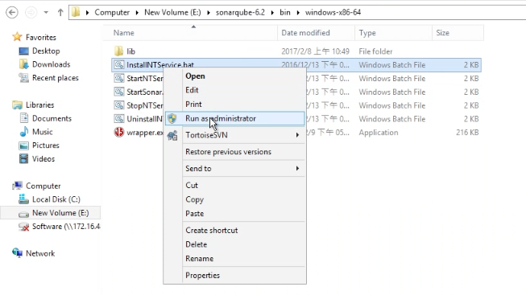
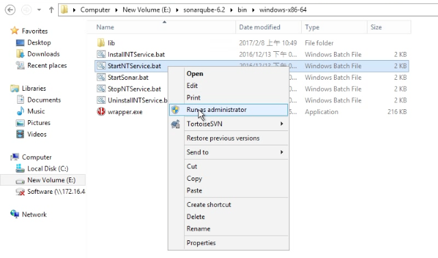
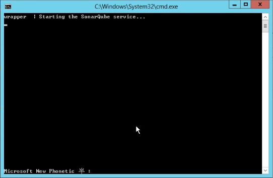
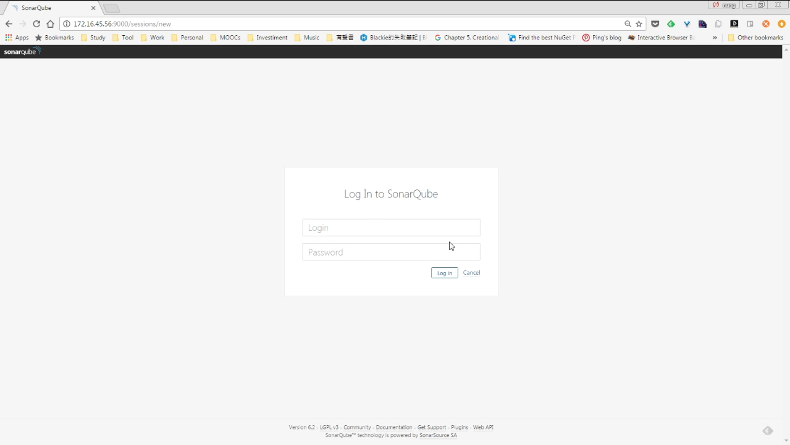

要進行 SonarQube 的系統升級，目前 Update Center 只支援查閱更新以及告知升級的步驟，尚未支援自動升級，需要自行手動升級。  

<!-- More -->

 

可以先下載新版的 SonarQube 程式。  

 

將舊的 SonarQube 服務停止。  

 

 

停止後將舊的服務移除。  

 

將舊的 SonarQube 設定與套件放到新的 SonarQube。  

 

再將新的 SonarQube 服務安裝。  

 

將安裝好的服務啟動。  

 

 

即完成 SonarQube 的系統升級。  

 
