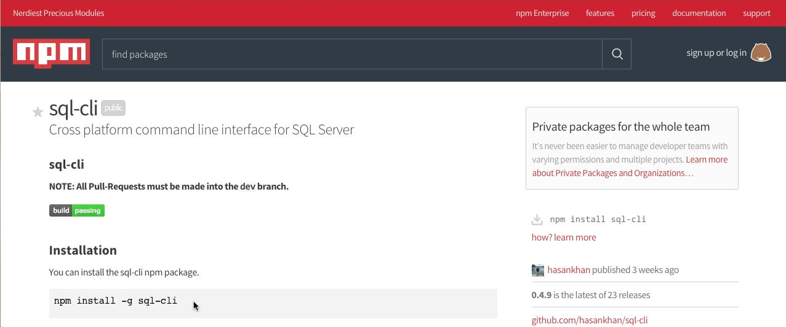
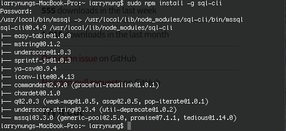
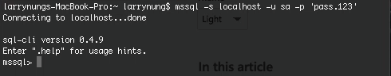
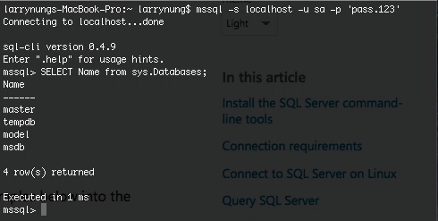

sql-cli 是一命令列的 SQL Server 工具。  

<!-- More -->

 

透過 npm 安裝到全域即可使用。  

    npm install -g sql-cli

 

使用方式如下：  

    Usage: mssql [options]
     
    Options:
     
      -h, --help                     output usage information
      -V, --version                  output the version number
      -s, --server <server>          Server to conect to
      -u, --user <user>              User name to use for authentication
      -p, --pass <pass>              Password to use for authentication
      -o, --port <port>              Port to connect to
      -t, --timeout <timeout>        Connection timeout in ms
      -d, --database <database>      Database to connect to
      -q, --query <query>            The query to execute
      -v, --tdsVersion <tdsVersion>  Version of tds protocol to use [7_4, 7_2, 7_3_A, 7_3_B, 7_4]
      -e, --encrypt                  Enable encryption
      -f, --format <format>          The format of output [table, csv, xml, json]
      -c, --config <path>            Read connection information from config file

 

其中 -s 可用來指定 SQL Server 位置，-u 用來指定帳號，-p 用來指定密碼。像是若要連入本機的 SQL Server，其 sa 的密碼為 pass.123，那就可以像下面這樣調用以進行連線：    

 

連線後可以輸入 SQL 語法去做運行。  

 

Link
----
* [sql-cli](https://www.npmjs.com/package/sql-cli)
