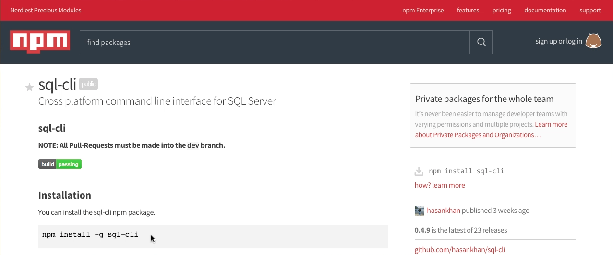
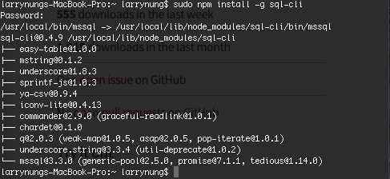
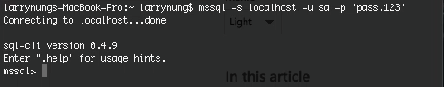
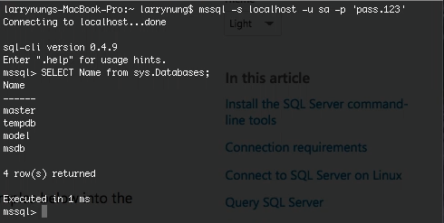

sql-cli 是一命令列的 SQL Server 工具。

透過 npm 安裝到全域即可使用。

npm install -g sql-cli

使用方式如下：

Usage: mssql [options]

Options:

-h, --help                     output usage information
-V, --version                  output the version number
-s, --server           Server to conect to
-u, --user               User name to use for authentication
-p, --pass               Password to use for authentication
-o, --port               Port to connect to
-t, --timeout         Connection timeout in ms
-d, --database       Database to connect to
-q, --query             The query to execute
-v, --tdsVersion   Version of tds protocol to use [7_4, 7_2, 7_3_A, 7_3_B, 7_4]
-e, --encrypt                  Enable encryption
-f, --format           The format of output [table, csv, xml, json]
-c, --config             Read connection information from config file

其中 -s 可用來指定 SQL Server 位置，-u 用來指定帳號，-p 用來指定密碼。像是若要連入本機的 SQL Server，其 sa 的密碼為 pass.123，那就可以像下面這樣調用以進行連線：

連線後可以輸入 SQL 語法去做運行。

Link
----
* [sql-cli](https://www.npmjs.com/package/sql-cli)